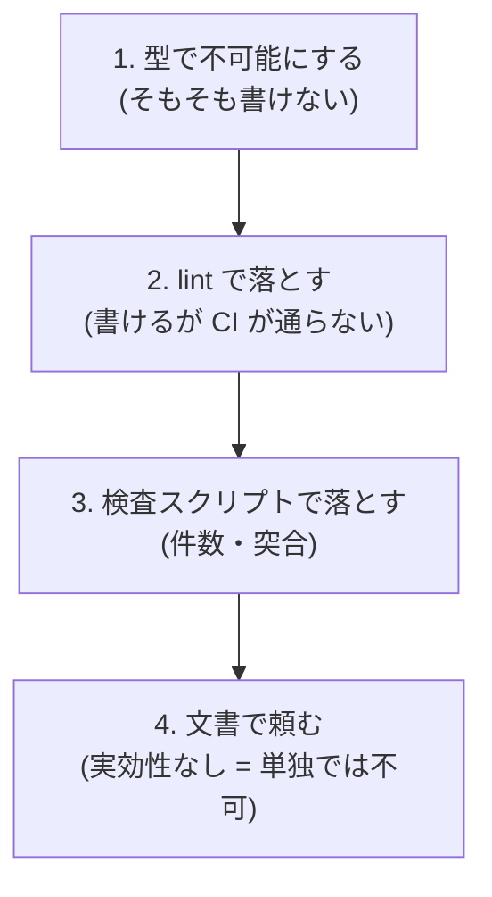

# elxea Web設計憲章

<!--
  この置き場について。

  憲章の正本は **この1ファイル**である (2026-08-26の採択時に決定)。
  Notionには写しを作らない — Master Spec §8「複製ではなくリンクで持つ」の適用で、
  Notion側はMaster Spec §7-3から**このURLを指すだけ**にする。
  採択の経緯とR1-R8の詳しい論拠 (実測値・却下した代案) は採択時の提案書に残っている。
  ここはその要旨と、**機械が読む欄**を持つ。

  「ここに置く」と決めながら、ファイルは2026-08-27まで作られていなかった。
  そのあいだR1-R8はcommitメッセージとコード内コメント (40箇所以上) から
  参照されるだけで、**原則の一覧はどこにも無かった**。憲章R8が言う
  「装置を入れたが寄せ切っていない」が憲章そのものに起きていた形なので、
  R9を足すのと同時にこのファイルを作る。
-->

## この憲章のスキーマ

原則は必ず次の6欄を持つ。**「強制機構」が空の原則は憲章に載せない** —
載せた瞬間に「文書だけの規律」が復活するため。

| 欄 | 意味 |
|---|---|
| id | `R<n>` |
| 一言 | 原則を1文で |
| 実障害 | その原則が無くて実際に起きたこと (実測値・日付つき) |
| 強制機構 | 機械が落とすもののファイルパス。**実在しない道を書けない** |
| 例外表 | 逃げ道の置き場と現在値 |
| 配線assert | 「強制機構が空回りしていないこと」を確かめるテスト |

思想・トーン・意図といった抽象欄は持たせない。運用されないことが分かっているため。

強制の階層。上ほど強い。**各原則は上位3層のいずれかを必ず1つ持つ**。

**この表の「強制機構」「配線assert」の欄に書いたパスは、`__tests__/constitution.test.ts`
が実在を検査する。** 道が消えたのに憲章に残っている状態を作らないため。

---

## R1〜R8 (採択済み・Wave 0〜4で実装)

各行の「実障害」欄は採択時 (2026-08-26 / `dd6b35e`) の実測。**現在値ではない** —
その多くはWave 0〜4の実装で解消済みで、解消されたことは各強制機構と例外表が示す。

| id | 一言 | 強制機構 | 例外表 | 配線assert |
|---|---|---|---|---|
| R1 | 失敗は「区別可能」にしてから握る | `eslint-rules/no-silent-catch-at-boundary.mjs` | `ratchets.json` の `silent-catch-grandfathered` / `expected-failure-escapes` | `__tests__/failure-visibility.test.ts` |
| R2 | 外部との境界は1枚の通り道を必ず通る | `lib/shopify/index.ts` (gateway) / `eslint.config.mjs` のgateway制限 | `eslint-suppressions.json` | `__tests__/sot-registry.test.ts` |
| R3 | キャッシュは「対」でしか存在させない | `lib/cache/tags.ts` (タグレジストリ・型で指定必須) | なし (型で不可能にしている) | `__tests__/cache-tags-registry.test.ts` |
| R4 | 設定値は起動時に1度検証し、以後rawを読まない | `lib/config/spec.ts` + `no-restricted-syntax` | `ratchets.json` の `eslint-inline-disable` | `__tests__/config-env.test.ts` |
| R5 | 「単一正本」を自称させない | `scripts/ops/check-sot-registry.mjs` | なし (同一conceptの二重宣言は無条件で落ちる) | `__tests__/sot-registry.test.ts` |
| R6 | 緑は「実行された」ことの証明でなければならない | `scripts/ops/check-test-floor.mjs` | `docs/ops/test-floor.md` の下限値 | (テスト自身が配線) |
| R7 | 本番に触れる経路は多層で止める (fail-closed既定) | `lib/sanity/write-target.ts` / `lib/firebase/firestore-target.ts` | なし | `__tests__/firestore-local-isolation.test.ts` |
| R8 | 装置の導入は「全件移行 + 再流入止め」までで1セット | `scripts/ops/check-ratchet.mjs` | `ratchets.json` (全表の上限) | `__tests__/ratchet.test.ts` |

R6 / R7は採択時点で「半分実装済み」と判定されたもので、拡張 (名指しの必須シナリオ集合 /
gatewayへの取り込み) は未着手。**未着手であることをここに書いておく**のがR8の作法である。

---

## R9. 押せるものは、全部台帳に載る

| 欄 | 内容 |
|---|---|
| **id** | R9 |
| **一言** | ユーザーが押せる操作は、**応答の出し方を宣言した台帳に必ず載る**。載っていない操作は作れない。 |
| **強制機構** | `scripts/ops/generate-interaction-inventory.mjs` (`pnpm check:interactions` / CIは `static-checks` に相乗り) |
| **例外表** | `interaction-inventory.json` の各行の `exempt`。件数は `ratchets.json` の `interaction-unclassified` (max 0) と `interaction-exempt` |
| **配線assert** | `__tests__/interaction-inventory.test.ts` / `e2e/interaction-response.spec.ts` |

### なぜ (実障害)

「押した瞬間に効く」は2026-08-26にlint (`mutation-through-shared-primitive`) を
入れて機械強制したはずだった。**それでも同じ不具合が2件、緑のまま通っていた。**

1. **商品画像カルーセルが押しても切り替わらない** — サムネイルを押すと
   `setSelected` は即時に走るが、`<Image>` は同じDOMのまま `src` が差し替わる
   だけなので、**未取得のURLを取り終わるまで見た目は旧画像のまま**だった
   (本番実測705〜1,865ms / うちTTFB 628〜1,788msは画像変換待ちで通信量ではない。
   温まっていれば同じ操作が19〜174ms)。
   **なぜ見えなかったか**: これは書き込みではないのでlintの母集団に入らない。
   `__tests__/interactive-instant-controls.test.ts` の手書き3ファイルにも無い。
   **一度も数えられたことがない操作**だった。表示切替は78件あり、そのすべてが
   同じ立場にあった。

2. **カート数量を変えても金額が2秒古いまま** — `cartReducer` は `totalQuantity` と
   `lines[].quantity` だけを書き換え、`cost.*` を触らない。しかし画面は
   `item.cost.totalAmount` / `cart.cost.subtotalAmount` / `cart.cost.totalAmount` を
   描いている。結果、数量は本番実測16〜75msで動くのに金額は **2,139〜2,417ms**
   古いまま ——「2個になっているのに1個ぶんの金額」という中間状態。
   **なぜ見えなかったか**: `cart-context.tsx` は共通機構を**正しく通っている**ので
   lintは緑。`disabled={isPending}` の字面しか見ないテストも緑。
   **「通っているか」は検査されるが「楽観更新が画面の描く項目を覆っているか」は
   誰も検査していなかった。**

3. **`lib/**` と `.ts` 全域がlintの視界の外だった** — `eslint.config.mjs` の
   `files` が `components/**/*.tsx` と `app/**/*.tsx` だけで、
   `lib/favorites/client-store.ts` は `"use client"` + `method: "POST"` +
   例外表未登載の三拍子なのに `npx eslint` が0件で返っていた。
   ファイルを `.tsx` から `.ts` に移すだけで、**例外表に差分を出さずに監査から
   消せた**。ルール本体が謳う「逃げ道は差分に必ず現れる」が上流から破れていた。

この3つは症状が違うが原因は1つで、**母集団の取り方が「書き込み」に限られ、
しかもその書き込みも全部は見ていなかった**ことに尽きる。

### どう強制するか

`app/ components/ lib/ hooks/` をTypeScriptのparserで走査し、
**ユーザーが押せるもの5種**を抽出して `interaction-inventory.json` と突き合わせる。
拡張子と配置で絞らない。

| 種別 | 抽出するもの | なぜ要るか |
|---|---|---|
| handler | JSXの `on*` 属性 | 最も普通の操作 |
| write | 書き込み呼び出し (`fetch` の書き込みメソッド / Server Action) | 従来のlintの母集団 |
| link | 内部hrefを持つ `<Link>` / `<a>` | **ハンドラを1つも持たない素のLink** が漏れていた (「さらにN件を表示」) |
| form | `<form action={...}>` のServer Action参照 | 現状0件。`useActionState` へ寄せた瞬間に書き込みが丸ごと消えるので、ゼロのうちに塞ぐ |
| listener | client側の `addEventListener` | `useEffect` 内で張られるのでハンドラ属性では原理的に見えない |

**書き方を変えて逃げる道も塞いである** (敵対 QA 指摘 / いずれも着手時の実例は 0〜9 件):
素の要素への `{...props}` (中身が読めないので安全側に 1 行立てる) /
`React.createElement` の `on*` / `fetch` の init を外に出した形
(`const init = { method: "POST" }` — `mutation-through-shared-primitive` も同じ形で抜ける) /
`globalThis.fetch` / 角括弧の `el["addEventListener"]` /
副作用だけの `import "./m"` (到達可能性の辺として数える)。

**サーバ専用モジュールの書き込みは載せない。** `app/api/**` や `lib/line/*` の往復は
「ユーザーが押せるもの」ではなく押した結果サーバ側で起きること。載せると台帳が
「押せるものの表」でなくなり、本当に押せる行が埋もれる。判定は eslint 側と同じ
ブラウザ到達可能性を使う (二重の定義を作らない)。

**内部リンクの自動 exempt は毎回 href から付け直す。** 台帳の id は
`file#link:Link#n` で **href を含まない**ので、引き継ぐと href に `?` を足すだけで
「別ページへ移るだけ」の exempt を維持したまま、ページ内で見た目が変わる遷移
(G6 と同型) を宣言なしで復活させられる。

各行は `response` (応答の出し方) の宣言を必須とし、`optimistic` / `sync-dom` は
`observe` (その操作で必ず更新される要素) も必須にする。

**`observe` を人が宣言するのが要点**である。「操作が描き変える全項目」を機械が
自動で知る手段は無い — `cart.cost.subtotalAmount` が `<OrderSummary subtotal={...}>` を
経てpropで渡る現状ではデータフロー解析が要り、現実的でない。よって
**人が宣言し、機械が守る**形にする。**そこに合計を書いた時点で、上の実障害2は
機械的に赤くなる。** これが唯一の実現可能な経路だった。

### どう検査するか — 壁時計をやめる

`playwright.config.ts` の `webServer` は `pnpm dev` で、`next dev` はルートを
最初のリクエストで初めてコンパイルする。**「0.3秒以内」をassertすると恒常的に
flakyになり、`--retries=2` で握り潰されるか、そのうち誰も見ない赤になる。**
それはR6が禁じた「見ていない緑」を別の形で作るだけである。

そこで**時間ではなく依存関係の性質**を見る。

| `response` | assertする内容 |
|---|---|
| `optimistic` / `sync-dom` | `observe` の**全要素**が、書き込みの往復を `page.route()` で保留した状態でも更新完了する |
| `asset-load` | 切替先アセットが**操作前に取得済み**である (押したあとの速さは測らない) |

`IMMEDIATE_FEEDBACK_BUDGET_MS = 300` (`lib/interaction/mutation-classes.ts`) は
設計上の約束の正本として引き続き参照するが、CIのassertは上表に置き換える。
壁時計での実測は本番URL相手の `staging-smoke` の仕事で、**`pnpm dev` 相手に
絶対時間を測らない**。

### 段階導入

一度に入れると、機構の不具合と実際の遅さの区別がつかないまま大量の赤に埋もれる。
先に「増えない」を確定させ、次に「減らす」に入る。

1. **第1段 (増加をゼロで止める)** — 台帳を生成し、導入時点の全行を `exempt` で
   据え置き、件数を `ratchets.json` に固定する。内部リンクのうち「別ページへ移る
   だけ」のものは自動exempt。**新しい操作だけが宣言を強制される。**
2. **第2段 (捕まえる)** — 深刻なものから `exempt` を外して `observe` を宣言する。
   外した瞬間にe2eが赤くなるのが正しい。そこから直す。
   ratchetが両方向検査なので、直り次第 `max` の引き下げが強制される。

### コスト

静的検査はスクリプト1本で数秒。既存の `static-checks` に相乗りさせる
(**新規ジョブは作らない** — 緑のpush 1回 = 15分 / 無料枠2,000分/月。
`docs/ci-gates.md`)。e2eは既存の `e2e-tests` jobにspec 1本。
時間非依存のassertはリトライ費用を増やさない。
