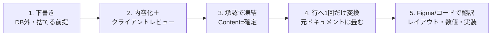

> ⚠️ この文書は Notion 正本の書き出しミラーです（v4 / 2026-07-03 時点）。
> 正本: https://www.notion.so/39070c9d064c8148b983f9004c85fc3d
> 編集は Notion 側で行い、版更新時に本ファイルを再書き出しすること。直接編集禁止。

# デザイン業務フロー総合仕様書（Design Ops Spec）

**一言**: このページ 1 枚で、コンテクストゼロの新セッションでも CIRCL / elxea / クライアントの全メディア（UI・Web・デザインシステム・ガイドライン・LP・DTP・バナー広告・営業資料・ロゴ/名刺）のデザイン業務を、同じ手順で迷わず回せるようにする総合マニュアル。DB の仕様書ではなく、デザイン業務フロー全般の運用書。

**状態**: 管理モデル v2（Structure List 単独 ＋ コードが正本 ＋ 文書は「章」）に全面準拠。旧 Section List は廃止済。現状 — elxea Web App = スキーマ v2 運用・参照 cockpit 稼働／elxea Design System = 全 6 章完成（In progress）／OFE ガイドライン = 章 16 件中 実内容 2 件。

**Ask**: FYI（本マニュアルに沿って運用する）。ただしデータモデル（DB のプロパティ・リレーション構造）に触れる改訂は Decider=Human の決定ログが必須（§19）。個別作業のクライアント確定・金額・契約は Tier 2＝Setaka 承認。

---

## 版数・変更履歴

**版**: v4 / 2026-07-03 — 全文書き直し（v3 に混入していた Section List の記述を浄化し、管理モデル v2 を反映）。旧版（v3 / 2026-07-02、v2・v1 / 2026-07-01〜02）は Notion のページ履歴に残る。

**この文書は SSoT（Single Source of Truth＝唯一の正本）**。新規ページを作らず、本ページを全文更新して版を上げる。派生 Spec を別ページに作らない（§15 アンチパターン）。

**v3 → v4 の主な変更**

- **Section List の廃止を全面反映**: v3 は Section List を「生きた 5 番目の DB（状態バリエーション管理）」として記載していたが、これは人間未承認のまま仕様書に混入した誤り。管理モデル v2（決定ログ `39170c9d-064c-8107-9483-f27ad5f62acb`）で廃止が確定済。v4 では構造 DB を **Structure List 単独**に一本化した。
- **状態バリエーションの持ち方を変更**: DB（旧 Section List）ではなく、**コードのバリアント ＋ Figma フレーム命名**で持つ（§16 Q&A）。
- **スキーマ v2 運用表を新設（§4）**: 現行 18 プロパティのうち運用で使う 13 個を「誰が・いつ・どの値を・何のために」で表化。削除 7・追加 2（公開状態／成果物）を明記。
- **SoT を双方向で明記（§5）**: 創作は Figma → コード、記録は コード → Figma（鏡）。部品・数値の正本はコード、Storybook が図鑑、Figma はライブラリ＋探索。ライブラリ乖離は機械計測で管理。
- **手順書 8 本（§13）・良い例/悪い例（§14）・アンチパターン集（§15）・迷ったときの Q&A（§16）・実行主体の分担表（§18）を追加**。メディア深度（§7）を Rich / Light / Flat で再定義。
- **決定根拠**: `39170c9d-064c-8107-9483-f27ad5f62acb`（デザインリソース管理モデル v2 確定・Decider=Human・承認済）。

> **関連（クリックで開ける正本）**
>
> - 管理モデル v2 決定ログ（5 決定＋撤回 4 条件）: <https://app.notion.com/p/39170c9d064c81079483f27ad5f62acb>
> - フィルタ基本ルール決定（PJ ページの linked view は必ず該当 Project でフィルタ）: <https://app.notion.com/p/39170c9d064c81f792bbcec0a07c7b03>
> - 掃除 Devlog（ページ行一本化／Section List 廃止／view 撤去／Archive 台帳）: <https://app.notion.com/p/39170c9d064c8154bd72e2fcbc40d166>
> - 模範章 — カラー: <https://app.notion.com/p/39170c9d064c8100b379eac757f4bda6> ／ 原則: <https://app.notion.com/p/39170c9d064c811d8689cb28415e2f76>

## 0. 3 分で全体像 ＋ この文書の使い方

**読者の前提**: あなたはこの案件のコンテクストを持たない新セッションかもしれない。まず本節だけ読めば動ける。以降は用途に応じて必要な節へ飛ぶ。

**用語（初出定義）**

- **SSoT / 正本（Single Source of Truth）**: ある事実を書いてよい唯一の場所。「ここを直せば全部直る」という一箇所。
- **DB / データソース（data source）**: Notion のデータベース。API では `collection://<data source id>` で指す。本書は各 DB の実 ID を明記する。
- **行（row）**: DB の 1 レコード＝ 1 ページ。本書では「1 画面＝ 1 行」「1 章＝ 1 行」のように使う。
- **章（chapter）/ ページ（page）**: Structure List の行が取る 2 種の「種類」。章＝デザインシステム/ガイドラインの文章単位、ページ＝UI/Web の画面単位。
- **de-fatten（デファット）**: 行に数値（HEX / px）をベタ書きせず「値の正本は Figma / コード」と書いて痩せさせること。二重管理を防ぐ。
- **Figma Node ID**: Figma 上の部品 / フレームの位置を指す ID（例 `654:7`）。
- **Foundation 層**: 色・タイポグラフィ・スペーシングの変数（トークン）定義。見た目はここで決める（コードの `@theme`／Figma 変数）。
- **shadcn/ui**: 基盤 UI 部品ライブラリ（Radix ＋ CVA ＋ `cn()`）。コード有り案件の土台に構造そのまま使う。
- **Storybook（図鑑）/ Figma（鏡）**: コードが正本の部品を、Storybook が一覧化（図鑑）、Figma が視覚的に写す（鏡）。

**3 分で全体像**: デザインの事実は役割ごとに置き場を 1 つに固定する。同じ事実を 2 箇所で保守しない。

- **構成・順序・文章内容** → **Structure List**（Notion／ページ行・章行）
- **数値・トークン・レイアウト・実装・部品の正本** → **コード / Figma**（コードが正本、Figma は鏡・探索・ライブラリ）
- **原則・ルール・Do/Don't・本 Spec** → **Document DB**（Notion）
- **成果物 1 本＝ 1 行の索引** → **Design Assets 台帳**（Notion）
- **部品カタログ** → **Component List**（Notion／**コードを持たないメディア専用**。コード有り案件では使わない＝正本はコード）

**2 原則（詳細は §2）**: ① 1 つの事実の家は 1 つ（1 事実 1 か所）。② 機械が作れる一覧を、人が手で保守しない。

**まず何を読むか（用途別）**

| あなたの用途 | 読む節 |
|---|---|
| 全体像を掴む | §0 → §2（2 原則）→ §5（SoT）→ §10（ワークフロー） |
| 構造 DB をどう使うか知る | §3（Structure 単独）→ §4（スキーマ v2） |
| コード有りの UI 案件を始める | §13(e) → §6（アーキ）→ §12（cockpit） |
| コード無しの文書（ガイドライン等）を書く | §13(e) → §13(b)（章の書き方）→ §21.3（OFE の現状） |
| 営業資料・バナー・ロゴ等の軽い案件 | §7（メディア深度）→ §13(e) の Light/Flat |
| 手を動かす手順が欲しい | §13（手順書 8 本） |
| 迷った／判断に詰まった | §16（Q&A）→ §15（アンチパターン） |
| 進行中案件の「今」を知る | §20（見つけ方）→ §21（スナップショット） |

**今すぐ着手できる進行中案件（2026-07-03 時点・詳細は §21）**

- **OFE デザインガイドライン**（Project「Branding for OMRON Field Engineering」）: ダミー 14 章の本文執筆が次アクション。→ §13(b)・§21.3。
- **elxea Web App**（Project「Web App Development for elxea」）: スキーマ v2 運用・参照 cockpit 稼働。新規ページ行作成・部品作業は可。→ §21.1。
- **elxea Design System**（Project「elxea Design System」）: 全 6 章完成・In progress（常設資産）。→ §21.2。

## 1. 目的とスコープ

**目的**: 全メディアのデザインリソースを二重管理なく一貫管理し、「内容先行 → クライアントレビュー → 凍結 → 行へ変換 → Figma/コード翻訳」のワークフローを、担当が誰でも同じ手順で回せるようにする。

**対象メディア（スコープ）**: UI/Web、デザインシステム（DS）、デザインガイドライン、LP、DTP（印刷物）、バナー広告、営業資料、ロゴ・名刺。**全 org 横断**（CIRCL / elxea / クライアント案件）。

**設計意図（なぜ DB を増やさないか）**: 過去に elxea 専用 DB（`-elxea` サフィックス）を乱立させ破綻しかけた。**役割で置き場を固定**すれば、案件・メディア・org が増えても DB は増えず、横断検索と部品の再利用が効く。会社・メディア・案件の区別は DB を分けず、**Structure List の「Project 欄」と「種類 (Type)」**のタグで仕分ける。「増やさないこと」がスケールの条件。

**スケール条件（増やさない前提が崩れる境界）**: 下記が起きたら DB / 正本配置の再設計を検討する（撤回 4 条件・§19）。すなわち — 部品改修が常時 10 本以上並走／専任デザインチーム発足／文書の消費チームが 3 つ以上／成果物の案件横断再利用。それまでは本モデルを維持する。

**スコープ外**: 見た目・数値の正本（Figma / コードが持つ。Notion の DB 群は索引・構造・文章のみ）。ページ番号の手管理（レイアウト出力の結果として扱い、Notion では保持しない）。タスクの進行管理（All Tasks DB が持つ。Structure List は構造であってタスク表ではない）。

## 2. 2 原則（この文書全体の背骨）

すべての手順は次の 2 原則から導かれる。迷ったら原則に戻る。

**原則① 1 つの事実の家は 1 つ（1 事実 1 か所）**

同じ事実を 2 箇所に置かない。「どこを直せば全部直るか」が常に一意に言える状態を保つ。数値は Figma/コード、構成・文章は Structure List の行、原則は Document DB — 役割で家を固定し、境界をまたいで同じ事実を持たせない。生きた正本は常に 1 つ（§10）。

**原則② 機械が作れる一覧を、人が手で保守しない**

コードから機械生成できる一覧（部品カタログ・トークン一覧・数値表）を、人が Notion に手写しで並行保守しない。手写し台帳は必ず腐る（実際にリンク切れ 2 件が発生し、これが管理モデル再設計の契機になった）。一覧が欲しくなったら「これは機械生成できないか？」を先に問う（§16）。

**補助原則: 創作の向きと記録の向きを分ける**

作るときは Figma → コード（探索・試行）。確定後の記録は コード → Figma（鏡・同期）。向きを混ぜると「Figma にしかない状態」がコードに溜まり、正本が二重化する（§5）。

## 3. 構造 DB は Structure List 単独

**構造（ページ／章の並び・内容）を持つ Notion DB は Structure List ただ 1 つ**。data source `9838311b-ddb0-4e0f-ac89-774a36c59b04`（wrapper DB `a5b3e2658bd8474b9af2b21c4ec3e524`／タイトル列＝**ページ名**）。行は **種類 (Type) = ページ ／ 章** の 2 種（旧「セクション」値は廃止・使わない）。UI/Web は「ページ」行、DS/ガイドラインは「章」行で持つ。

**旧 Section List は廃止（v1）**。かつて状態バリエーション（default / loading / error / empty …）を専用 DB で管理していたが、実データ検査で「Section 行の正体は部品かページ内容に割れ、中間層に固有の中身が無い」ことが判明し廃止した。DB は削除せず「Section List \[廃止 v1・2026-07-03\]」へ in-place 改名し、行は全保全（非破壊・可逆）。経緯とアーカイブ台帳は **Archive (Design Ops v1)** ページ `39170c9d-064c-8128-9746-c1c1694f64a2`。旧 data source（参照専用・書き込み禁止）は `2a590da5-1a64-4f3f-8c50-11a5f0700351`。**新規に Section List を作り直さない**（§15）。状態バリエーションは §16 の方式で持つ。

**Component List はコードを持たないメディア専用に存続**。data source `ba6dafb7-233b-4a88-aad2-3cd5c3584b9e`。**コードを持つ案件（elxea Web App 等）では使わない** — 部品の正本はコード（`components/ui/` 等）＋ Storybook（図鑑）だから、Notion に手写しの部品カタログを持つと原則②に反する。コード基盤を持たないメディア（一部のビジュアル/印刷系で部品概念を Notion 上で扱う必要がある場合）に限って使う。elxea Web App PJ では linked view を撤去済（掃除 Devlog）。

> **要点**: 「構造は Structure List、部品と数値はコード、原則は Document DB、成果物索引は台帳」。Notion に構造 DB を 2 つ以上持たせない。

## 4. スキーマ v2 プロパティ運用表（Structure List）

**読み方**: 物理削除は 2026-07-03 実施済み（現物 13 プロパティ）。削除前の全値はスナップショット `39170c9d-064c-81aa-a37f-f8ad32379350` に保全（可逆・非破壊）。スキーマ v2 の「13 列」は**運用スキーマ**＝ 実際に使ってよい列の集合で、現物 13 プロパティと一致する。**新規行は下記 13 列だけを使う**。

**使う 13 列（誰が・いつ・どの値を・何のために）**

| プロパティ | 型 | 誰が・いつ設定 | 値 | 何のために |
|---|---|---|---|---|
| ページ名 | title | 制作者・行作成時 | 画面名 / 章名 | 行の識別（1 画面＝ 1 行 / 1 章＝ 1 行） |
| 種類 (Type) | select | 制作者・行作成時 | **ページ / 章**（2 値） | 横断分類の唯一軸。フィルタ・横断検索はこれで行う |
| 順番 (Order) | number | 制作者・構成確定時 | 10 / 20 / 30…（隙間運用） | 並び順。間に挿入できるよう間隔を空ける |
| ページ階層 | number | 制作者・構成確定時 | サイトマップの深さ（例 1 / 2 / 3） | サイト階層の深さ（Setaka 確定ピック・順番とは別軸） |
| Figma | url | 制作者・翻訳時 | ボード / ノード URL | 数値・レイアウトの正本（Figma/コード）への索引 |
| ステータス：Content | select | 制作者→レビュー承認時 | 未定稿 / ドラフト / **確定** | 凍結の器。確定＝内容を凍結（§10） |
| ステータス：Design | status | 制作者・進行時 | Not started / In progress / Done | デザイン工程の進捗 |
| ステータス：Dev | status | 開発者・進行時 | Not started / In progress / Done | 実装工程の進捗 |
| Project | relation → All Projects | 制作者・行作成時 | 案件 | 案件で仕分ける（DB を分けない代わりの軸） |
| 公開状態 | select | 制作者・本番リリース時 | 企画中 / 公開中 / 廃止予定（**ページ行のみ**） | ライブに出ているかを追跡。企画中→公開中は本番リリース時に更新 |
| URL | text | 制作者 | 公開 URL / パス | ページの実 URL（ページ行） |
| Data Source | select | 制作者・行作成時 | Static / Shopify / Sanity / Shopify+Sanity / Client | このページの中身がどこから来るかをコードを読まずに把握する |
| 成果物 | relation → Design Assets 台帳 | 制作者・台帳登録時 | 成果物 1 行 | 複数の構成行を 1 成果物へ束ねる（§9） |

**削除した 7 列（理由 1 行ずつ・2026-07-03 物理削除済み）**

- **Components**（旧 Component List への relation）— 部品の正本はコード（`components/ui/` 等）＋ Storybook。使用マップは機械生成できるため、Notion に手写しの relation を持たない（原則②）。
- **Sections**（旧 Section List への relation）— 関係先の Section List が廃止され、参照が宙に浮くため。
- **詳細**（旧世代の内容置き場）— 内容 SoT は「行の本文」に一本化。プロパティに章の中身を詰めない（§14）。
- **Type**（旧 elxea：静的 / 一覧 / 詳細 / LP / フォーム / 認証 / インタラクティブ）— 「種類 (Type)」へ横断軸を一本化。分類軸が 2 つ併存するのが最大の事故源だった。
- **カテゴリー**（Top / 商品 / コンテンツ / …）— elxea サイト固有の情報設計。全メディア横断スキーマに一般化しない。
- **レスポンシブ**（PC+SP / PCのみ / SPのみ）— 見た目・実装の属性。Figma / コードが持つ。
- **優先度**（High / Mid / Low）— タスク管理の属性。構造 DB でなく All Tasks が持つ。

**保留（未決定・スキーマに入れない）**

- **翻訳ステータス** — 多言語（i18n）の持ち方が未解決（行で持つか別レイヤーか未定）。確定日 未定。
- **確定日（凍結日時）** — ステータス：Content＝確定 とは別に「いつ凍結したか」を列で持つか検討中。未確定。

## 5. SoT ループ（創作の向き ／ 記録の向き）

部品と数値の正本は **コード**。**Storybook が図鑑**（機械生成の一覧）、**Figma はライブラリ＋探索の場・鏡**。作る向きと記録する向きを分けることで、正本が二重化しない。

| 局面 | 向き | やること |
|---|---|---|
| 創作（探索・試行） | **Figma → コード** | Figma で案を探索し、確定したらコードに実装する（コードが正本になる） |
| 記録（確定後の同期） | **コード → Figma（鏡）** | コードの部品・トークンを Figma 変数 / フレームへ同期し、Figma を最新の鏡に保つ |

**事実の種類 → 正本の置き場**

| 事実の種類 | 正本 | なぜ |
|---|---|---|
| 部品（構造・挙動・バリアント） | コード（`components/`）＋ Storybook 図鑑 | 実装が唯一の真実。手写しカタログは腐る（原則②） |
| 数値（HEX / OKLCH / px / トークン値） | コード（`@theme` / tokens）＝正本、Figma 変数＝鏡 | 行にベタ書きすると必ず乖離する（de-fatten・§14） |
| 構成・順序・文章内容 | Structure List の行（本文＋順番） | 構造と内容を同じ場所に置くとズレない |
| 原則・ルール・Do/Don't | Document DB（章行は索引としてリンク） | ルールは横断参照される。1 か所に集約 |
| レイアウト・見た目 | Figma | 視覚は Figma が唯一の真実 |

**ライブラリ乖離の扱い（「道具は同期・成果物は自由」）**

- **道具（基礎部品・トークン）は同期する**: shadcn/ui の基礎部品は公式キットで自動整合。独自部品は変更時に Figma へ更新。コード ↔ Figma の差分は**機械計測**（例 `scripts/design-system/sync-figma-read.ts`）で可視化する。
- **成果物（実際の画面・提案）は自由**: 個々の画面レイアウトまで Figma とコードを一致させ続けようとしない。同期の対象は「道具」であって、道具を使って作った「成果物」ではない。乖離が問題になるのは道具の層だけ。

## 6. コード有り案件のアーキテクチャ

正本は原則章（<https://app.notion.com/p/39170c9d064c811d8689cb28415e2f76>）とリポの `CLAUDE.md`。要旨：

- **基盤は shadcn/ui をそのまま使う** — プリミティブ（new-york・Radix ＋ CVA ＋ `cn()`）を `npx shadcn add` で `components/ui/` に取り込み、**構造・挙動を作り替えない**。アクセシビリティと品質を基盤に委ね、車輪の再発明をしない。
- **見た目は Foundation 層で決める** — 色・タイポグラフィ・スペーシングを `@theme`（`app/globals.css`）に変数（Foundation トークン）で定義し、shadcn 部品に適用して見た目をブランドへ寄せる。部品・画面は役割名で参照し、生の値を直接持たない。
- **足りないものだけ独自に足す** — shadcn に無い部品（例 ProductCard・SiteHeader）だけを独自作成し、その独自部品も Foundation トークン ＋ shadcn プリミティブの上に組む（基盤と地続きに保つ）。
- **3 層のトークン** — 生の値（Core）／用途別の役割（Semantic）／適用値（Component）。画面は役割名だけを使う。
- **正本はコード** — 部品・値の正本はコード、Storybook が図鑑、Figma が鏡（§5）。

## 7. メディア深度（Rich / Light / Flat）

**全メディアで同じ重さの運用をしない**。媒体に応じて構造の深さを変える。軽い案件を重い運用に巻き込まない。

| 深度 | メディア例 | Notion での持ち方 | 部品ライブラリ |
|---|---|---|---|
| **Rich**（構造リッチ） | コード有り UI/Web・DS・デザインガイドライン | Structure List に **章 / ページ行**（構成・内容 SoT）＋ コード / Figma フル連携 | 持つ（コード＝正本／DS は Storybook 図鑑） |
| **Light**（構造ライト） | 営業資料・バナー広告 | Design Assets 台帳に **1 行**。必要なら Structure List に章を数本（構成メモ） | **持たない**（成果物ごとの使い切り。共有ライブラリ化しない） |
| **Flat**（ほぼ平ら） | ロゴ・名刺・印刷物（DTP） | 台帳 ＋ ルール（Document DB）＋ 納品ファイル | 持たない |

- **LP は分岐**: コードで作る（実装を伴う）なら **Rich**、外部ツール（ノーコード / デザインのみ）で作るなら **Light**。
- **設計意図**: バナー 1 本のために部品ライブラリを整備するのは過剰。DTP のページ番号はレイアウト由来なので Notion にスキーマ追加は不要（台帳＋ドキュメントで足りる）。

## 8. 3 ケース比較（同じモデルが媒体でどう変わるか）

| 観点 | コード無し文書（OFE ガイドライン） | コード有り UI（elxea Web App） | デザインシステム（elxea DS・3 本脚） |
|---|---|---|---|
| Structure List の行 | **章**行（順番＋本文＝内容 SoT） | **ページ**行（画面ごと） | **章**行（原則 / カラー / タイポ…） |
| 部品の持ち方 | Component List（コード無しのため可） | **コードが正本**（Component List 不使用） | **コードが正本** ＋ Storybook 図鑑 |
| 数値の正本 | Figma（章の Figma 列が指す） | コード（`@theme` / tokens）＝正本・Figma は鏡 | コード（tokens）＝正本・Figma 変数は鏡 |
| 凍結 | ステータス：Content＝確定（章ごと） | 同（ページごと） | 同（章ごと・全 6 章完成） |
| 成果物台帳 | 1 行「OFE Design Guideline」 | Web App 成果物として台帳＋ cockpit | DS 成果物（常設資産・独立 PJ） |
| 3 本脚（正本 / 図鑑 / 鏡） | Figma / —（図鑑なし）/ — | コード / Storybook / Figma | **コード / Storybook / Figma**（業界標準構成） |

## 9. 成果物と Project の階層

事実は次の階層で位置づける。上から下へ「誰の・どの案件の・どの成果物の・どの構成の・何の中身か」が一意に辿れる。

- **Company（会社）** → All Projects の Company / Client 欄。CIRCL / elxea / クライアント会社。
- **Project（案件）** → All Projects `22263392-2e8d-4f63-912b-c74a4299e0be`。「Web App Development for elxea」等。すべての行が Project でひもづく。
- **成果物（1 本＝ 1 行）** → **Design Assets 台帳** `81987020-c817-4481-9af3-132184c02a96` の 1 行（薄い索引：媒体・進捗・プレビュー）。
- **構成（章 / ページ）** → **Structure List** の行（順番＋種類＋本文）。1 成果物が複数の構成行を持つときは、各構成行の **成果物リレーション**（§4 追加列）で台帳の 1 行へ束ねる。
- **中身** → 行の本文（文章）＋ Figma / コード（数値・レイアウト・実装）。

**Project 昇格の基準**: 1 案件に複数成果物があっても原則 DB は増やさず、**成果物リレーションで束ねる**。**独立 Project に昇格するのは「常設資産」だけ**（例 elxea Design System — 案件をまたいで生き続ける土台）。単発の成果物のために PJ を新設しない。

## 10. ワークフロー（内容先行・一度に 1 つの正本）

下書き（DB 外）→ 内容化＋クライアントレビュー → 承認で凍結 → 行へ 1 回だけ変換 → Figma / コードで翻訳。**この順で進める。**

1. **下書き（ラフ）**: DB 外・捨てる前提。構造を "発見" する段階。
2. **内容化＋クライアントレビュー**: 文書化してレビューにかける（人の判断ゲート）。
3. **承認で凍結**: 「確定＝凍結」を Structure List の **ステータス：Content＝確定** で追跡する。
4. **行へ 1 回だけ変換**: Structure List の行へ移し、**元ドキュメントは畳む**（並行保守しない）。
5. **Figma / コードで翻訳**: レイアウト・数値・実装に落とし、行の Figma 列にリンク（コード有りはコードが正本）。

> **「一度に 1 つの正本」ルール**: 生きた正本は常に 1 つ。レビュー用ドキュメントも Figma も、その時々の正本の "下流"。**同じ内容を 2 か所で生かし続けない**（承認凍結時の 1 回の移動だけが例外）。内容が固まる前に Figma で作り込むと、レビュー修正のたびに二重に直す羽目になる。

## 11. 台帳（Design Assets）と Document DB の運用

### 11.1 Design Assets 台帳 — 成果物 1 本＝ 1 行の索引

data source `81987020-c817-4481-9af3-132184c02a96`（wrapper `1195c76e-f1e8-4c1f-845d-ebdafb3e269a`／タイトル列＝**Name**）。登録は共有 skill `design-asset-record` に従う。

| プロパティ | 値・意味 |
|---|---|
| Medium | UI / Guideline / Logo / Editorial / Packaging / Motion / Spatial / Campaign（媒体で DB を分けずこのラベルで分類） |
| Type | Layout / Component / Proposal / Asset |
| Kind / GL Section | 章種別（L2 基礎 / L3 部品 / Cover）／ガイドライン節番号 |
| Tool / Status / Progress | Figma 等 / Draft・Active・Archived / 未着手〜納品済 |
| Preview | サムネイル（file） |
| Project / Client / Assignee | → All Projects / → Company List / → People |

**いつ 1 行を作るか**: 「成果物」が 1 本立ち上がった時（＝ 独立して納品・参照される単位ができた時）。章 1 本ごと・画面 1 枚ごとには作らない（それは Structure List の行）。台帳は「成果物カタログ」、Structure List は「その中の構成」。

### 11.2 Document DB — ルール・原則・本 Spec

data source `2bd0a535-91e5-4a5b-adec-cb1364c78818`。記録は共有 skill `notion-record` に従う。**Type の使い分け**：

| Type | 使う場面 |
|---|---|
| Spec | 正本仕様（本書）。1 テーマ 1 ページを版更新（新規乱立しない） |
| Devlog | 作業記録。何を・なぜ・実施内容・Open items |
| Planning | 着手前の計画・段取り |
| Research | 調査・比較検討の結果 |
| Report | 完了報告・成果まとめ |
| Proposal / Outreach / Creative | 提案書 / 外部発信文面 / 制作コンテンツ |

> **本 Spec の発見方法**: Type=Spec ＋ Project=「Design Management for CIRCL」（`46a00815c0be4920af757a967c0f3045`）＋ Status=Active の **Date 最新**を採用（ハードコード ID を直接開かない）。

## 12. Project ページ cockpit 規約（linked view は必ずフィルタ）

**PJ ページはその案件のリソース全容への入口**。共有 DB（Structure List 等）の linked view を PJ ページに置くときは、**必ず該当 Project でフィルタする**（未フィルタだと全 PJ の行が出て入口にならない）。全 PJ 共通の基本ルール（決定ログ `39170c9d-064c-81f7-92bb-cec0a07c7b03`・Decider=Human・承認済）。

**実装制約と 2 段運用**: Notion API（view DSL）は**リレーション列（Project）のフィルタ設定ができない**（`=` / CONTAINS 名称 / CONTAINS URL / IN の 4 構文すべて silent no-op を実証）。したがって：

1. **view 追加は API**（エージェントが linked view を作る）。
2. **フィルタ設定はブラウザ UI**（対象 org の admin subagent が UI から Project フィルタを設定し、**全員向けに保存**）。circl は `circl-admin`、elxea は `elxea-admin`。**オーナーに手動クリックを依頼しない**（手動操作禁止原則）。

> cockpit の作り方の手順は §13(f)。elxea Web App の稼働 cockpit は §21.1。

## 13. 手順書（8 本・手を動かせるレベル）

すべて Structure List = `9838311b-ddb0-4e0f-ac89-774a36c59b04`／台帳 = `81987020-c817-4481-9af3-132184c02a96`／Document DB = `2bd0a535-91e5-4a5b-adec-cb1364c78818`。API では `collection://<id>`。

### (a) 新規ページ行の作り方（UI/Web）

1. Structure List に行を作る（親 data_source_id = `9838311b-ddb0-4e0f-ac89-774a36c59b04`）。
2. プロパティ値：**ページ名**＝画面名／**種類 (Type)＝ページ**／**順番 (Order)**＝ 10・20・30…（隙間運用）／**Project**＝案件（All Projects へリレーション）／必要なら **URL**（公開パス）。
3. **本文の型**（行を開いて書く）：画面の目的 → 主なセクション → 使う部品（コード有りはコード名を指す）→ 状態の考慮（§16）→ 数値は書かず Figma を指す。
4. 進捗は **ステータス：Design / Dev** を Not started → In progress → Done で進める。ライブに出たら **公開状態＝公開中**。

### (b) 章の書き方（模範＝カラー章）

模範は <https://app.notion.com/p/39170c9d064c8100b379eac757f4bda6>（カラー）／<https://app.notion.com/p/39170c9d064c811d8689cb28415e2f76>（原則）。**章の本文は次の 5 見出しで構成し、生の数値（HEX/px）を一切書かない**：

1. **概要 / 目的** — この章が何を・なぜ縛るか（例：色は役割トークンで運用しコントラストを構造で保証）。
2. **体系** — 役割・分類の一覧（例：background/foreground の面＋前景ペア、primary/secondary…）。
3. **使い方（Do / Don't）** — すべき・避けるを箇条書き。
4. **意図 / 根拠** — なぜこの体系か（例：ペア設計はコントラストを個別判断に委ねないため）。
5. **値の正本（数値はここに複製しない）** — 「実値はコード（`@theme` / tokens）／鏡は Figma 変数」と**参照先だけ**書く（de-fatten）。

- 行プロパティ：**種類 (Type)＝章**／順番／Project／Figma 列に該当ノード。書き上げたら (c) で凍結。

### (c) 凍結の仕方

1. 内容がクライアント承認 or 社内確定したら、その行の **ステータス：Content＝確定** に更新する（凍結の器）。
2. 凍結後は元の下書きドキュメントを畳む（並行保守しない・§10）。
3. 以後の変更は「行が正本」。行を直し、必要なら Figma / コードへ翻訳し直す。

### (d) Figma リンクの張り方

1. 行の **Figma 列（url 型）** に、該当ボード / ノードの URL を貼る（例 `https://www.figma.com/design/<fileKey>?node-id=<node>`）。
2. **ファイルは案件ごとに分ける**（1 ファイルに混在させない）。OFE ＝ `fn7NJJKYO64KAzLP2GwXPf`／elxea ＝ `AWLnI0XF07e8rScuxPYPc7`。
3. コード有り案件は「Figma は鏡」。数値の正本はコード。Figma リンクは視覚参照＋探索の入口として張る。

### (e) 新規案件の始め方（3 通り）

**コード有り（UI/Web・LP 実装あり）**

1. リポの `CLAUDE.md`（デザインシステム方針）に従い shadcn/ui ＋ Foundation 層で土台を作る（§6）。
2. Structure List に **種類＝ページ** 行を画面ごとに作る（(a)）。部品の正本はコード（Component List は使わない）。
3. Figma を鏡として同期（(h)）。PJ ページに cockpit を作る（(f)）。

**コード無しの文書（デザインガイドライン・DS 文書）**

1. 下書きで章立てを発見（§10-1）。
2. 固まった章を **種類＝章** 行に (b) の 5 見出しで書く。数値は Figma を指す。
3. 確定したら (c) で凍結。台帳に成果物 1 行（(g)）。

**Light / Flat（営業資料・バナー・ロゴ・名刺・DTP — 台帳起点）**

1. **Design Assets 台帳に 1 行**を作る（Medium＝Campaign/Logo 等・Type・Project・Assignee・Preview）。これが起点。
2. 構造が要るときだけ Structure List に章を数本（構成メモ）。部品ライブラリは作らない（§7）。
3. ルールが要れば Document DB を参照。納品ファイルは台帳の行に紐づける。

### (f) cockpit の作り方（PJ ページ）

1. PJ ページに Structure List の **linked view** を追加する（API／エージェント）。
2. その view を **該当 Project でフィルタ**する — ただし API はリレーション列フィルタ不可なので、**対象 org の admin subagent がブラウザ UI でフィルタを設定し全員向けに保存**（§12・2 段運用）。
3. 必要に応じ Workspace URL 行や関連 PJ へのリンクを添える。

### (g) 台帳登録と成果物リレーション

1. 成果物が 1 本立ったら **Design Assets 台帳**に 1 行（skill `design-asset-record`）。
2. その成果物が複数の構成行（章 / ページ）を持つなら、各 Structure 行の **成果物リレーション**（§4 追加列）で台帳の 1 行へ束ねる。
3. 台帳は薄い索引に保つ（構造・数値を台帳に持たせない）。

### (h) コード → Figma 同期と差分計測

1. 確定した部品・トークンを **コード → Figma** の向きで同期する（記録の向き・§5）。基礎部品は shadcn キットで自動整合、独自部品は変更時に更新。
2. 乖離は**機械計測**で可視化する（例 `scripts/design-system/sync-figma-read.ts`。elxea の `DEFAULT_FILE_KEY` は `AWLnI0XF07e8rScuxPYPc7` と一致）。
3. 差分は「道具（部品・トークン）の層」だけを対象にする。個々の成果物レイアウトの一致は追わない（「道具は同期・成果物は自由」）。

## 14. 良い例 / 悪い例

**良い例（章行の本文・de-fatten 済）**

> ## 概要 / 目的
>
> カラーは「面」と「その上の文字」を対で持つ役割トークンで運用する。役割で縛ることでライト/ダーク切替とコントラストを一箇所で管理できる。
>
> ## 体系
>
> background/foreground（基調）、primary/primary-foreground（主）、secondary（副）、muted（抑制）、destructive（破壊）…
>
> ## 使い方（Do / Don't）
>
> Do: 面を置くときは対の前景トークンを必ず使う。／ Don't: 実値（HEX/OKLCH）を画面側に直書きしない。
>
> ## 意図 / 根拠
>
> ペア設計はコントラストを個別判断に委ねないため。
>
> ## 値の正本（数値はここに複製しない）
>
> 実値はコード `app/globals.css` の `@theme`（＋ `tokens/`）。鏡は Figma 変数。本行は索引。

**悪い例（やってはいけない）**

- **生値ベタ書き**: 本文に「primary = #2E7D32 / padding 16px」と数値を書く。→ コード / Figma と必ず乖離する。数値は参照先だけ書く。
- **プロパティに内容を詰める**: 「詳細」プロパティに章の中身を書く。→ 内容 SoT は**行の本文**。プロパティは索引用の短い値だけ。
- **placeholder 汚染**: 「【ダミー・内容未確定】…」のまま凍結（Content＝確定）する。→ 未確定は 未定稿 / ドラフト のまま。凍結は実内容が入ってから。
- **種類の取り違え**: 横断フィルタに旧「Type」（静的/一覧/…）を使う。→ 唯一軸は **種類 (Type)＝ページ/章**。

## 15. アンチパターン集（なぜ 1-2 行付き）

- **手写し台帳の並行運用** — コードから機械生成できる部品/数値一覧を、人が Notion に手写しで並行保守する。→ 必ず腐る（リンク切れ 2 件が実際に発生し再設計の契機になった）。原則②違反。
- **Section List の再発明** — 状態バリエーション用に専用 DB を作り直す。→ 中間層に固有の中身がなく、部品かページ内容に割れる。廃止済（§3）。状態は §16 の方式で持つ。
- **人間の決定ログ無しのデータモデル変更** — DB のプロパティ/リレーション構造を、決定ログ無しで変える。→ 未承認変更が仕様書に混入した事故の再来（Section List 混入がまさにこれ）。Decider=Human 必須（§19）。
- **仕様書の新規ページ乱立** — 本 Spec を更新せず、派生 Spec を別ページに作る。→ 正本が分裂し「どれが本物か」が失われる。本ページを版更新する（§19）。
- **PJ ページの未フィルタ view** — 共有 DB の linked view を Project フィルタ無しで置く。→ 全 PJ の行が出て入口として機能しない。必ずフィルタ（§12）。

## 16. 迷ったときの Q&A

- **Q. 部品の状態（loading / error / empty / sold-out …）を追跡したい。** → **A. DB を作らない**。コードの**バリアント**（`variant` / state）で持ち、Figma では**フレーム命名**（例 `ProductCard / empty`）で表す。旧 Section List は再建しない（§3・§15）。
- **Q. 新しい一覧（部品表・トークン表）が欲しい。** → **A. まず「機械生成できないか？」を問う**（原則②）。コード / Storybook から出せるなら手写ししない。出せないものだけ Notion に置く。
- **Q. 章はいつ書くのか。** → **A. 読者（その章を使う人）ができた時**。全章を先に埋めない。必要になった章から書き、書けたら凍結（§10・§13c）。
- **Q. elxea の色 / 余白の数値を変えたい。** → **A. コードの Foundation（`@theme` / tokens）を直す**。Figma は鏡なので後から同期（§5・§13h）。行や画面に直書きしない。
- **Q. DB を増やしたくなった（この案件専用に）。** → **A. 増やさない**。Project 欄と 種類 (Type) で仕分ける（§1）。増やすのは「常設資産の独立 PJ 昇格」だけ（§9）。
- **Q. 成果物が 1 案件に複数ある。** → **A. 成果物リレーションで台帳の 1 行に束ねる**（§9・§13g）。PJ を新設しない。
- **Q. コード無しの軽い案件（バナー 1 本）。** → **A. 台帳 1 行から始める**（Light・§7・§13e）。部品ライブラリも章も無理に作らない。

## 17. 進め方の前提（自動パイプラインは無い）

- **この業務に自動パイプラインは無い。人＋エージェントの対話式で進める。**「DB に行を作れば自動で Figma / コードが生成される」等の自動連携は存在しない。各ステップは人 / エージェントが手で実行する。
- **人の判断ゲートが要所にある**（自動では越えられない）：クライアントレビュー（§10-2）／承認による凍結（§10-3）／Tier 1・2 の承認（データモデル変更・一括更新・契約金額など・§19・承認 Tier）。
- したがって本 Spec は「自動化の設定書」ではなく「担当が手で回すための手順書」。迷ったら §0 と §16 に戻る。

## 18. 実行主体の分担表

| 作業 | 担当 | 備考 |
|---|---|---|
| 制作（行・章・画面・成果物の作成／内容執筆） | **circl-designer** | 本 Spec の主担当。コード有りは実装も担う |
| 独立検証（Generator-Verifier の検証側） | **circl-qa** | 制作物のクロスチェック。Pass→Done / Fail→再委譲 |
| ブラウザ作業（cockpit のフィルタ設定・view 保存等） | **対象 org の admin** | circl＝circl-admin / elxea＝elxea-admin。手動依頼はしない |
| ステータス遷移（In Progress / Done / Review） | **Boss** | All Tasks の Status 更新はサブエージェント禁止・Boss のみ |
| データモデル変更の承認 | **Setaka（Decider=Human）** | 決定ログ必須（§19） |

## 19. ガバナンスと版管理

- **データモデル変更は Decider=Human の決定ログが必須**。DB のプロパティ / リレーション構造・正本の置き場・DB の増減に触れる改訂は、判断ログ（Master DB 傘下「判断ログ」）に Decider=Human で起票し承認を得てから実施する。未承認変更を仕様書へ混入させない（Section List 混入の再発防止）。
- **本ページを全文更新して版を上げる（新規ページ禁止）**。派生 Spec を別ページに作らない。旧版は Notion のページ履歴に残る。版・変更履歴は本書冒頭に記す。
- **撤回 4 条件（このモデルを見直す境界）**:
   1. **部品改修が常時 10 本以上並走** → 工程かんばん（進行管理レイヤー）の再導入を検討。
   2. **専任デザインチームが発足** → 正本配置（コード中心）を再検討。
   3. **文書の消費チームが 3 つ以上** → 専用文書ツールへの移行を検討。
   4. **成果物の案件横断再利用が発生** → その成果物を独立 Project へ昇格。
- いずれも「起きたら再設計を検討する」トリガー。起きるまでは本モデルを維持する。

## 20. コールドスタート（実 ID / URL 一覧・現状の見つけ方）

**新規参照はこの節の ID を使う**（推測・名前検索は禁止＝旧名キャッシュで誤参照する）。API では `collection://<data source id>`。

**DB / 台帳（data source id）**

| 対象 | data source id（wrapper DB id） | 役割 |
|---|---|---|
| Structure List | 9838311b-ddb0-4e0f-ac89-774a36c59b04（a5b3e2658bd8474b9af2b21c4ec3e524） | 構成・順序・内容 SoT（ページ/章） |
| Design Assets 台帳 | 81987020-c817-4481-9af3-132184c02a96（1195c76e-f1e8-4c1f-845d-ebdafb3e269a） | 成果物 1 本＝ 1 行の索引 |
| Document DB | 2bd0a535-91e5-4a5b-adec-cb1364c78818 | 原則・ルール・本 Spec・Devlog |
| Component List | ba6dafb7-233b-4a88-aad2-3cd5c3584b9e | **コード無しメディア専用**の部品カタログ |
| Section List【廃止 v1】 | 2a590da5-1a64-4f3f-8c50-11a5f0700351 | 参照専用（書き込み禁止）。新規再建しない |
| All Projects / Company / People | 22263392-2e8d-4f63-912b-c74a4299e0be / 038a04dc-c372-443a-89a3-6b76063a2a94 / 03c6f4f7-96dd-4c55-a69e-4202b4464055 | 案件 / 会社 / 担当 |
| Master DB（container） | c5daf42f81544770b56db9416a501555 | 全 DB の傘 |
| Archive (Design Ops v1) | 39170c9d-064c-8128-9746-c1c1694f64a2 | 廃止経緯のアーカイブ台帳 |

**Project（案件）**

| PJ | id / Status |
|---|---|
| Design Management for CIRCL（本 Spec の所在） | 46a00815c0be4920af757a967c0f3045 |
| Branding for OMRON Field Engineering（OFE） | 2ca70c9d-064c-804a-b9c0-d46acd3f317d / In progress |
| Web App Development for elxea（作業入口） | 22870c9d-064c-80cf-af4e-ff9204e25701 / In progress |
| elxea Design System（常設資産） | 32770c9d-064c-8181-a2ca-f09ad5182c90 / In progress |

**Figma（案件ごとに別ファイル・混在させない）**: OFE ＝ `fn7NJJKYO64KAzLP2GwXPf`（OFE カラー ＝ node `654:7`）／ elxea ＝ `AWLnI0XF07e8rScuxPYPc7`（repo `sync-figma-read.ts` の `DEFAULT_FILE_KEY` と一致）。elxea のトークン数値の正本は**コード**（`tokens/` ＋ `@theme`）、Figma は鏡。

**サンプル行（手本）**: OFE カラー(L2.1) `39070c9d-064c-81a3-9abb-c48e07b8655e`（de-fatten 手本）／ OFE ボタン(L3.1) `39070c9d-064c-81aa-8630-d1d617e3beaa` ／ elxea 商品詳細（部品リンク例）`36b70c9d-064c-81fb-a7ce-c972d9f80c9e` ／ Component SiteHeader `33270c9d-064c-81f7-b9b5-ef263e8cfdf5`。模範章: 原則 `39170c9d-064c-811d-8689-cb28415e2f76` ／ カラー `39170c9d-064c-8100-b379-eac757f4bda6`。circl-designer People ID ＝ `32a70c9d-064c-811f-b0da-ca6dfd0a1189`。

**現状の見つけ方（静的数字を信じない）**: 下の §21 の数字はスナップショット。**必ず実データで現在値を見る** — Structure List（`9838311b-…`）を **Project ＋ 種類 (Type)** でフィルタし、各行を開いて本文が実内容か placeholder かで進度を判定する。

**関連 skill（共有）**: `design-asset-record`（台帳登録）/ `figma-page-naming`（Figma ページ命名）/ `notion-record`（記録）/ `task-protocol`（タスク）/ `delegation-protocol`（委譲）。

## 21. 現状スナップショット（as of 2026-07-03）

### 21.1 elxea Web App（スキーマ v2 運用・cockpit 稼働）

- **見つけ方**: 作業入口 PJ ＝「Web App Development for elxea」（`22870c9d-064c-80cf-af4e-ff9204e25701` / In progress）。参照 cockpit ＝ 同 PJ ページの「Design Structure」節（Structure List view を Project でフィルタ済 ＋ Workspace URL・全員向け保存）。現在値は Structure List を **Project=Web App ＋ 種類 (Type)** でフィルタして確認。
- **状態**: スキーマ v2 運用（§4 の 13 列で新規行）。旧 Section List / Component の linked view は撤去済（部品の正本＝コード＋Storybook）。ページ行は Web App PJ 単独に一本化済（掃除 Devlog `39170c9d-064c-8154-bd72-e2fcbc40d166`／35 行）。
- **主要ページ**: トップ `33270c9d-064c-81c4-8d19-de307d9a1156` / 商品一覧 `33270c9d-064c-81b3-abf1-e864a28df43b` / ログイン `33270c9d-064c-8138-bc5f-c14540c0fb95` / 商品詳細 `36b70c9d-064c-81fb-a7ce-c972d9f80c9e`。部品層が最も成熟。
- **既知フォロー（BLOCKER ではない）**: Component SiteHeader 行 `33270c9d-064c-81f7-b9b5-ef263e8cfdf5` の Figma Node ID `119:2` は stale。`AWLnI0` 上の現行ノードを再取得して更新する。旧 elxea 行の内容 SoT 統一（本文へ移行）は順次。

### 21.2 elxea Design System（全 6 章完成・In progress・常設資産）

- **見つけ方**: PJ ＝「elxea Design System」（`32770c9d-064c-8181-a2ca-f09ad5182c90` / In progress）。Structure List を **Project=elxea DS ＋ 種類 (Type)＝章** でフィルタ → 章行一覧。
- **状態**: 全 6 章完成。模範は 原則 `39170c9d-064c-811d-8689-cb28415e2f76` ／ カラー `39170c9d-064c-8100-b379-eac757f4bda6`（いずれも de-fatten 済・値の正本はコード / Figma）。管理モデル v2 で「常設資産」として独立 PJ・In progress に位置づけ。正本はコード、Storybook が図鑑、Figma が鏡（3 本脚）。

### 21.3 OFE デザインガイドライン（章 16 中 実内容 2）

- **見つけ方**: PJ ＝「Branding for OMRON Field Engineering」（`2ca70c9d-064c-804a-b9c0-d46acd3f317d` / In progress）。Structure List を **Project=OFE ＋ 種類 (Type)＝章** でフィルタ → 各行を開き本文が実内容か「【ダミー…】」placeholder かで判定。
- **状態**: 章行 16 件。実内容 2 件＝ カラー(L2.1) `39070c9d-064c-81a3-9abb-c48e07b8655e` / ボタン(L3.1) `39070c9d-064c-81aa-8630-d1d617e3beaa`。残り 14 件は placeholder。台帳索引 1 行「OFE Design Guideline」`39070c9d-064c-8101-8fe4-f18efeebbd07`。Figma ＝ `fn7NJJKYO64KAzLP2GwXPf`。
- **次アクション**: ダミー 14 章の本文執筆（§10 の下書き→凍結→行→Figma を各章に適用・§13b）。書けた章は 種類＝章 確認・順番付与・Figma リンク・ステータス：Content＝確定。

---

*本書は Design Ops の唯一の正本（SSoT）。データモデルに触れる改訂は Decider=Human の決定ログ（`39170c9d-064c-8107-9483-f27ad5f62acb`）を経て、本ページを全文更新し版を上げること。*
