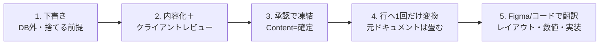

> ⚠️ この文書はNotion正本の書き出しミラーです（v14 / 2026-07-13時点の書き出し。正本は現在v18）。
> 正本: https://www.notion.so/39070c9d064c8148b983f9004c85fc3d
> 編集はNotion側で行い、版更新時に本ファイルを再書き出しすること。直接編集禁止（本ヘッダ節と後述の上書き注記を除く）。
>
> ### ⚠️ SoTの上書き（本リポには本文より優先して適用する）
>
> 本文（v14書き出し）は随所で「**部品・数値の正本はコード。Figmaは鏡**」と述べているが、
> **elxea-web-app（roji）については2026-08-08のSetaka宣言により反転済み** —
> **「Figmaの内容が全て正本。コード側はFigmaの設定に追従する」**。
> 本リポのデザイン値・トークンのSoTを判断するときは、本文中の「コードが正本」表現ではなく
> この上書き注記に従うこと。
>
> - 本リポ側の正本記述: `CLAUDE.md`「原則: SoTはFigma（全テンプレート共通）」／`scripts/design-system/design-map.json` の `$schema_note`
> - 開発工程の正本: roji Dev Ops Spec v1 https://app.notion.com/p/3b570c9d064c818fbee6f1dbeab63702 （原則1 = Figmaが正本）
> - 手順カード: `.claude/skills/dev-workflow.md`
> - **未了**: Notion正本（Design Ops Spec）側は2026-08-07時点で未反映（v18本文はまだ「正本はコード」）。
>   正本の版上げは本ミラーの責務外のため、デザイン側タスクとして別途起票する。
>   正本が更新され次第、本ファイルを再書き出しして本上書き注記を削除すること。
>
> ### 注記: プロジェクト名のリネーム
>
> 本文中のPJ名は書き出し時点のもの。旧名「Web App Development for elxea」は2026-08-01に
> **「elxea Web — EC & Media」**へリネーム済み（All Projects `22870c9d-064c-80cf-af4e-ff9204e25701`）。
> 本ミラーでは本文の該当4箇所を新名称に置換してある（正本の再書き出し時は正本側の表記に従う）。

# デザイン業務フロー総合仕様書（Design Ops Spec）
**一言**: このページ 1 枚で、コンテクストゼロの新セッションでも CIRCL / elxea / クライアントの全メディア（UI・Web・デザインシステム・ガイドライン・LP・DTP・バナー広告・営業資料・ロゴ/名刺）のデザイン業務を、同じ手順で迷わず回せるようにする総合マニュアル。DB の仕様書ではなく、デザイン業務フロー全般の運用書。
**状態**: 管理モデル v2（Structure List 単独 ＋ コードが正本 ＋ 文書は「章」）に全面準拠。旧 Section List は廃止済。現状 — elxea Web App = **本番稼働**（elxea.com・2026-07-12 公開・SITE_PASSWORD ゲート維持／Figma 製本完了・同期ガバナンス稼働・§21.1）／elxea Design System = 全 6 章完成（In progress）／OFE ガイドライン = 章 16 件中 実内容 2 件。
**Ask**: FYI（本マニュアルに沿って運用する）。ただしデータモデル（DB のプロパティ・リレーション構造）に触れる改訂は Decider=Human の決定ログが必須（§19）。個別作業のクライアント確定・金額・契約は Tier 2＝Setaka 承認。
---
## 版数・変更履歴
**版**: v14 / 2026-07-13 — elxea Web App の本番稼働（elxea.com・2026-07-12 公開・SITE_PASSWORD 維持・prod branch=main）／デプロイ経路（Vercel 無料プラン・GitHub Actions・docs-only 非デプロイ）／Figma 製本完了（@route 41 ページ・DS 化率 90.5%・新規 Module 10 種）／同期ガバナンス（マージ前 SubagentStop ゲート・週次 3 検査・トークンと色は Figma variable と code token 同時変更）を反映。§21.1 を as-built 化し §5・§13h に同期ガバナンスを追記。データモデル（正本の置き場）は不変につき §19 対象外（スナップショットと方法論の追記のみ）。前版 v13 / 2026-07-13 — Asset Hub（全社共用の内部ツール）の Figma 統治編入を反映（Mode=A）：§13(d) に「Asset Hub」ブロックを追記（独立 Figma ファイル／SoT=コード・Foundations は実値の鏡／標準8分類のうち Foundations・Components・Proposals・Review・Layouts を使用・Screens なし／凍結検査は社内ツール Tier＝機械化 6 検査＋コントラスト監査で 42 観点フル視覚回帰装置は新規導入しない／org 着せ替えは将来の加算的 override・既定挙動不変）。データモデル（正本の置き場＝コード）に触れる改訂につき §19 に従い Decider=Human で記録。決定＝判断ログ「Asset Hub の Figma 統治編入：独立ファイル・SoT=コード・中立化（無彩色・案A）承認」（Decider=Human・Verdict=承認・2026-07-13・`39c70c9d-064c-8165-9be5-c7284b459f86`・ds `ed72adb2-c32d-4a45-aa4e-073dfcb482cd`）。前版 v12 / 2026-07-11 — 画像アセット管理 v4 Phase 0 を反映（8 件・Mode=A）：§13(a) に画像枠 callout（v2.3・コード有り Rich 専用／台本文法の禁止条項に例外を彫り込み）／§14 良い例③・§16 Q&A 追補（Spec 自己矛盾の解消）／§5 SoT 表へ 3 行（asset identity＝台帳 Type=Asset／配置＝行本文 callout(Rich)／slot 契約＝コード Slot Registry）／§11.1 に v9 決定の適用範囲（Type=Asset と成果物行の境界・全社共通 1 台帳＋org プロパティ）／§13(c)・§10 に「callout は Content 凍結の対象外」／§17 に配信親スペックとの管轄境界＋lint fail 一次対応／§18 分担表に 4 行／§20 に台帳 Type=Asset・Slot Registry パス。データモデル（正本の置き場）に触れる改訂につき §19 に従い Decider=Human で記録。決定＝判断ログ「画像アセット管理 v4 Phase 0：Design Ops Spec 8 件改版（callout 方式/台帳一本化/全社共通台帳）」（Decider=Human・Verdict=承認・2026-07-11・`39a70c9d-064c-81f9-9882-f089df74f238`・ds `ed72adb2-c32d-4a45-aa4e-073dfcb482cd`。承認根拠＝Setaka 2026-07-10「クロスレビュー済み内容は全て承認」＋2026-07-11「③もOKですよ」）。前版 v11 / 2026-07-06 — Spec 再現性 完全化：ゼロコンテキスト別セッションが同一デザイン業務フローを辿れる状態へ 5 ギャップを閉塞。①§13(i) i-9(3) の 42 観点を「等」打切りから全 42 実列挙（カテゴリ＋各観点 1 行説明）に置換／②Figma ゲートのスキャナ本体（6 検査コード＋合格条件 totalCriticalHandmadeAtoms==0 かつ totalWrappedLabels==0＋fail3 分類＋緑レポート様式）を durable 保存（`~/.claude/skills/design-workflow/figma-gate-scanner.md`）し i-8② と design-workflow SKILL から参照／③§13(i) i-3.1 に Phase 0 テンプレ（定義シート 7 観点様式＋サンプラーボード構成）を収載／④i-8① にコード側関門の実 CI ファイル所在を明記（ci.yml / no-raw-colors.mjs / validate-tokens.ts / .storybook / eslint-suppressions.json / button-padding.test.ts）／⑤§21.1 clone 元カタログに汎用ルール（非 elxea/新規案件は各案件 DS Components ページを指す）を追記。第 6 検査＋fail3 分類は記録済み v1.3 の 5 検査を超える拡張につき、Setaka の本セッション明示委任（「判断を任せる」）に基づき Decider=Human で正式採用。決定＝判断ログ「Spec 再現性 完全化：42観点実列挙・ゲートscript永続化・Phase0テンプレ・CIファイル所在・第6検査正式化（Setaka 委任）」（Decider=Human・Verdict=承認・2026-07-06・`39470c9d-064c-8124-a6a2-f30f5ff55ded`・ds `ed72adb2-c32d-4a45-aa4e-073dfcb482cd`）。前版 v10 / 2026-07-06 — Spec 再現性強化：今セッション確定手順を明文化。§13(i) i-8② に第 6 検査＝短ラベル折返し assert・明示の合格条件・fail 3 分類を追補／i-9(1) にスケッチ選択理由の判断ログ記録を追記・i-9(4) に HF 制作手順を新設／§13(g) に NP→バックログ→正式化フローを追補／§21.1 に clone 元 DS 部品カタログ参照（primary=73:3673 逆記載訂正含む）・残 NP 既定台帳参照を追補。第 6 検査化・fail 3 分類は v1.3 の 5 チェック決定を超える as-built 拡張につき §19 ガバナンス（Decider=Human）で SoT 化。決定＝判断ログ「Spec 再現性強化：今セッション確定手順を明文化」（Decider=Human・承認済 2026-07-06・`39470c9d-064c-8100-b74b-e9c7d86d223c`・ds `ed72adb2-c32d-4a45-aa4e-073dfcb482cd`）。前版 v9 / 2026-07-06 — デザイン成果物の管理台帳を明文化（§11.1 に追記）：レイアウト / 部品 / 提案 / アセットは**新規 DB を作らず既存 Design Assets 台帳**（ds `81987020-c817-4481-9af3-132184c02a96`）で **Type＋Progress** により状態管理する。新規部品＝Type=Component／承認＝Progress=承認済／ダッシュボードは別セッションのものに委ね新規作成しない／二重管理しない。決定＝判断ログ「デザイン成果物の管理台帳＝既存 Design Assets DB（新規 DB 不要・二重管理しない）」（Decider=Human・承認済 2026-07-06・`39470c9d-064c-816e-b718-e1b218997dbe`・ds `ed72adb2-c32d-4a45-aa4e-073dfcb482cd`）。前版 v8 / 2026-07-05 — デザイン業務 共通ルール（全プロジェクト共通）を正式化：提案作成時に 2 モード（既定 HF＝DS 部品インスタンス＋トークン/テキストスタイルのみで組み準拠を「作り方」で構造保証／例外スケッチ＝明示 opt-in）を宣言し、チェックを二層化（毎回＝全 UI 要素が DS インスタンス/束縛済みかの 1 スキャンのみ・軽量／凍結時のみ＝42 観点フル監査＋視覚回帰＋コントラスト）。§13(i) に i-9 を新設し i-8 の監査ゲートを「毎回＝軽量 DS 準拠スキャン／凍結時＝42 観点フル」に整合。全プロジェクト共通ルール。決定＝判断ログ「デザイン業務 共通ルール: 2 モード（HF/スケッチ）＋二層チェック」（Decider=Human・承認済 2026-07-05・`39470c9d-064c-81b6-bd78-d4399b4f31f5`）。前版 v7 / 2026-07-05 — デザイン監査 v1.3：案 A（コード＝本当の関門／Figma は手作り禁止の機械チェック 1 個／人は方向のみ）で v1.2 を訂正（§13(i) i-8 を全面書き直し）。v1.2 の「Figma 側の既存監査基盤 `design-system-audit` を強制化」は誤り（同 skill はコード監査＝Figma 測定能力ゼロ、Figma を測る既存監査は存在しない）。前版 v6 / 2026-07-05 — 方法論 v1.2：DS 部品必須＋提示前 DS 適合監査ゲート（§13(i) に i-8 として追補・ルール A/B）。前版 v5 / 2026-07-04 — 提案方法論 v1.1 を正式収載（敵対的レビュー 2 本 circl-qa / 外部視点 の反映）。§13(i) 新設 ＋ §13(a)/§16 を仮 ID 運用に整合。前版 v4 / 2026-07-03 — 全文書き直し（v3 に混入していた Section List の記述を浄化し、管理モデル v2 を反映）。旧版（v3 / 2026-07-02、v2・v1 / 2026-07-01〜02）は Notion のページ履歴に残る。
**この文書は SSoT（Single Source of Truth＝唯一の正本）**。新規ページを作らず、本ページを全文更新して版を上げる。派生 Spec を別ページに作らない（§15 アンチパターン）。

**v13 → v14 の主な変更**

- **リリース**: elxea Web App が elxea.com で本番稼働（2026-07-12 公開・SITE_PASSWORD ゲート維持・production branch = main）。§21.1 を as-built 化。
- **デプロイ**: Vercel 無料プラン維持（Setaka 決定）。push-to-main → GitHub Actions（Vercel CLI・認証はリポジトリシークレット／値非記載）で全自動。org 私有リポの Vercel Git 連携（Hobby 不可）は不使用。docs-only push はデプロイ対象外（paths-ignore）。
- **デザインシステム**: Figma 製本完了（@route 41 ページ・component-level インスタンス化率 90.5%・理由なき素描き 0・除外台帳あり）。新規 DS 部品/Module 10 種（CollectionCard / FarmerCard / PlaylistCard / TeaMenuCard / Stepper / MenuTrigger / MembershipPlanCard / BtnService / TeaThumb / Tag ほか variant 追加）。
- **同期ガバナンス**（§5・§13h に方法論・§21.1 に適用状況）: (a) マージ前 SubagentStop ゲート（fidelity-table 必須・ds-instance-report 必須・EVIDENCE 実在チェック）(b) 週次 3 検査（instance-rate 決定論／ESLint no-raw-colors ratchet／design-fidelity-spotcheck: 変更ページ優先＋決定論ローテーション 9 週一巡・許容 max(2px,1%)・色 hex 完全一致・無変更週は thin 1 ページ）(c) 原則: トークン/色変更は Figma variable + code token 同時変更必須（片側先行禁止・Decision Log 記載済み）。
- **登録済み差分**: muted-foreground を AA 対応済みに更新（実値はコード・de-fatten）／記事テーマバッジ = 丸 pill 短縮ラベル（Figma 準拠に統一）／法人お問い合わせ = 1 カラム（Setaka 決定 2026-07-13・Figma 更新済み）／既知: 系統的コントラスト 22 件は第 2 ラウンド待ち（Issue systemic-contrast-aa）。
- **既知の限界**: 検知盲点（語彙回避・Figma branch 編集・外部 CMS 変化）／burst drift はマージ前ゲート未実装（PR #29 精査待ち）。
- **コンテンツ状態**: 41 ページ本番コピー反映済み／PREVIEW_SEED システム／画像台帳運用／実データ（農家写真・記事サムネ・商品説明）未投入。
**v7 → v8 の主な変更（2026-07-05）— デザイン業務 共通ルール（全プロジェクト共通）正式化**
- **全プロジェクト共通の「作り方」ルールを §13(i) に i-9 として新設**。核心＝「DS 準拠を『後から重く監査』でなく『作り方』で構造的に保証し、重い監査は凍結時だけに寄せる」。背景＝直近の DS 準拠監査で 118 件の違反、原因は DS に部品があるのに手描き（scratch 再現）で組んだこと。
- **2 モード（提案作成時に宣言・既定は HF）**：HF（DS 準拠・既定）＝DS 部品インスタンス＋トークン/テキストスタイルのみで組み、変えるのはレイアウト・構成だけ（DS 外は NP＋理由 1 行で明示）／スケッチ（例外・明示 opt-in）＝DS 外の自由探索（準拠保証の対象外）。既定 HF、Setaka が「スケッチで」の時のみ。
- **二層チェック**：毎回（提案ごと・軽量）＝全 UI 要素が DS インスタンス/束縛済みかの 1 スキャンのみ（緑でなければ提示不可）／凍結時のみ（稀・重量）＝42 観点フル監査＋視覚回帰（Chromatic）＋コントラストを Proposals→Layouts 移動時・スケッチの DS 昇格時に 1 回。毎回は走らせない。
- **i-8（監査ゲート）を二層チェックに整合**：「Figma 提示前＝触れた要素だけ／凍結時＝フル 1 回」を「毎回＝軽量 DS 準拠スキャン／凍結時＝42 観点フル」と明記。
- **決定根拠**：判断ログ「デザイン業務 共通ルール: 2 モード（HF/スケッチ）＋二層チェック（毎回軽量/凍結時フル42観点）」（Decider=Human・承認済 2026-07-05・`39470c9d-064c-81b6-bd78-d4399b4f31f5`・ds `ed72adb2-c32d-4a45-aa4e-073dfcb482cd`）。
**v6 → v7 の主な変更（2026-07-05）— デザイン監査 v1.3（案 A・v1.2 訂正）**
- **v1.2 の誤りを訂正**: v1.2 は「Figma 側の既存監査基盤 `design-system-audit` / `visual-qa` を強制化」と書いたが、`design-system-audit` は実体が**コード監査 skill**（トークンファイル find＋grep＋Playwright 実機／`figma`・`node`・`bbox`・`mcp` は grep ヒット 0）で **Figma 測定能力ゼロ**。Figma を測る既存監査は**存在しなかった**。「既存を強制化」は成立しない。敵対的レビュー 2 本（内部 circl-qa `39470c9d-064c-81db-8418-f894103c61c4`＝絶対要件未達／外部実務 `39470c9d-064c-81f5-8a51-dc4040079080`＝方向は正・原因未潰し）が独立に同じ穴を指摘。
- **案 A を採用（enforcement の重心をコードへ）**: ① **コード側＝本当の関門**（この製品はコードが正本）。既存の機械チェック（lint / `validate:tokens` / Chromatic / Storybook a11y）を「助言」から「違反でビルドを落とす関門」へ格上げ＝主たる enforcement。② **Figma 側＝方向探索**。新規の軽い機械チェック **1 個だけ**置く（提示前に Figma ノードデータで assert・下記 i-8）。③ **人（Setaka）＝方向・世界観のみ判断**。細部適合は機械が全数保証し、**Boss のスクショ抜取は enforcement から外す**（抜取＝取りこぼしが人に届くため機械レポートに置換）。
- **監査制御の訂正**: **CI が唯一の強制点**。監査スタンプは **DS/トークンの版連動**（共有 DS 部品・トークンの版が変われば凍結物のスタンプを失効させ再監査）。変更の大きさで深さ可変。
- **v1.1/v1.2 矛盾の解消**: i-4「編集も Chromatic 機械検知」×「凍結後は再監査しない」→「凍結後は差分が無い限り再監査しない。DS/トークン版変化・明示再オープン時のみ再監査」で統一。i-6 の full-audit 発火＝**Proposals→Layouts へ移す（凍結）時にフル 1 回**と明記。
- **決定根拠**: 判断ログ「デザイン監査 v1.3：案 A（コード＝関門/Figma は手作り禁止 1 チェック）— v1.2 訂正」（Decider=Human・承認済 2026-07-05・`39470c9d-064c-813a-87a2-e9769aa6aac8`・ds `ed72adb2-c32d-4a45-aa4e-073dfcb482cd`）。
**v5 → v6 の主な変更（2026-07-05）**
- **提案方法論 v1.2：DS 適合ゲートを §13(i) に i-8 として追補**。ルール A（DS 部品必須・非交渉＝あるものは使う/無いものだけ作る）＋ルール B（提示前 DS 適合監査ゲート 6 項目・作成者が自己検査し不合格は自分で直してから提示）。測れる規約（DS 部品使用・padding・トークン・タップ領域・内部メモ非露出・コントラスト）は機械監査で担保し、Setaka は好み・方向・世界観のみ判断する（padding 係をさせない）。
- **決定根拠**: 判断ログ「デザイン方法論 v1.2：DS 部品必須＋提示前 DS 適合監査ゲート」（Decider=Human・承認済 2026-07-05・`39470c9d-064c-812d-ae14-eb503410b4f7`・ds `ed72adb2-c32d-4a45-aa4e-073dfcb482cd`）。背景＝elxea Web App で手作り部品・padding 欠陥を Setaka が手動指摘 → 自動化要求。
**v4 → v5 の主な変更（2026-07-04）**
- **提案方法論 v1.1 を §13(i) に正式収載**: 発案・選定・維持の運用層（2 層構造・3 方向 A/B/C・Phase 0/A/B・一貫性 4 アンカー［基準セット固定］・選定ログ必須・凍結分離・運用衛生）。敵対的レビュー 2 本（circl-qa `39370c9d-064c-8127-89a6-e5f0bee0a1a6` / 外部視点 `39370c9d-064c-8196-9bf5-c6a81b43c3e0`）の指摘 8 点を反映。
- **§13(a) / §16 を仮 ID（NP-01）運用に整合**: 無名部品の命名デッドロックを解消（仮 ID は識別子であって命名ではない・正式命名は採用時 1 回のまま）。
- **決定根拠**: 判断ログ「デザイン提案方法論 v1.1 確定」（Decider=Human・承認済・ds `ed72adb2-c32d-4a45-aa4e-073dfcb482cd`）。
**v3 → v4 の主な変更**
- **Section List の廃止を全面反映**: v3 は Section List を「生きた 5 番目の DB（状態バリエーション管理）」として記載していたが、これは人間未承認のまま仕様書に混入した誤り。管理モデル v2（決定ログ `39170c9d-064c-8107-9483-f27ad5f62acb`）で廃止が確定済。v4 では構造 DB を **Structure List 単独**に一本化した。
- **状態バリエーションの持ち方を変更**: DB（旧 Section List）ではなく、**コードのバリアント ＋ Figma フレーム命名**で持つ（§16 Q&A）。
- **スキーマ v2 運用表を新設（§4）**: 現行 18 プロパティのうち運用で使う 13 個を「誰が・いつ・どの値を・何のために」で表化。削除 7・追加 2（公開状態／成果物）を明記。
- **SoT を双方向で明記（§5）**: 創作は Figma → コード、記録は コード → Figma（鏡）。部品・数値の正本はコード、Storybook が図鑑、Figma はライブラリ＋探索。ライブラリ乖離は機械計測で管理。
- **手順書 8 本（§13）・良い例/悪い例（§14）・アンチパターン集（§15）・迷ったときの Q&A（§16）・実行主体の分担表（§18）を追加**。メディア深度（§7）を Rich / Light / Flat で再定義。
- **決定根拠**: `39170c9d-064c-8107-9483-f27ad5f62acb`（デザインリソース管理モデル v2 確定・Decider=Human・承認済）。
> **関連（クリックで開ける正本）**
> 管理モデル v2 決定ログ（5 決定＋撤回 4 条件）: <mention-page url="https://app.notion.com/p/39170c9d064c81079483f27ad5f62acb"/>
> フィルタ基本ルール決定（PJ ページの linked view は必ず該当 Project でフィルタ）: <mention-page url="https://app.notion.com/p/39170c9d064c81f792bbcec0a07c7b03"/>
> 掃除 Devlog（ページ行一本化／Section List 廃止／view 撤去／Archive 台帳）: <mention-page url="https://app.notion.com/p/39170c9d064c8154bd72e2fcbc40d166"/>
> 模範章 — カラー: <mention-page url="https://app.notion.com/p/39170c9d064c8100b379eac757f4bda6"/> ／ 原則: <mention-page url="https://app.notion.com/p/39170c9d064c811d8689cb28415e2f76"/>
## 0. 3 分で全体像 ＋ この文書の使い方
**読者の前提**: あなたはこの案件のコンテクストを持たない新セッションかもしれない。まず本節だけ読めば動ける。以降は用途に応じて必要な節へ飛ぶ。
**用語（初出定義）**
- **SSoT / 正本（Single Source of Truth）**: ある事実を書いてよい唯一の場所。「ここを直せば全部直る」という一箇所。
- **DB / データソース（data source）**: Notion のデータベース。API では `collection://<data source id>` で指す。本書は各 DB の実 ID を明記する。
- **行（row）**: DB の 1 レコード＝ 1 ページ。本書では「1 画面＝ 1 行」「1 章＝ 1 行」のように使う。
- **章（chapter）/ ページ（page）**: Structure List の行が取る 2 種の「種類」。章＝デザインシステム/ガイドラインの文章単位、ページ＝UI/Web の画面単位。
- **de-fatten（デファット）**: 行に数値（HEX / px）をベタ書きせず「値の正本は Figma / コード」と書いて痩せさせること。二重管理を防ぐ。
- **Figma Node ID**: Figma 上の部品 / フレームの位置を指す ID（例 `654:7`）。
- **Foundation 層**: 色・タイポグラフィ・スペーシングの変数（トークン）定義。見た目はここで決める（コードの `@theme`／Figma 変数）。
- **shadcn/ui**: 基盤 UI 部品ライブラリ（Radix ＋ CVA ＋ `cn()`）。コード有り案件の土台に構造そのまま使う。
- **Storybook（図鑑）/ Figma（鏡）**: コードが正本の部品を、Storybook が一覧化（図鑑）、Figma が視覚的に写す（鏡）。
**3 分で全体像**: デザインの事実は役割ごとに置き場を 1 つに固定する。同じ事実を 2 箇所で保守しない。
- **構成・順序・文章内容** → **Structure List**（Notion／ページ行・章行）
- **数値・トークン・レイアウト・実装・部品の正本** → **コード / Figma**（コードが正本、Figma は鏡・探索・ライブラリ）
- **原則・ルール・Do/Don't・本 Spec** → **Document DB**（Notion）
- **成果物 1 本＝ 1 行の索引** → **Design Assets 台帳**（Notion）
- **部品カタログ** → **Component List**（Notion／**コードを持たないメディア専用**。コード有り案件では使わない＝正本はコード）
**2 原則（詳細は §2）**: ① 1 つの事実の家は 1 つ（1 事実 1 か所）。② 機械が作れる一覧を、人が手で保守しない。
**まず何を読むか（用途別）**
<table header-row="true">
<tr>
<td>あなたの用途</td>
<td>読む節</td>
</tr>
<tr>
<td>全体像を掴む</td>
<td>§0 → §2（2 原則）→ §5（SoT）→ §10（ワークフロー）</td>
</tr>
<tr>
<td>構造 DB をどう使うか知る</td>
<td>§3（Structure 単独）→ §4（スキーマ v2）</td>
</tr>
<tr>
<td>コード有りの UI 案件を始める</td>
<td>§13(e) → §6（アーキ）→ §12（cockpit）</td>
</tr>
<tr>
<td>コード無しの文書（ガイドライン等）を書く</td>
<td>§13(e) → §13(b)（章の書き方）→ §21.3（OFE の現状）</td>
</tr>
<tr>
<td>営業資料・バナー・ロゴ等の軽い案件</td>
<td>§7（メディア深度）→ §13(e) の Light/Flat</td>
</tr>
<tr>
<td>手を動かす手順が欲しい</td>
<td>§13（手順書 8 本）</td>
</tr>
<tr>
<td>迷った／判断に詰まった</td>
<td>§16（Q&A）→ §15（アンチパターン）</td>
</tr>
<tr>
<td>進行中案件の「今」を知る</td>
<td>§20（見つけ方）→ §21（スナップショット）</td>
</tr>
</table>
**今すぐ着手できる進行中案件（2026-07-03 時点・詳細は §21）**
- **OFE デザインガイドライン**（Project「Branding for OMRON Field Engineering」）: ダミー 14 章の本文執筆が次アクション。→ §13(b)・§21.3。
- **elxea Web App**（Project「elxea Web — EC & Media」）: **本番稼働**（elxea.com・SITE_PASSWORD ゲート）。スキーマ v2 運用・Figma 製本完了・同期ガバナンス稼働。→ §21.1。
- **elxea Design System**（Project「elxea Design System」）: 全 6 章完成・In progress（常設資産）。→ §21.2。
## 1. 目的とスコープ
**目的**: 全メディアのデザインリソースを二重管理なく一貫管理し、「内容先行 → クライアントレビュー → 凍結 → 行へ変換 → Figma/コード翻訳」のワークフローを、担当が誰でも同じ手順で回せるようにする。
**対象メディア（スコープ）**: UI/Web、デザインシステム（DS）、デザインガイドライン、LP、DTP（印刷物）、バナー広告、営業資料、ロゴ・名刺。**全 org 横断**（CIRCL / elxea / クライアント案件）。
**設計意図（なぜ DB を増やさないか）**: 過去に elxea 専用 DB（`-elxea` サフィックス）を乱立させ破綻しかけた。**役割で置き場を固定**すれば、案件・メディア・org が増えても DB は増えず、横断検索と部品の再利用が効く。会社・メディア・案件の区別は DB を分けず、**Structure List の「Project 欄」と「種類 (Type)」**のタグで仕分ける。「増やさないこと」がスケールの条件。
**スケール条件（増やさない前提が崩れる境界）**: 下記が起きたら DB / 正本配置の再設計を検討する（撤回 4 条件・§19）。すなわち — 部品改修が常時 10 本以上並走／専任デザインチーム発足／文書の消費チームが 3 つ以上／成果物の案件横断再利用。それまでは本モデルを維持する。
**スコープ外**: 見た目・数値の正本（Figma / コードが持つ。Notion の DB 群は索引・構造・文章のみ）。ページ番号の手管理（レイアウト出力の結果として扱い、Notion では保持しない）。タスクの進行管理（All Tasks DB が持つ。Structure List は構造であってタスク表ではない）。
## 2. 2 原則（この文書全体の背骨）
すべての手順は次の 2 原則から導かれる。迷ったら原則に戻る。
**原則① 1 つの事実の家は 1 つ（1 事実 1 か所）**
同じ事実を 2 箇所に置かない。「どこを直せば全部直るか」が常に一意に言える状態を保つ。数値は Figma/コード、構成・文章は Structure List の行、原則は Document DB — 役割で家を固定し、境界をまたいで同じ事実を持たせない。生きた正本は常に 1 つ（§10）。
**原則② 機械が作れる一覧を、人が手で保守しない**
コードから機械生成できる一覧（部品カタログ・トークン一覧・数値表）を、人が Notion に手写しで並行保守しない。手写し台帳は必ず腐る（実際にリンク切れ 2 件が発生し、これが管理モデル再設計の契機になった）。一覧が欲しくなったら「これは機械生成できないか？」を先に問う（§16）。
**補助原則: 創作の向きと記録の向きを分ける**
作るときは Figma → コード（探索・試行）。確定後の記録は コード → Figma（鏡・同期）。向きを混ぜると「Figma にしかない状態」がコードに溜まり、正本が二重化する（§5）。
## 3. 構造 DB は Structure List 単独
**構造（ページ／章の並び・内容）を持つ Notion DB は Structure List ただ 1 つ**。data source `9838311b-ddb0-4e0f-ac89-774a36c59b04`（wrapper DB `a5b3e2658bd8474b9af2b21c4ec3e524`／タイトル列＝**ページ名**）。行は **種類 (Type) = ページ ／ 章** の 2 種（旧「セクション」値は廃止・使わない）。UI/Web は「ページ」行、DS/ガイドラインは「章」行で持つ。
**旧 Section List は廃止（v1）**。かつて状態バリエーション（default / loading / error / empty …）を専用 DB で管理していたが、実データ検査で「Section 行の正体は部品かページ内容に割れ、中間層に固有の中身が無い」ことが判明し廃止した。DB は削除せず「Section List \[廃止 v1・2026-07-03\]」へ in-place 改名し、行は全保全（非破壊・可逆）。経緯とアーカイブ台帳は **Archive (Design Ops v1)** ページ `39170c9d-064c-8128-9746-c1c1694f64a2`。旧 data source（参照専用・書き込み禁止）は `2a590da5-1a64-4f3f-8c50-11a5f0700351`。**新規に Section List を作り直さない**（§15）。状態バリエーションは §16 の方式で持つ。
**Component List はコードを持たないメディア専用に存続**。data source `ba6dafb7-233b-4a88-aad2-3cd5c3584b9e`。**コードを持つ案件（elxea Web App 等）では使わない** — 部品の正本はコード（`components/ui/` 等）＋ Storybook（図鑑）だから、Notion に手写しの部品カタログを持つと原則②に反する。コード基盤を持たないメディア（一部のビジュアル/印刷系で部品概念を Notion 上で扱う必要がある場合）に限って使う。elxea Web App PJ では linked view を撤去済（掃除 Devlog）。
> **要点**: 「構造は Structure List、部品と数値はコード、原則は Document DB、成果物索引は台帳」。Notion に構造 DB を 2 つ以上持たせない。
## 4. スキーマ v2 プロパティ運用表（Structure List）
**読み方**: 物理削除は 2026-07-03 実施済み（現物 13 プロパティ）。削除前の全値はスナップショット `39170c9d-064c-81aa-a37f-f8ad32379350` に保全（可逆・非破壊）。スキーマ v2 の「13 列」は**運用スキーマ**＝ 実際に使ってよい列の集合で、現物 13 プロパティと一致する。**新規行は下記 13 列だけを使う**。
**使う 13 列（誰が・いつ・どの値を・何のために）**
<table header-row="true">
<tr>
<td>プロパティ</td>
<td>型</td>
<td>誰が・いつ設定</td>
<td>値</td>
<td>何のために</td>
</tr>
<tr>
<td>ページ名</td>
<td>title</td>
<td>制作者・行作成時</td>
<td>画面名 / 章名</td>
<td>行の識別（1 画面＝ 1 行 / 1 章＝ 1 行）</td>
</tr>
<tr>
<td>種類 (Type)</td>
<td>select</td>
<td>制作者・行作成時</td>
<td>**ページ / 章**（2 値）</td>
<td>横断分類の唯一軸。フィルタ・横断検索はこれで行う</td>
</tr>
<tr>
<td>順番 (Order)</td>
<td>number</td>
<td>制作者・構成確定時</td>
<td>10 / 20 / 30…（隙間運用）</td>
<td>並び順。間に挿入できるよう間隔を空ける</td>
</tr>
<tr>
<td>ページ階層</td>
<td>number</td>
<td>制作者・構成確定時</td>
<td>サイトマップの深さ（例 1 / 2 / 3）</td>
<td>サイト階層の深さ（Setaka 確定ピック・順番とは別軸）</td>
</tr>
<tr>
<td>Figma</td>
<td>url</td>
<td>制作者・翻訳時</td>
<td>ボード / ノード URL</td>
<td>数値・レイアウトの正本（Figma/コード）への索引</td>
</tr>
<tr>
<td>ステータス：Content</td>
<td>select</td>
<td>制作者→レビュー承認時</td>
<td>未定稿 / ドラフト / **確定**</td>
<td>凍結の器。確定＝内容を凍結（§10）</td>
</tr>
<tr>
<td>ステータス：Design</td>
<td>status</td>
<td>制作者・進行時</td>
<td>Not started / In progress / Done</td>
<td>デザイン工程の進捗</td>
</tr>
<tr>
<td>ステータス：Dev</td>
<td>status</td>
<td>開発者・進行時</td>
<td>Not started / In progress / Done</td>
<td>実装工程の進捗</td>
</tr>
<tr>
<td>Project</td>
<td>relation → All Projects</td>
<td>制作者・行作成時</td>
<td>案件</td>
<td>案件で仕分ける（DB を分けない代わりの軸）</td>
</tr>
<tr>
<td>公開状態</td>
<td>select</td>
<td>制作者・本番リリース時</td>
<td>企画中 / 公開中 / 廃止予定（**ページ行のみ**）</td>
<td>ライブに出ているかを追跡。企画中→公開中は本番リリース時に更新</td>
</tr>
<tr>
<td>URL</td>
<td>text</td>
<td>制作者</td>
<td>公開 URL / パス</td>
<td>ページの実 URL（ページ行）</td>
</tr>
<tr>
<td>Data Source</td>
<td>select</td>
<td>制作者・行作成時</td>
<td>Static / Shopify / Sanity / Shopify+Sanity / Client</td>
<td>このページの中身がどこから来るかをコードを読まずに把握する</td>
</tr>
<tr>
<td>成果物</td>
<td>relation → Design Assets 台帳</td>
<td>制作者・台帳登録時</td>
<td>成果物 1 行</td>
<td>複数の構成行を 1 成果物へ束ねる（§9）</td>
</tr>
</table>
**削除した 7 列（理由 1 行ずつ・2026-07-03 物理削除済み）**
- **Components**（旧 Component List への relation）— 部品の正本はコード（`components/ui/` 等）＋ Storybook。使用マップは機械生成できるため、Notion に手写しの relation を持たない（原則②）。
- **Sections**（旧 Section List への relation）— 関係先の Section List が廃止され、参照が宙に浮くため。
- **詳細**（旧世代の内容置き場）— 内容 SoT は「行の本文」に一本化。プロパティに章の中身を詰めない（§14）。
- **Type**（旧 elxea：静的 / 一覧 / 詳細 / LP / フォーム / 認証 / インタラクティブ）— 「種類 (Type)」へ横断軸を一本化。分類軸が 2 つ併存するのが最大の事故源だった。
- **カテゴリー**（Top / 商品 / コンテンツ / …）— elxea サイト固有の情報設計。全メディア横断スキーマに一般化しない。
- **レスポンシブ**（PC+SP / PCのみ / SPのみ）— 見た目・実装の属性。Figma / コードが持つ。
- **優先度**（High / Mid / Low）— タスク管理の属性。構造 DB でなく All Tasks が持つ。
**保留（未決定・スキーマに入れない）**
- **翻訳ステータス** — 多言語（i18n）の持ち方が未解決（行で持つか別レイヤーか未定）。確定日 未定。
- **確定日（凍結日時）** — ステータス：Content＝確定 とは別に「いつ凍結したか」を列で持つか検討中。未確定。
## 5. SoTループ（創作の向き ／ 記録の向き）

> ⚠️ **elxea-web-app（roji）では本節は反転して読むこと。** 2026-08-08のSetaka宣言により、
> 本リポのデザイン値・トークンの正本は **Figma**、コードは追従側（`tokens/base.json` が写し・`dist/` が生成物）。
> 「創作 = Figma → コード」の向きは変わらないが、**確定後の記録で「コードが正本になる」という部分は本リポには適用しない**。
> 値が食い違ったら直す方向は常に「コードをFigmaに合わせる」。詳細はファイル冒頭の「SoTの上書き」節。
> 以下の本文はNotion正本v14書き出しのままで、他メディア（コードを持たない案件等）にはそのまま適用される。

部品と数値の正本は **コード**。**Storybook が図鑑**（機械生成の一覧）、**Figma はライブラリ＋探索の場・鏡**。作る向きと記録する向きを分けることで、正本が二重化しない。
<table header-row="true">
<tr>
<td>局面</td>
<td>向き</td>
<td>やること</td>
</tr>
<tr>
<td>創作（探索・試行）</td>
<td>**Figma → コード**</td>
<td>Figma で案を探索し、確定したらコードに実装する（コードが正本になる）</td>
</tr>
<tr>
<td>記録（確定後の同期）</td>
<td>**コード → Figma（鏡）**</td>
<td>コードの部品・トークンを Figma 変数 / フレームへ同期し、Figma を最新の鏡に保つ</td>
</tr>
</table>
**事実の種類 → 正本の置き場**
<table header-row="true">
<tr>
<td>事実の種類</td>
<td>正本</td>
<td>なぜ</td>
</tr>
<tr>
<td>部品（構造・挙動・バリアント）</td>
<td>コード（`components/`）＋ Storybook 図鑑</td>
<td>実装が唯一の真実。手写しカタログは腐る（原則②）</td>
</tr>
<tr>
<td>数値（HEX / OKLCH / px / トークン値）</td>
<td>コード（`@theme` / tokens）＝正本、Figma 変数＝鏡</td>
<td>行にベタ書きすると必ず乖離する（de-fatten・§14）</td>
</tr>
<tr>
<td>構成・順序・文章内容</td>
<td>Structure List の行（本文＋順番）</td>
<td>構造と内容を同じ場所に置くとズレない</td>
</tr>
<tr>
<td>原則・ルール・Do/Don't</td>
<td>Document DB（章行は索引としてリンク）</td>
<td>ルールは横断参照される。1 か所に集約</td>
</tr>
<tr>
<td>レイアウト・見た目</td>
<td>Figma</td>
<td>視覚は Figma が唯一の真実</td>
</tr>
<tr>
<td>アセットの identity（再利用素材＝ロゴ / 写真 / 図版）</td>
<td>Design Assets 台帳の Type=Asset 行（asset_id・current_url・focal / alt）</td>
<td>7/6 決定で新規 DB を作らず台帳一本化（§11.1・判断ログ 39470c9d-064c-816e）</td>
</tr>
<tr>
<td>画像の配置（コード有り Rich ページ）</td>
<td>ページ行本文の画像枠 callout（slot / asset 参照・§13(a)）</td>
<td>本文に URL・見せ方を焼き込まない。文書系 / Light / Flat は対象外</td>
</tr>
<tr>
<td>画像枠 slot の契約（型・targetAspect）</td>
<td>コード内 Slot Registry（各 product repo・例 src/content/slot-registry.ts）</td>
<td>枠契約の正本はコード一本。CI が call-site と照合</td>
</tr>
</table>
**ライブラリ乖離の扱い（「道具は同期・成果物は自由」）**
- **道具（基礎部品・トークン）は同期する**: shadcn/ui の基礎部品は公式キットで自動整合。独自部品は変更時に Figma へ更新。コード ↔ Figma の差分は**機械計測**（例 `scripts/design-system/sync-figma-read.ts`）で可視化する。
- **成果物（実際の画面・提案）は自由**: 個々の画面レイアウトまで Figma とコードを一致させ続けようとしない。同期の対象は「道具」であって、道具を使って作った「成果物」ではない。乖離が問題になるのは道具の層だけ。

**同期ガバナンス（片側先行の禁止・二層防御）**

- **原則（トークン / 色）**: トークン・色の変更は **Figma variable と code token を同時に変更**する（片側先行禁止）。コードが正本・Figma が鏡でも、値の変更は両面を 1 回で揃える。根拠は Decision Log（記載済み）。
- **マージ前ゲート（SubagentStop）**: デザイン反映 PR は SubagentStop ゲートで **fidelity-table・ds-instance-report・EVIDENCE 実在**を必須チェックし、証跡なきマージを止める。
- **週次検査（3 本柱）**: instance-rate（決定論）／ESLint no-raw-colors ratchet（生値混入の逆行を禁止）／design-fidelity-spotcheck（変更ページ優先＋決定論ローテーションで全ページを一巡・許容は max(2px,1%)、色は hex 完全一致）。合格は記録のみ・不合格は Issue 起票・検査自体の失敗も loud。運用詳細は §13h。
- **同期の線引き（何を Figma に写すか）**: 同期する対象は **トークン**（常時・機械同期）と **実使用部品の見本**（変更時 ＋ リデザイン・ウェーブ開始時の差分検査）の 2 つだけ。**ページの絵（画面レイアウト）は同期しない** — リデザイン時に Proposals で新たに生まれ、確定版が Layouts に溜まることで、必要な範囲から Figma 版が自然にできていく（全ページを先回りで Figma 化しない）。詳細は §13(d) の「Proposals の空間規約とラウンド運用」と対で運用する。
## 6. コード有り案件のアーキテクチャ
正本は原則章（<mention-page url="https://app.notion.com/p/39170c9d064c811d8689cb28415e2f76"/>）とリポの `CLAUDE.md`。要旨：
- **基盤は shadcn/ui をそのまま使う** — プリミティブ（new-york・Radix ＋ CVA ＋ `cn()`）を `npx shadcn add` で `components/ui/` に取り込み、**構造・挙動を作り替えない**。アクセシビリティと品質を基盤に委ね、車輪の再発明をしない。
- **見た目は Foundation 層で決める** — 色・タイポグラフィ・スペーシングを `@theme`（`app/globals.css`）に変数（Foundation トークン）で定義し、shadcn 部品に適用して見た目をブランドへ寄せる。部品・画面は役割名で参照し、生の値を直接持たない。
- **足りないものだけ独自に足す** — shadcn に無い部品（例 ProductCard・SiteHeader）だけを独自作成し、その独自部品も Foundation トークン ＋ shadcn プリミティブの上に組む（基盤と地続きに保つ）。
- **3 層のトークン** — 生の値（Core）／用途別の役割（Semantic）／適用値（Component）。画面は役割名だけを使う。
- **正本はコード** — 部品・値の正本はコード、Storybook が図鑑、Figma が鏡（§5）。
## 7. メディア深度（Rich / Light / Flat）
**全メディアで同じ重さの運用をしない**。媒体に応じて構造の深さを変える。軽い案件を重い運用に巻き込まない。
<table header-row="true">
<tr>
<td>深度</td>
<td>メディア例</td>
<td>Notion での持ち方</td>
<td>部品ライブラリ</td>
</tr>
<tr>
<td>**Rich**（構造リッチ）</td>
<td>コード有り UI/Web・DS・デザインガイドライン</td>
<td>Structure List に **章 / ページ行**（構成・内容 SoT）＋ コード / Figma フル連携</td>
<td>持つ（コード＝正本／DS は Storybook 図鑑）</td>
</tr>
<tr>
<td>**Light**（構造ライト）</td>
<td>営業資料・バナー広告</td>
<td>Design Assets 台帳に **1 行**。必要なら Structure List に章を数本（構成メモ）</td>
<td>**持たない**（成果物ごとの使い切り。共有ライブラリ化しない）</td>
</tr>
<tr>
<td>**Flat**（ほぼ平ら）</td>
<td>ロゴ・名刺・印刷物（DTP）</td>
<td>台帳 ＋ ルール（Document DB）＋ 納品ファイル</td>
<td>持たない</td>
</tr>
</table>
- **LP は分岐**: コードで作る（実装を伴う）なら **Rich**、外部ツール（ノーコード / デザインのみ）で作るなら **Light**。
- **設計意図**: バナー 1 本のために部品ライブラリを整備するのは過剰。DTP のページ番号はレイアウト由来なので Notion にスキーマ追加は不要（台帳＋ドキュメントで足りる）。
## 8. 3 ケース比較（同じモデルが媒体でどう変わるか）
<table header-row="true">
<tr>
<td>観点</td>
<td>コード無し文書（OFE ガイドライン）</td>
<td>コード有り UI（elxea Web App）</td>
<td>デザインシステム（elxea DS・3 本脚）</td>
</tr>
<tr>
<td>Structure List の行</td>
<td>**章**行（順番＋本文＝内容 SoT）</td>
<td>**ページ**行（画面ごと）</td>
<td>**章**行（原則 / カラー / タイポ…）</td>
</tr>
<tr>
<td>部品の持ち方</td>
<td>Component List（コード無しのため可）</td>
<td>**コードが正本**（Component List 不使用）</td>
<td>**コードが正本** ＋ Storybook 図鑑</td>
</tr>
<tr>
<td>数値の正本</td>
<td>Figma（章の Figma 列が指す）</td>
<td>コード（`@theme` / tokens）＝正本・Figma は鏡</td>
<td>コード（tokens）＝正本・Figma 変数は鏡</td>
</tr>
<tr>
<td>凍結</td>
<td>ステータス：Content＝確定（章ごと）</td>
<td>同（ページごと）</td>
<td>同（章ごと・全 6 章完成）</td>
</tr>
<tr>
<td>成果物台帳</td>
<td>1 行「OFE Design Guideline」</td>
<td>Web App 成果物として台帳＋ cockpit</td>
<td>DS 成果物（常設資産・独立 PJ）</td>
</tr>
<tr>
<td>3 本脚（正本 / 図鑑 / 鏡）</td>
<td>Figma / —（図鑑なし）/ —</td>
<td>コード / Storybook / Figma</td>
<td>**コード / Storybook / Figma**（業界標準構成）</td>
</tr>
</table>
## 9. 成果物と Project の階層
事実は次の階層で位置づける。上から下へ「誰の・どの案件の・どの成果物の・どの構成の・何の中身か」が一意に辿れる。
- **Company（会社）** → All Projects の Company / Client 欄。CIRCL / elxea / クライアント会社。
- **Project（案件）** → All Projects `22263392-2e8d-4f63-912b-c74a4299e0be`。「elxea Web — EC & Media」等。すべての行が Project でひもづく。
- **成果物（1 本＝ 1 行）** → **Design Assets 台帳** `81987020-c817-4481-9af3-132184c02a96` の 1 行（薄い索引：媒体・進捗・プレビュー）。
- **構成（章 / ページ）** → **Structure List** の行（順番＋種類＋本文）。1 成果物が複数の構成行を持つときは、各構成行の **成果物リレーション**（§4 追加列）で台帳の 1 行へ束ねる。
- **中身** → 行の本文（文章）＋ Figma / コード（数値・レイアウト・実装）。
**Project 昇格の基準**: 1 案件に複数成果物があっても原則 DB は増やさず、**成果物リレーションで束ねる**。**独立 Project に昇格するのは「常設資産」だけ**（例 elxea Design System — 案件をまたいで生き続ける土台）。単発の成果物のために PJ を新設しない。
## 10. ワークフロー（内容先行・一度に 1 つの正本）
下書き（DB 外）→ 内容化＋クライアントレビュー → 承認で凍結 → 行へ 1 回だけ変換 → Figma / コードで翻訳。**この順で進める。**

1. **下書き（ラフ）**: DB 外・捨てる前提。構造を "発見" する段階。
2. **内容化＋クライアントレビュー**: 文書化してレビューにかける（人の判断ゲート）。
3. **承認で凍結**: 「確定＝凍結」を Structure List の **ステータス：Content＝確定** で追跡する（画像枠 callout はこの凍結の対象外＝Layouts 昇格後も差し替え可・§13(c)）。
4. **行へ 1 回だけ変換**: Structure List の行へ移し、**元ドキュメントは畳む**（並行保守しない）。
5. **Figma / コードで翻訳**: レイアウト・数値・実装に落とし、行の Figma 列にリンク（コード有りはコードが正本）。
> **「一度に 1 つの正本」ルール**: 生きた正本は常に 1 つ。レビュー用ドキュメントも Figma も、その時々の正本の "下流"。**同じ内容を 2 か所で生かし続けない**（承認凍結時の 1 回の移動だけが例外）。内容が固まる前に Figma で作り込むと、レビュー修正のたびに二重に直す羽目になる。
## 11. 台帳（Design Assets）と Document DB の運用
### 11.1 Design Assets 台帳 — 成果物 1 本＝ 1 行の索引
data source `81987020-c817-4481-9af3-132184c02a96`（wrapper `1195c76e-f1e8-4c1f-845d-ebdafb3e269a`／タイトル列＝**Name**）。登録は共有 skill `design-asset-record` に従う。
<table header-row="true">
<tr>
<td>プロパティ</td>
<td>値・意味</td>
</tr>
<tr>
<td>Medium</td>
<td>UI / Guideline / Logo / Editorial / Packaging / Motion / Spatial / Campaign（媒体で DB を分けずこのラベルで分類）</td>
</tr>
<tr>
<td>Type</td>
<td>Layout / Component / Proposal / Asset</td>
</tr>
<tr>
<td>Kind / GL Section</td>
<td>章種別（L2 基礎 / L3 部品 / Cover）／ガイドライン節番号</td>
</tr>
<tr>
<td>Tool / Status / Progress</td>
<td>Figma 等 / Draft・Active・Archived / 未着手〜納品済</td>
</tr>
<tr>
<td>Preview</td>
<td>サムネイル（file）</td>
</tr>
<tr>
<td>Project / Client / Assignee</td>
<td>→ All Projects / → Company List / → People</td>
</tr>
</table>
**いつ 1 行を作るか**: 「成果物」が 1 本立ち上がった時（＝ 独立して納品・参照される単位ができた時）。章 1 本ごと・画面 1 枚ごとには作らない（それは Structure List の行）。台帳は「成果物カタログ」、Structure List は「その中の構成」。
**新規 DB を作らない（成果物・部品・提案の管理台帳は本台帳に一本化）**: レイアウト / 部品 / 提案 / アセットの管理は**新規 DB を作らず本 Design Assets 台帳**（ds `81987020-c817-4481-9af3-132184c02a96`）で行う。**Type**（Layout / Component / Proposal / Asset）で分類し、**Progress**（未着手 → 制作中 → レビュー中 → 承認済 → 納品済）で状態管理する。**新規部品 ＝ Type=Component**（バックログは Progress=未着手／Figma で「(Proposed)」の部品は Progress=レビュー中＝承認待ち）、**承認 ＝ Progress=承認済**へ遷移する。**ダッシュボードは別セッションのものに委ね新規作成しない**。部品・提案・アセットを別台帳に複写して二重管理しない（原則②）。なお本台帳は「デザイン工程の成果物・部品バックログ／承認状態の索引」であって、コード有り案件で出荷済み部品の**正本はコード**（`components/` ＋ Storybook・§3 / §5）である点は不変（本台帳は Figma 段階の提案・承認ワークフローを可視化する索引）。決定＝判断ログ `39470c9d-064c-816e-b718-e1b218997dbe`（Decider=Human・承認済 2026-07-06）。
**v9 決定の適用範囲（画像アセット・v4 で明文化）**: 台帳内で **Type=Asset 行＝「使う素材」（再利用アセット・asset_id の家）**、その他 Type 行＝「作った成果物」の索引、と語彙分離する。境界規則＝再利用前提の素材（ロゴ / 写真 / 図版）は Type=Asset・納品物そのもの（バナー完成品等）は成果物行・両該当（例ロゴ）は Type=Asset 行が正本で成果物行から relation。台帳は**全社共通 1 本**（org 別 DB を作らない）で org は Project→Company で解決するプロパティ、R2 実体は org 別インフラで可（当面 elxea のみ）。org 跨ぎ参照は不可（asset_id の org prefix 突合を lint 第一防壁として機械維持）。詳細＝画像・アセット管理 設計 v4（[https://www.notion.so/39970c9d064c81b6962be097b53f260f](https://app.notion.com/p/39970c9d064c81b6962be097b53f260f) ）。
### 11.2 Document DB — ルール・原則・本 Spec
data source `2bd0a535-91e5-4a5b-adec-cb1364c78818`。記録は共有 skill `notion-record` に従う。**Type の使い分け**：
<table header-row="true">
<tr>
<td>Type</td>
<td>使う場面</td>
</tr>
<tr>
<td>Spec</td>
<td>正本仕様（本書）。1 テーマ 1 ページを版更新（新規乱立しない）</td>
</tr>
<tr>
<td>Devlog</td>
<td>作業記録。何を・なぜ・実施内容・Open items</td>
</tr>
<tr>
<td>Planning</td>
<td>着手前の計画・段取り</td>
</tr>
<tr>
<td>Research</td>
<td>調査・比較検討の結果</td>
</tr>
<tr>
<td>Report</td>
<td>完了報告・成果まとめ</td>
</tr>
<tr>
<td>Proposal / Outreach / Creative</td>
<td>提案書 / 外部発信文面 / 制作コンテンツ</td>
</tr>
</table>
> **本 Spec の発見方法**: Type=Spec ＋ Project=「Design Management for CIRCL」（`46a00815c0be4920af757a967c0f3045`）＋ Status=Active の **Date 最新**を採用（ハードコード ID を直接開かない）。
## 12. Project ページ cockpit 規約（linked view は必ずフィルタ）
**PJ ページはその案件のリソース全容への入口**。共有 DB（Structure List 等）の linked view を PJ ページに置くときは、**必ず該当 Project でフィルタする**（未フィルタだと全 PJ の行が出て入口にならない）。全 PJ 共通の基本ルール（決定ログ `39170c9d-064c-81f7-92bb-cec0a07c7b03`・Decider=Human・承認済）。
**実装制約と 2 段運用**: Notion API（view DSL）は**リレーション列（Project）のフィルタ設定ができない**（`=` / CONTAINS 名称 / CONTAINS URL / IN の 4 構文すべて silent no-op を実証）。したがって：
1. **view 追加は API**（エージェントが linked view を作る）。
2. **フィルタ設定はブラウザ UI**（対象 org の admin subagent が UI から Project フィルタを設定し、**全員向けに保存**）。circl は `circl-admin`、elxea は `elxea-admin`。**オーナーに手動クリックを依頼しない**（手動操作禁止原則）。
> cockpit の作り方の手順は §13(f)。elxea Web App の稼働 cockpit は §21.1。
## 13. 手順書（8 本・手を動かせるレベル）
すべて Structure List = `9838311b-ddb0-4e0f-ac89-774a36c59b04`／台帳 = `81987020-c817-4481-9af3-132184c02a96`／Document DB = `2bd0a535-91e5-4a5b-adec-cb1364c78818`。API では `collection://<id>`。
### (a) 新規ページ行の作り方（UI/Web）
1. Structure List に行を作る（親 data_source_id = `9838311b-ddb0-4e0f-ac89-774a36c59b04`）。
2. プロパティ値：**ページ名**＝画面名／**種類 (Type)＝ページ**／**順番 (Order)**＝ 10・20・30…（隙間運用）／**Project**＝案件（All Projects へリレーション）／必要なら **URL**（公開パス）。
3. **本文の型（台本文法 v2.2・純マークダウン 3 ルール）**（行を開いて書く）：まず冒頭にそのページの目的を 1〜2 行の素の文で書く。以降は画面を「台本」として、次の 3 ルールだけで書く。
	- **白地（素のテキスト）＝画面に表示される文字**。ボタンラベルは**太字のみ**で表す（太字以外の記号装飾はしない）。
	- **（）で始まる行＝ト書き**。画像・繰り返しなど「存在情報」だけを書く（見た目・寸法は書かない）。
	- **設計メモ＝セクション末尾の素の箇条書き（固定 5 キー）**。表示内容（白地・ト書き）を書いた後、そのセクションの末尾に素の箇条書き（`- キー: 値`）で置く。固定 5 キーに限定する（自由文禁止・省略可）：**ねらい**（このセクションの仕事 1 行）／**遷移先**（ボタン・リンクの行き先）／**データ**（自動供給の出どころ＝Shopify / Sanity）／**状態**（売り切れ・0 件時などの特記）／**備考**（上記に収まらない事実＝コード直書き・部品名等）。1 キー 1 行・キーの順序はこの順に固定・使わないキーは行ごと省略・全キー不要なら設計メモ自体を省略。画面に表示される文字には使わない（表示は白地・太字ボタン）。
	- **禁止**：記号による意味付け（矢印「→」等は廃止＝半角スペース揺れが事故源）／Notion 固有ブロック（トグル・表、および装飾目的の callout。ただし後述の画像枠 callout だけは例外として許可）／列数・配置・サイズの記述（レイアウトは台本に書かず Figma Proposals で決める・§16）。
	- **部品の呼び方**：本文で部品に触れるときは**コード名のみ**（正本＝Storybook / Figma Components）。未存在の部品は名前を付けず一般語で書く（正式命名は部品が生まれる時に 1 回）。ただし提案フェーズで案をまたいで同一部品として参照する必要があるときは**仮 ID（NP-01 形式）**で識別する（仮 ID は識別子であって命名ではない。正式命名は採用時 1 回のまま・§13(i)）。
	- この台本文法は**ページ行専用**。章行（DS / ガイドライン）は §13(b) の 5 見出し構成に従う。決定根拠＝判断ログ `39270c9d-064c-816e-88fa-cc8413b909aa`。
	- **画像枠 callout（v2.3・コード有り Rich ページ専用）**：画像の配置は本文プロズに書かず、固定アイコンの callout ブロックを容器にして 1 行 1 キーで `slot` / `asset`（＋条件キー locale/variant/from/to）だけを書く（見せ方情報 focus/aspect/alt は書かない＝家は Design Assets 台帳の Type=Asset 行と コード Slot Registry）。例：🖼 画像枠 / slot: hero.main / asset: AST-ELX-0042。lint 7 規則（slot/asset 実在・各 slot に無条件 default 必須・複合キー重複禁止・未知キー禁止・org prefix 突合・生 image ブロック併用禁止 等）で機械検証し、fail 時はページ URL＋ブロック位置を提示する。文書系・Light/Flat には持ち込まない。Content 凍結の対象外（§13(c)）。詳細正本＝画像・アセット管理 設計 v4（[https://www.notion.so/39970c9d064c81b6962be097b53f260f](https://app.notion.com/p/39970c9d064c81b6962be097b53f260f) ）。
4. 進捗は **ステータス：Design / Dev** を Not started → In progress → Done で進める。ライブに出たら **公開状態＝公開中**。
### (b) 章の書き方（模範＝カラー章）
模範は <mention-page url="https://app.notion.com/p/39170c9d064c8100b379eac757f4bda6"/>（カラー）／<mention-page url="https://app.notion.com/p/39170c9d064c811d8689cb28415e2f76"/>（原則）。**章の本文は次の 5 見出しで構成し、生の数値（HEX/px）を一切書かない**：
1. **概要 / 目的** — この章が何を・なぜ縛るか（例：色は役割トークンで運用しコントラストを構造で保証）。
2. **体系** — 役割・分類の一覧（例：background/foreground の面＋前景ペア、primary/secondary…）。
3. **使い方（Do / Don't）** — すべき・避けるを箇条書き。
4. **意図 / 根拠** — なぜこの体系か（例：ペア設計はコントラストを個別判断に委ねないため）。
5. **値の正本（数値はここに複製しない）** — 「実値はコード（`@theme` / tokens）／鏡は Figma 変数」と**参照先だけ**書く（de-fatten）。
- 行プロパティ：**種類 (Type)＝章**／順番／Project／Figma 列に該当ノード。書き上げたら (c) で凍結。
### (c) 凍結の仕方
1. 内容がクライアント承認 or 社内確定したら、その行の **ステータス：Content＝確定** に更新する（凍結の器）。
2. 凍結後は元の下書きドキュメントを畳む（並行保守しない・§10）。
3. 以後の変更は「行が正本」。行を直し、必要なら Figma / コードへ翻訳し直す。
4. **画像枠 callout は Content 凍結の対象外**（コード有り Rich ページ）。Layouts 昇格時に記入し、凍結後も差し替え可（callout は本文プロズと物理分離されるため凍結本文を触らず編集できる・§13(a)）。Notion に部分ロックは無いため最終担保は規律＋sync の「凍結ページ diff が callout 以外に及んだら警告」。
### (d) Figma リンクの張り方
1. 行の **Figma 列（url 型）** に、該当ボード / ノードの URL を貼る（例 `https://www.figma.com/design/<fileKey>?node-id=<node>`）。
2. **ファイルは案件ごとに分ける**（1 ファイルに混在させない）。OFE ＝ `fn7NJJKYO64KAzLP2GwXPf`／elxea ＝ `AWLnI0XF07e8rScuxPYPc7`。
3. コード有り案件は「Figma は鏡」。数値の正本はコード。Figma リンクは視覚参照＋探索の入口として張る。
**ファイル内の標準ページ構成（全デザインファイル共通）** — リンク先の Figma ファイルは、案件が違っても下記の標準ページ構成に従う。ファイルごとにページ名や区分けが変わると横断管理が壊れる（どこに何があるか案件ごとに探し直しになる）ため、全デザインファイルで共通化する。命名は `figma-page-naming` 規約 `{Product} / {Category}` に従い、Category 部分を下表に固定する（例 `elxea / Foundations`・`OFE / Layouts`）。
<table header-row="true">
<tr>
<td>ページ（Category）</td>
<td>中身</td>
<td>備考</td>
</tr>
<tr>
<td>Cover</td>
<td>表紙・索引</td>
<td>任意</td>
</tr>
<tr>
<td>**Foundations**</td>
<td>カラー・タイポ・スペーシング等の基本設定（トークンの鏡）</td>
<td>現状維持</td>
</tr>
<tr>
<td>**Components**</td>
<td>部品の一覧を 1 ページに集約: ①基盤キット部品のインスタンス参照一覧 ②オーバーライド適用品 ③独自モジュール — をアートボードで分類</td>
<td>ページを部品ごとに分けない</td>
</tr>
<tr>
<td>**Icons**</td>
<td>アイコンセットをセット別アートボードで並べ 1 ページで比較</td>
<td>ページをセットごとに分けない</td>
</tr>
<tr>
<td>**Layouts**</td>
<td>**決定版のみ**（レビュー済み・開発に回すレイアウト）</td>
<td>「Layouts / All」等の派生名は使わない</td>
</tr>
<tr>
<td>**Review**</td>
<td>オーナー / クライアント確認用の凍結候補スナップショット（Proposals から選抜した候補の確認専用コピー・確認が済んだら破棄可）</td>
<td>ここで**新規デザインを作らない**（別成果物にしない）。確認 → Setaka 明示昇格で Layouts へ複製</td>
</tr>
<tr>
<td>**Proposals**</td>
<td>**作成途中・提案の一本化**（すべての WIP はここ）</td>
<td>「Explorations」「Layout Proposals」等の別名は使わない</td>
</tr>
<tr>
<td>Structure Boards</td>
<td>Notion 構造行と連携するミラー（該当案件のみ）</td>
<td>任意</td>
</tr>
<tr>
<td>（ベンダーキットのページ群）</td>
<td>例: shadcn 公式キットのページ単位部品</td>
<td>**ベンダー構造のまま触らない**</td>
</tr>
</table>
**（命名の正本 = 本節）** 命名の正本は本節（標準ページ構成の 8 分類）。`figma-page-naming` skill は本節に従属する（skill と本節が食い違う場合は本節が優先）。
**Asset Hub（全社共用の内部ツール）** — 案件ファイルとは別に、全社共用の内部ツールとして **独立 Figma ファイル**を 1 つ持つ（本節-2 の「案件ごとに分ける」に対し、全社横断の内部ツールという別カテゴリとして 1 ファイル化する）。ページは標準 8 分類のうち **Foundations / Components / Proposals / Review / Layouts** を使用し、**Screens は作らない**。SoT=**コード**（`tokens/base.json` → `sd.config.mjs` → `dist/tokens.css`）で、**Figma Foundations は実値の鏡**（手 author しない・§5 の「コード → Figma（鏡）」に従う）。凍結検査は**社内ツール Tier**＝既存の機械化 6 検査＋コントラスト監査で回し、42 観点フル視覚回帰装置は新規導入しない（§13(i) i-8/i-9 の重装は外部公開品向けとして持ち込まない）。org 着せ替えは将来の加算的 override（既定挙動不変・拡張は加算）。決定＝判断ログ「Asset Hub の Figma 統治編入：独立ファイル・SoT=コード・中立化（無彩色・案A）承認」（Decider=Human・Verdict=承認・2026-07-13・`39c70c9d-064c-8165-9be5-c7284b459f86`・ds `ed72adb2-c32d-4a45-aa4e-073dfcb482cd`）。
**承認フロー（決定版と途中版の 2 層分離）**: 提案・作成途中はすべて **Proposals** に置く → オーナー / クライアント確認は **Review** レーンで行う → **Setaka が明示的に OK したものだけ Layouts へ複製で昇格**（原本は Proposals に凍結保持・移動しない）→ 開発に回す。**Layouts は決定済みのレイアウトのみ**を置く。生きた正本は Layouts の複製 1 つ、Proposals 側の原本は凍結・非保守の履歴（§10「一度に 1 つの正本」と両立）。決定版（Layouts）と途中版（Proposals）を構造で 2 層に分けるのが原則。これは §10 の「承認で凍結」ゲートを Figma ファイル内に適用したもので、§10・§12 の承認フローと矛盾しない。
> **Layouts は決定済みのレイアウトのみを置く。Layouts への昇格は Setaka が明示的に指示したときにのみ行う。**（Setaka 判断 2026-07-06・原文）
**Review レーンの定義（3 空間の役割分離）**: **Proposals = WIP 探索**（LLM 生成の作業空間・ラウンド運用）／ **Review = オーナー・クライアント確認用の凍結候補ビュー**（Proposals の候補を確認する場・別成果物を作らない）／ **Layouts = 決定版のみ**。**Review は別成果物を作らない**: Review は Proposals の候補フレームの**確認用スナップショット**を置くだけの場で、ここでデザインを編集・発展させない（発展は Proposals に戻す）。事実制約: Figma はページ間でフレームを "linked mirror" する native 機能を持たない（コピーになる）ため、実装は「確認時点の候補を Review へ複製し `確認用・編集しない` とラベルするスナップショット」とし、**確認完了後は破棄可**（disposable）＝ Review を第 3 の恒久正本にしない。承認された原本（Proposals 側）を Layouts へ複製昇格する（Review スナップショットではなく **昇格元は原本** とし、正本の一意性を保つ）。
**Proposals の空間規約とラウンド運用** — Proposals は LLM 生成で案が無秩序に増殖しやすい。配置を空間規約で縛り、ラウンド履歴を枠自体に自己記述させることで、量が増えても「どの案がどのラウンドの何か」を一目で辿れる状態を、人手の整理コストを増やさずに保つ（判断ログ `39370c9d-064c-81d7-a68b-d89ab5ac6c10`・Decider=Human・承認済）。
1. **1 対象ページ ＝ 1 セクション枠**: Proposals ページ直下に、対象ページ（Structure List のページ名）ごとの **セクション枠**（Figma の Section）をゾーンとして作る。その対象ページの案はすべてその枠の中に置く。
2. **生成位置の事前指定**: エージェントは案を生成する前に、必ず対象のセクション枠を特定する（無ければ作成する）。その枠の中に生成する。**Proposals ページのルート直下への直置きは禁止**（どの枠にも属さない浮き案を作らない）。
3. **ラウンドは横一列・新ラウンドは下に縦積み**: 同一ラウンドの案はセクション枠内で横一列に並べる。新しいラウンドはその下へ縦に積む。各ラウンド行の先頭に 1 行テキストで **「R\{n\} — このラウンドで反映したフィードバック要約」** を置く（そのラウンドが何に応えたかを行自身に書く）。
4. **フレーム命名で自己識別**: 各案フレームは **`対象ページ / R{ラウンド}-{記号}: 方向名`** で命名する（例 `トップ / R2-B: Editorial 発展`）。前ラウンドの案を育てた場合は末尾に出自を付ける（例 `（R1-B 派生）`）。どの枠を単体で見てもラウンドと出自が分かる状態にする。
5. **全ラウンド保持（上書き・削除しない）／掃除は選定確定時**: 過去ラウンドの案は消さず全て残す。掃除は選定が確定した時にだけ行う — 選定案を **Layouts** へ**複製で昇格**した時点で、Proposals 側の原本枠は**凍結保持**（削除・破棄しない履歴）。進行中でなくなった原本枠は視認性のため **`z / Proposals Archive`** ページ（無ければ `z/` 接頭辞で作成）へ**集約してよい**（同一ファイル内の見た目の整理であって "生きた正本の移動" ではない・原本は破棄しない）。Proposals には**進行中の対象ページだけ**が見える状態を保つ。
6. **想定ラウンド数**: 方向出し **R1**（2〜3 案）→ 絞り込み・別アイデア **R2〜**（各 2〜3 案）→ 詰め、の順で進める。**最低 3 ラウンドを想定・上限なし**。
- **同期との関係**: ここで生まれた「ページの絵」は Figma へ同期しない（§5 の「同期の線引き」）。Proposals で案が生まれ、確定版が Layouts に溜まることで、必要な範囲から Figma 版が自然にできる。
### (e) 新規案件の始め方（3 通り）
**コード有り（UI/Web・LP 実装あり）**
1. リポの `CLAUDE.md`（デザインシステム方針）に従い shadcn/ui ＋ Foundation 層で土台を作る（§6）。
2. Structure List に **種類＝ページ** 行を画面ごとに作る（(a)）。部品の正本はコード（Component List は使わない）。
3. Figma を鏡として同期（(h)）。PJ ページに cockpit を作る（(f)）。
**コード無しの文書（デザインガイドライン・DS 文書）**
1. 下書きで章立てを発見（§10-1）。
2. 固まった章を **種類＝章** 行に (b) の 5 見出しで書く。数値は Figma を指す。
3. 確定したら (c) で凍結。台帳に成果物 1 行（(g)）。
**Light / Flat（営業資料・バナー・ロゴ・名刺・DTP — 台帳起点）**
1. **Design Assets 台帳に 1 行**を作る（Medium＝Campaign/Logo 等・Type・Project・Assignee・Preview）。これが起点。
2. 構造が要るときだけ Structure List に章を数本（構成メモ）。部品ライブラリは作らない（§7）。
3. ルールが要れば Document DB を参照。納品ファイルは台帳の行に紐づける。
### (f) cockpit の作り方（PJ ページ）
1. PJ ページに Structure List の **linked view** を追加する（API／エージェント）。
2. その view を **該当 Project でフィルタ**する — ただし API はリレーション列フィルタ不可なので、**対象 org の admin subagent がブラウザ UI でフィルタを設定し全員向けに保存**（§12・2 段運用）。
3. 必要に応じ Workspace URL 行や関連 PJ へのリンクを添える。
### (g) 台帳登録と成果物リレーション
1. 成果物が 1 本立ったら **Design Assets 台帳**に 1 行（skill `design-asset-record`）。
2. その成果物が複数の構成行（章 / ページ）を持つなら、各 Structure 行の **成果物リレーション**（§4 追加列）で台帳の 1 行へ束ねる。
3. 台帳は薄い索引に保つ（構造・数値を台帳に持たせない）。
4. **NP（新部品候補）→ バックログ → 正式化フロー**（i-8② が吐く ACCEPTED-NP を台帳へ落とす手順・as-built 追補・§13(i) i-7 と対）：
	1. 提案中に DS に無い要素が出たら、手組みしつつ **NP-xx（NP-01 形式）＋『なぜ DS で不足か』1 行**を必ず付記する。
	2. ページ提案完了後、**Design Assets 台帳**に **Progress=未着手 / Type=Component** で登録する。
	3. **重複排除**：既登録部品と同一機能の NP は登録せず除外（除外理由をメモ）。**集約**：同一パターンの複数 NP は 1 行に集約し、使用ページは Note に両方明記する。
	4. 汎用性が高いものは Note に『○ DS 候補』と付す。
	5. 後続で circl-designer が Figma component を確定し **Progress=承認済** へ遷移する。
	- **NP は『DS に真に無い要素』限定**：CRITICAL（DS に在る部品の手作り）は NP 扱いにせず必ずインスタンス化する（i-8② の CRITICAL と一致）。
	- **5 行超の一括 create は Plan-Lock 対象**：`issue-bulk-approval.sh --scope <名>` で `bulk_approval_token` を発行し create payload に埋め込んで正規 bypass する（実績 token a78257f76bbaf1bc / 16 件登録）。
### (h) コード → Figma 同期と差分計測
1. 確定した部品・トークンを **コード → Figma** の向きで同期する（記録の向き・§5）。基礎部品は shadcn キットで自動整合、独自部品は変更時に更新。
2. 乖離は**機械計測**で可視化する（例 `scripts/design-system/sync-figma-read.ts`。elxea の `DEFAULT_FILE_KEY` は `AWLnI0XF07e8rScuxPYPc7` と一致）。
3. 差分は「道具（部品・トークン）の層」だけを対象にする。個々の成果物レイアウトの一致は追わない（「道具は同期・成果物は自由」）。
4. **マージ前ゲート（SubagentStop）**: デザイン反映 PR は fidelity-table・ds-instance-report・EVIDENCE 実在を必須チェックし、未証跡マージを止める。
5. **週次 3 検査**: instance-rate（決定論）／no-raw-colors ratchet／design-fidelity-spotcheck（変更ページ優先＋決定論ローテーション 9 週一巡・許容 max(2px,1%)・色 hex 完全一致・無変更週は thin 1 ページ）。合格は記録のみ・不合格は Issue 起票・検査自体の失敗も loud。設計正本は elxea Web App の週次ドリフト検査 Spec `39a70c9d-064c-81e5-a2f9-d10ad8c32393`。
6. **トークン / 色の変更原則**: Figma variable と code token を同時変更（片側先行禁止・Decision Log 記載済み）。
### (i) デザイン提案の方法論（v1.4）— 発案・選定・維持（＋全プロジェクト共通ルール i-9）
提案の**発案・選定・維持**の運用層。§10（内容先行のワークフロー・凍結）と §13(d)（Proposals の空間規約・ラウンド運用）の上に乗る。正本＝判断ログ「デザイン提案方法論 v1.1 確定」（Decider=Human・承認済 2026-07-04・ds `ed72adb2-c32d-4a45-aa4e-073dfcb482cd`）。敵対的レビュー 2 本（circl-qa `39370c9d-064c-8127-89a6-e5f0bee0a1a6` / 外部視点 `39370c9d-064c-8196-9bf5-c6a81b43c3e0`）の指摘 8 点を反映済。**v1.3 訂正（2026-07-05・判断ログ ****`39470c9d-064c-813a-87a2-e9769aa6aac8`****）＝ i-8 を全面書き直し。案 A＝コード側を「違反でビルドを落とす関門」に格上げして主 enforcement とし、Figma は方向探索と割り切り手作り禁止の機械チェック 1 個だけ置く。v1.2 の「Figma 既存監査基盤（design-system-audit）の強制化」は誤り（同 skill はコード監査で Figma 測定能力ゼロ）。旧 v1.2（判断ログ ****`39470c9d-064c-812d-ae14-eb503410b4f7`****・6 項目自己監査＋Boss 抜取）は本 i-8 で置換**。
**i-1. 2 層構造（共通層 / 方向層）**
- **共通層**（全方向・全ページで不変）＝ Foundation トークン ＋ DS 文書 ＋ **非交渉ルール 3 つ**：①コントラスト（WCAG 比・機械判定）②タップ領域（最小サイズ）③トークン外の生値禁止（数値は必ず Foundation トークン経由）。
- **方向層**＝ **方向性定義シート（7 観点）**：①タイポ使用上限 ②色の使用頻度 ③写真のトーンと文字乗せ可否 ④余白密度 ⑤モーション度合い ⑥部品使用傾向 ⑦非交渉確認。定義シートは「制約」ではなく**レビュー観点**として運用する（余白密度・写真トーン・モーション度合いは主観判定のため過剰な保証を約束せず、レビュー合議の軸に留める）。
**i-2. 方向は 3 種・識別は方向コード（A / B / C）**
- 方向は 3 種。**識別子は方向コード A / B / C で固定**し、表示名（Editorial / Refined Minimal / Commerce Forward 等）は**改名自由**。フレーム名・連鎖参照・判断ログはすべて**コード（A/B/C）で参照**する（表示名を改名しても命名規則・参照が壊れない）。§13(d).4 のフレーム命名 `対象ページ / R{n}-{記号}: 方向名` の \{記号\} に方向コードを使う。
**i-3. Phase 0 → A → B**
- **Phase 0** ＝ 定義シート ＋ サンプラーボード（方向の質感見本）を作る。
- **Phase A** ＝ 代表 2〜3 ページ × 3 方向 × ラウンドで探索し**方向をロック**。ロック時に i-5 の選定ログ 1 件（方向ロック）を必須で残す。
- **Phase B** ＝ 全ページを**確定方向内**で 2〜3 案ずつ制作。各ページ選定ごとに i-5 の選定ログ 1 件。
**i-3.1 Phase 0 テンプレ（定義シート 7 観点様式＋サンプラーボード構成・as-built v1.5 追補）** — Phase 0 成果物 2 点の様式（実値でなく記入様式・記入例）。正本＝定義シート `39370c9d-064c-81b5-8921-e53e2da88eb6`。
- **記入粒度（全観点共通）**：値は書かない。「Foundation のどのトークン・部品を、どう使うか」の傾きで書く（実値は `globals.css` @theme と Figma 変数が正本）。各観点に「検査の目安」を添える（客観判定できる項目のみ・引けない主観項目は ［レビュー観点：目視］ と明示し過剰保証しない）。観点 1〜6 は傾き／レビュー観点、**観点 7 のみが全方向共通で破れない硬い制約**。方向は 3 種・識別は方向コード A/B/C 固定（表示名は改名自由）。
- **定義シート 7 観点（項目名＋記入例）**：1) **タイポ** — 使用上限（見出し最大 h レベル）＋書体族の使い方（例「上限 h1・special 明朝を表示に」／目安＝最大見出し h レベル）。2) **色** — 役割トークンの使用頻度（例「primary 出現 0〜1/画面」「accent はバッジ用途限定」）。3) **写真** — トーン＋文字乗せ可否＋全幅頻度（例「全幅多用・overlay 経由で文字乗せ可」／トーンは目視）。4) **余白** — 密度＝縦リズム py＋グリッド列数（例「py-16 以上基調・1〜2 列」）。5) **モーション** — 度合い（例「reveal/parallax」「fade のみ」「即応マイクロ」）。6) **部品** — DS 部品の使用傾向＝優先/抑制＋新規候補（例「Product Card grid 優先・長文抑制／新規候補は仮 ID」）。7) **非交渉確認**（全方向共通・破れない）— コントラスト WCAG AA（機械判定）／タップ 44×44px（実測）／生値禁止（役割トークン＋DS インスタンスのみ・detach/野良スタイル禁止）／色を意味の唯一の担い手にしない（ラベル＋アイコン＋形と併用）／destructive は不可逆操作専用／prefers-reduced-motion 尊重。
- **サンプラーボード構成**：Figma ファイル `AWLnI0XF07e8rScuxPYPc7` / Proposals ページに **3 方向（A/B/C）× 質感見本の面**を並べ、各面に上記 7 観点の実適用サンプル（タイポ・色・余白・部品の見本）を置く。方向コード A/B/C で識別。
- **暫定→確定**：定義シートとサンプラーは Phase A の「方向ロック」時に基準セット（golden set）へ昇格し確定（それまで暫定）。ロック時に採用/不採用理由 3〜5 行の顕示選好ノートを残し、各ページ提案の生成時に入力した本シート＋参照済みページ ID を痕跡として残す（連鎖参照を検査可能に）。昇格時に観点ごとの合否ライン（例：余白＝基準グリッド ±1 段／primary 頻度＝方向規定の許容数）を確定する。
**i-4. 一貫性の 4 アンカー（検査可能性を上げた版）**
1. **定義シート**（i-1・レビュー観点）。
2. **基準セット（golden set）** ＝ **方向ロック時に確定した実物一式に固定**する。「直近の承認ページ」への転がし参照はしない（世代蓄積ドリフトを断つ）。
3. **DS 部品インスタンス共有**（Figma でインスタンス参照＝機械判定可・detach を違反として検出できる）。
4. **連鎖参照** ＝ 生成には**基準セット ＋ 該当ページ台本**を入力し、**何を入力したか（参照した Figma frame id / 判断ログ id の列挙）を提案フレームの脇テキスト or ラウンド見出しに必ず記録**する（trace 化・事後に検証／反証できる状態にする）。
- **再生成の扱い**：承認済み成果物は**編集のみ**（ゼロから再生成しない）。編集もトレース記録の対象。
- **機械ガード**：実装段階は **Chromatic（視覚回帰テスト・導入済み）**を配線し、詰めラウンドの無言劣化を機械検知する（「編集のみ」を規範でなく機械で担保）→ §13(h) の差分計測と対で運用。
**i-5. 選定の記録（選定ログ必須・Done ゲート）**
- **選定ゲート**（方向ロック / 各ページの案選定）ごとに**判断ログ 1 件を必須**とする（ds `ed72adb2-c32d-4a45-aa4e-073dfcb482cd`）。
	- **Name** ＝ `[選定] <ページ> R<n> — <採用案>`
	- **選択肢** ＝ 各案 ＋ Figma URL
	- **決定** ＝ 採用案と移植要素（例「B 採用・A のヘッダー余白を移植」）
	- **判断軸** ＝ Setaka の理由ひと言
	- **Project** 紐付け ＋ 対象の台本行（Structure List ページ行）リンク
- 役割分担：**Setaka はチャットで「B で。理由: …」と言うだけ**。記録は **Boss / worker** が行う。
- **選定ログの無い選定は無効（Done 不可）**。
- **詰めラウンドの微修正は判断ログに書かない**（Figma のラウンド見出し §13(d).3 に残る）。
**i-6. 凍結の分離**
- **台本（内容）の凍結** ＝ 文言レビュー承認時（ステータス：Content＝確定・§10）。**レイアウト選定** ＝ 別トリガー（Proposals→Layouts 移動・§13(d)）。
- **レイアウト採用が自動的に文言を凍結しない**（内容と視覚は成熟速度が違う。レイアウト適合だけで未レビューのコピーを凍結しない）。
**i-7. 運用衛生**
- **新規部品候補は仮 ID（NP-01 形式）**で参照し、正式命名は採用時 1 回（§13(a)・§16 と整合）。仮 ID は識別子であって命名ではない。
- **アーカイブのライフサイクル**（§13(d).5 を補う）：**帰還手順** = 再探索宣言（下記）時は対象のアーカイブゾーンを Proposals へ戻す／**剪定** = 四半期ごとに確定から **90 日超**の落選ゾーンは削除可（Figma の版履歴に残る）。
- **撤回条件の適用範囲**：「**詰め 5 ラウンド超の常態化で見直し**」は **Phase B の詰め段階のみ**に適用（Phase A の方向探索には課さない）。
- **逃し弁 = 再探索宣言**：**Setaka 明示時のみ**、確定方向内で新ラウンドの自由探索を許可する。
**i-8. デザイン監査 v1.3（案 A・v1.2 訂正）— コード＝本当の関門／Figma は手作り禁止の機械チェック 1 個／人は方向のみ**
背景：elxea Web App の提案で、DS に部品があるのに手作り（scratch 再現）した UI や、ボタンの上下 padding 欠陥（テキストが上下中央でない）を Setaka が手動で指摘する事態が発生した。人手の padding チェック・部品確認を恒久化させないための監査設計。正本＝判断ログ「デザイン監査 v1.3：案 A（コード＝関門/Figma は手作り禁止 1 チェック）— v1.2 訂正」（Decider=Human・承認済 2026-07-05・`39470c9d-064c-813a-87a2-e9769aa6aac8`・ds `ed72adb2-c32d-4a45-aa4e-073dfcb482cd`）。
**v1.2 の誤りの訂正（前提）**：v1.2 は「Figma 側は既存 skill `design-system-audit` / `visual-qa` を強制化」と書いたが誤り。`design-system-audit` は実体が**コード監査 skill**（トークンファイル find＋grep＋Playwright 実機で、`figma`・`node`・`bbox`・`mcp` は grep ヒット 0）で **Figma のフレームを測る能力はゼロ**。Figma を測る既存監査は**存在しない**。よって「既存を強制化」ではなく、Figma には**新規の軽い機械チェックを 1 個**置く（下記②）。敵対的レビュー 2 本（内部 circl-qa `39470c9d-064c-81db-8418-f894103c61c4`＝絶対要件未達／外部実務 `39470c9d-064c-81f5-8a51-dc4040079080`＝方向は正・原因未潰し）が独立に同じ穴を指摘。
**3 つの役割分担（誰が何を保証するか）**
- **① コード側＝本当の関門（主たる enforcement）**。この製品は**コードが正本**。既存の機械チェックを「助言」から「違反でビルドを落とす関門」へ格上げする。具体：lint を **warn→error＋****`--max-warnings 0`**／`no-raw-colors` を色に加え **px 等の寸法生値も対象**にし **scope を \`app/**`・`components/ui/**\` 含む全 authored path へ拡張**（手作りボタンが出る `app/` の穴を塞ぐ）／**`validate:tokens`**** を CI 配線**／Chromatic を **`exitZeroOnChanges:false`****・****`autoAcceptChanges:main`**** 見直し・required status check**／**Storybook a11y を CI で ****`parameters.a11y.test='error'`**／**padding 上下対称・テキスト垂直中央は実装 PR で computed-style アサーションを HARD 配線**。これらを通らない限り merge させない＝機械が全数保証する。**実 CI ファイル所在（as-built）**：repo=`/Users/setaka/github/elxea/products/elxea-web-app`（PR #29 が現行 as-built＝未マージ・Boss レビュー待ち）。Chromatic 視覚回帰・`validate:tokens` 配線・a11y の `storybook-tests` job＝`.github/workflows/ci.yml`／生値 lint 本体＝`eslint-rules/no-raw-colors.mjs`（配線＝`eslint.config.mjs`・`error`＋`--max-warnings 0`・色＋px/rem/em 寸法・scope `app/**`＋`components/**`）／トークン整合検証＝`scripts/design-system/validate-tokens.ts`（`process.exit(1)`）／a11y 設定＝`.storybook`（`preview.ts` の `a11y.test='error'`）／既存 117 件の grandfather 台帳＝`eslint-suppressions.json`（件数・場所を残し黙殺しない）／padding 上下対称・テキスト垂直中央のアサーション＝`__tests__/design-system/button-padding.test.ts`（computed-style）。
- **② Figma 側＝方向探索（新規の軽い機械チェック 1 個だけ）**。提示前に、各 UI 要素が次を満たすかを **Figma のノードデータで機械 assert** する：**(a)** DS 部品のインスタンス（`componentId` 有＝手作りでない）**(b)** auto-layout（`layoutMode!=='NONE'`）**(c)** padding 上下対称（`paddingTop===paddingBottom`）**(d)** 文字縦中央（`counterAxisAlignItems==='CENTER'`）**(e)** トークン（`boundVariables` 有）**(f)** 短ラベル TEXT の実描画行数 \< 2（折返し無し）＝`characters.length<=10` の Badge / チップ / label は `lineHeight` から行数を推定し、折返していれば不合格・是正は `textAutoResize=WIDTH_AND_HEIGHT`（hug 化）。**緑（pass）レポートの無い提案は前進不可**。**手作り（****`componentId`**** 無し）は即不合格**。実装手段＝既存の自作プラグイン（variable-rebinder / exporter＝Figma 機械操作の実績）を lint 拡張、または ComponentQA / FigmaLint / YADL を pre-handoff 運用。plugin 読取は Free プラン非依存（Variables 読取のみ REST に plan 制約）。**これは「既存の強制化」ではなく新規構築**（小規模だが工数を過小見積もらない）。
**（②の合格条件・fail 3 分類・as-built ゲート v1.4 追補）**: 明示の合格条件＝`totalCriticalHandmadeAtoms==0` かつ `totalWrappedLabels==0`（緑＝この 2 つがゼロ）。**CRITICAL\>0 または WRAP\>0 のフレームは提示不可**。走査は **INSTANCE の内部には降りない**（DS 部品の中身は部品側の責務）。フレーム id を差し替えれば新規ページにも同手順で適用する。fail は重さで 3 分類して報告する — **CRITICAL**（DS に在る部品＝Card / Badge / Button の手作り → ゼロ清掃＝インスタンス化必須）／**ACCEPTED-NP**（DS に無い要素の手作り → 仮 ID＋理由 1 行必須で許容・§13(i) i-7／台帳登録は §13(g) の 4）／**LAYOUT-HYGIENE**（純レイアウト frame の vCenter / boundVar fail → Phase B のトークン移行課題）。CRITICAL と ACCEPTED-NP を混同しない（手作り違反と正当な DS gap の切り分けがこの分類の目的）。この第 6 検査（(f)）・合格条件・3 分類は v1.3 の記録決定（①〜⑤の 5 チェック・`39470c9d-064c-813a-87a2-e9769aa6aac8`）を超える as-built 拡張であり、§19 ガバナンス（Decider=Human）に基づき本版で SoT へ採り込む＝判断ログ「Spec 再現性強化：今セッション確定手順を明文化」（承認済 2026-07-06・`39470c9d-064c-8100-b74b-e9c7d86d223c`）。**スキャナ本体（6 検査コード＋合格条件＋fail3 分類＋緑レポート様式）の durable 正本＝****`~/.claude/skills/design-workflow/figma-gate-scanner.md`**（TTL の /tmp HANDOFF ではなく永続保存。新規ページは frame id を差し替えて同スキャナを `use_figma` で走らせる。design-workflow SKILL も本ファイルを参照）。v11 で第 6 検査＋fail3 分類を Setaka 明示委任により正式採用（判断ログ `39470c9d-064c-8124-a6a2-f30f5ff55ded`）。
- **③ 人（Setaka）＝方向・世界観のみ判断**。細部適合（padding / DS 準拠 / トークン / タップ 44×44px 以上 / コントラスト WCAG AA）は**機械が保証**する。**Boss のスクショ抜取は enforcement から外す**（抜取＝取りこぼしが人に届く。全数保証にならず Boss 原則 10「実行・検証しない」にも抵触するため、機械レポートに置換）。
**監査制御（コスト・速度）**
- **CI が唯一の強制点**。保存時・pre-commit はゲートに数えない（速い補助に留める）。
- 深さは局面で可変（二層チェック・i-9）：**毎回（提案ごと）＝軽量な DS 準拠スキャン 1 個のみ（全 UI 要素が DS インスタンス/束縛済みか）／凍結時のみ＝42 観点フル監査＋視覚回帰（Chromatic）＋コントラスト（Proposals→Layouts 移動時・スケッチの DS 昇格時にフル 1 回）**／実装 PR＝視覚回帰＋lint＋a11y。**毎回フル監査は走らせない**。
- **監査スタンプは DS/トークンの版連動**：「凍結後は再監査しない」を原則としつつ、**共有 DS 部品・トークンの版が変わったら凍結物のスタンプを失効させ再監査**する（スタンプのキーに参照 DS/トークン版を含める。artifact ローカルの版だけで判定しない＝でないと凍結物が silently drift する）。
- **変更の大きさで深さ可変**：文言のみ→構造監査せず／部品変更→その要素だけ／新規→フル。深さ分類は自己申告でなく機械判定（`git diff` / `diff:tokens`）を根拠にする。
**v1.1 / v1.2 との矛盾解消**
- **i-4 との衝突を解消**：i-4「編集も Chromatic 機械検知」と「凍結後は再監査しない」の衝突を、**「凍結後は差分が無い限り再監査しない。DS/トークン版変化・明示再オープン時のみ再監査」**で統一する。
- **i-6 の full-audit 発火を明記**：どの凍結がフル監査を発火するかを明記＝**Proposals→Layouts へ移す（レイアウト選定の凍結）時にフル 1 回**。台本（内容）の凍結（ステータス：Content＝確定・§10）はコード/視覚のフル監査を発火しない（内容と視覚は成熟速度が違う・i-6）。
**達成可否（レビュー突合の結論）**：コード側＝required status check 化で達成見込み（merge 済＝機械監査通過）。Figma 側＝上記 1 チェックの機械ゲート化で達成（「緑の機械レポートが無い提案は前進不可」）。v1.2 の自己申告＋Boss 抜取は本節で置換・廃止する。
**i-9. デザイン業務 共通ルール（全プロジェクト共通・v1.4 追補）— 2 モード（既定 HF／例外スケッチ）＋二層チェック（毎回軽量／凍結時フル 42 観点）**
**適用範囲＝全プロジェクト共通**（CIRCL / elxea / クライアント案件の全メディア）。核心＝「DS 準拠を『後から重く監査』でなく『作り方』で構造的に保証し、重い監査は凍結時だけに寄せる」。正本＝判断ログ「デザイン業務 共通ルール: 2 モード（HF/スケッチ）＋二層チェック（毎回軽量/凍結時フル42観点）」（Decider=Human・承認済 2026-07-05・`39470c9d-064c-81b6-bd78-d4399b4f31f5`・ds `ed72adb2-c32d-4a45-aa4e-073dfcb482cd`）。背景＝直近の DS 準拠監査で 118 件の違反、原因は DS に部品があるのに手描き（scratch 再現）で組んだこと。手描きは全 42 観点を毎回調査させる＝高コストの元凶。DS 部品を置けば角丸・余白・書体は部品から自動的に正解になる。
**(1) 2 モード（提案作成時に宣言・既定は HF）**
- **HF（DS 準拠モード・既定）**：DS の部品インスタンス＋トークン/テキストスタイルのみで組む。変えるのは**レイアウト・構成**（型は固定、その中で差を出す）。DS に無い要素は勝手に手作りせず、**NP（新部品候補）＋理由 1 行**で明示する。準拠は「作り方」で構造的に保証される。
- **スケッチモード（例外・明示 opt-in）**：DS 外を自由に探索するラフ。準拠保証の対象外（＝新部品の提案）。少数用途。
- **宣言規約**：既定 HF。Setaka が「スケッチで」と言った時のみスケッチ。**モードは着手時に明示宣言する**（既定 HF を暗黙化しない・ゼロコンテキストのエージェントも宣言を省略しない）。**スケッチは opt-in であり、選択したらその理由を判断ログに残す**（後からどの提案が準拠保証の対象外＝スケッチだったかを辿れるようにする）。正本＝判断ログ「2 モード」（`39470c9d-064c-81b6-bd78-d4399b4f31f5`）／design-workflow 非交渉ルール①。
**(2) チェックの二層化（速度・コスト最適化）**
- **提案ごと（毎回・軽量）**：「全 UI 要素が DS インスタンス/束縛済みか」の **1 スキャンのみ**（componentId 有・text は textStyleId/typography 変数束縛・色/角丸/余白はトークン束縛）。HF で組めば構造上ほぼ即合格＝低コスト。**緑でなければ提示不可**。
- **凍結時のみ（稀・重量）**：**42 観点フル監査＋視覚回帰（Chromatic）＋コントラスト**を、決定版を Layouts へ移す時／スケッチを DS へ昇格する時に **1 回**。**毎回は走らせない**（i-8 監査制御と整合）。
- **根拠**：DS 部品を置けば角丸・余白・書体は部品から自動的に正解。ゆえに毎回は「部品か否か」だけで足りる。手描きは全 42 観点調査を強いる＝高コストの元凶。
**(3) 42 観点（凍結時フル監査の対象・カテゴリ）**
全 42 観点をカテゴリ＋各 1 行説明で実列挙する（凍結時フル監査の対象。毎回は走らせない。視覚回帰 Chromatic・コントラスト WCAG AA は本 42 観点とは別枠で凍結時に併走＝i-8・i-9(2)）。各観点は「DS トークン/部品への束縛が保たれているか」を機械/レビューで判定する。合計 2+7+5+5+3+2+6+6+6＝42。出典＝HANDOFF [gp-audit-inventory.md](http://gp-audit-inventory.md)（design-system-audit C1-C9・repo R1-R9）＋既存 i-9(3) カテゴリ。
**色（2）**
- color — 色は役割トークン束縛のみ。raw HEX/OKLCH/rgb/hsl/oklab の生値を画面側に書かない（コード側は no-raw-colors lint）。
- primitive-leak — プリミティブ（原色・原寸法）が役割トークンを飛ばして直接漏れていない。
**タイポグラフィ（7）**
- type-family — 見出し/本文/副次/特殊の書体族が Foundation 指定どおり。
- type-size-scale — サイズが h1〜h6 / typography-style スケール上のトークン値のみ。
- type-weight — ウェイトがスケール定義値のみ（任意 weight 混入なし）。
- type-letter-spacing — 字間がトークン準拠。
- type-line-height — 行高がトークン準拠。
- type-composite-style — 複合テキストスタイル（textStyleId 束縛）で適用・個別上書きなし。
- type-figma-code-parity — Figma のテキストスタイルとコード typography トークンが一致。
**余白・寸法（5）**
- spacing — 余白（margin/padding/gap）が spacing トークンのみ。
- radius — 角丸が radius トークンのみ。
- border — 枠線の幅/色/種別がトークンのみ。
- per-component-sizing — 各コンポーネントの寸法が DS 定義サイズに一致。
- padding-symmetry — インタラクティブ要素の上下（左右）padding 対称（テキスト非中央の欠陥防止・本セッション追加）。
**レイアウト（5）**
- layout-grid — グリッド列数/間隔が方向規定内。
- container-width — コンテナ最大幅が section-narrow/wide/full のいずれか。
- breakpoint — ブレークポイントが定義値のみ。
- aspect-ratio — 画像/メディアのアスペクト比が規定値。
- vertical-centering — auto-layout の counterAxisAlignItems=CENTER（テキスト垂直中央・本セッション追加）。
**奥行き（3）**
- shadow-elevation — 影/標高が elevation トークンのみ。
- z-index — z-index が定義レイヤー値のみ。
- opacity — 不透明度がトークン/規定値のみ。
**アイコン・画像（2）**
- image-sizes — 画像サイズが定義寸法トークン。
- icon-sizes — アイコンサイズが定義寸法トークン。
**状態・操作（6）**
- focus-ring — focus-ring が DS 定義（ring トークン）で全 interactive 要素に付与。
- interactive-states — hover/active の状態表現が DS 定義（design-system-audit C5）。
- tap-target — インタラクティブ要素が最小 44×44px（実測）。
- motion-duration — モーションの duration がトークン準拠。
- motion-easing — モーションの easing がトークン準拠。
- motion-delay — モーションの delay がトークン準拠（prefers-reduced-motion 尊重）。
**部品整合（6）**
- component-instance — DS に在る部品はインスタンス使用（componentId 有・手作り再現しない＝Figma ゲート(a)/CRITICAL）。
- non-DS-reimplementation — 既存 DS 部品の非 DS 再実装をしない（コード側 scratch 再現検出）。
- override-drift — インスタンスの局所 override がベースから乖離していない。
- base-override-parity — ベース⇔オーバーライド（cjk 等）整合（design-system-audit C8）。
- deprecated-component — 非推奨（deprecated）部品を使っていない。
- auto-layout — 部品/レイアウトが auto-layout（layoutMode≠NONE・Figma ゲート(b)）。
**トークン衛生（6）**
- token-reference-integrity — トークン参照（\{...\}）が解決可能（dangling 参照なし）。
- token-format-validity — トークン定義が W3C DTCG（\$type/\$value・kebab-case）準拠（validate-tokens）。
- orphan-token — 未使用（orphan）トークンが残っていない。
- naming — トークン/部品の命名規則が一貫。
- theme-parity — テーマ（light/dark・cjk override）間でトークン網羅が一致。
- computed-style-parity — 実機 computed-style が期待トークン値と一致（design-system-audit C9・runtime 検証）。
（うち padding-symmetry / vertical-centering は本セッションで顕在化した「テキスト非中央・padding 非対称」欠陥を捕捉するため明示追加。i-8② の Figma ゲート 6 検査と対応：(a)=component-instance・(b)=auto-layout・(c)=padding-symmetry・(d)=vertical-centering・(e)=色/spacing の token 束縛・(f)=短ラベル折返し〔凍結時フルでは type/layout 観点で吸収〕。）
**(4) HF の制作手順（既定モードの作り方・as-built v1.4 追補）**
i-9(1) は HF の『何を』（DS 部品インスタンス＋トークンのみで組む）を定義する。ここは『どう組むか』の手順（既存ページの DS 準拠是正・新規ページ制作に共通）。
- **入力 4 点**：(a) 対象ページ定義シート／構成 (b) DS 部品サンプラー（clone 元カタログ・§21.1）(c) 台本（ページ行本文・§13(a)）(d) ゲート手順（i-8②）。
- **手順**：1) 対象フレームを**現行位置で in-place 是正**（ノード原点＝座標不変、内部 auto-layout のみ reflow）／2) 全 UI 要素を DS 部品インスタンスに置換 or トークン/テキストスタイルに束縛＝`use_figma`（Plugin API）の**バルク束縛**で一括処理（手描き修正でなく『監査→バルク束縛→検証』の少数 write で完結。実績：PDP 3 枚で総ツール 29 回・実書込 8・実デザイン変異 5 write で 262 ノード束縛）／3) DS に正規部品が無いものは **NP-xx** で手組み継続しつつ pill 角丸／elxea 書体／トークン余白／hug 幅に**部分是正**／4) 提示前に**軽量ゲート（i-8②）を緑確認**／5) `get_screenshot` で 3 方向スクショ取得（Boss 目視用に /tmp スクラッチへ保存。※i-8③ に従い抜取は enforcement ではなく非関門の最終視認）／6) 提示。
- **是正観点**：書体／角丸／余白／透明度／色の 5 観点フル（手組み部品は部分是正に留める）。
> **相互参照**：台本・凍結は §10（内容先行のワークフロー）／ 提案の空間配置・ラウンド運用・フレーム命名は §13(d)（Proposals の空間規約）／ ガバナンス（判断ログ必須）は §19。本 (i) はその上の「発案・選定・維持」層。
## 14. 良い例 / 悪い例
**良い例①（ページ行本文＝台本・台本文法 v2.2）** — Hero の実例。素の行＝表示文字／太字＝ボタン／（）＝ト書き（存在情報のみ）／セクション末尾の素の箇条書き＝設計メモ（固定 5 キー）。実際の行本文は次のように書く：
```javascript
このページの目的：初訪問の来訪者に elxea の世界観を伝え、商品一覧への回遊を促す。

（ブランドロゴ）
肌へのやさしさを、毎日の習慣に。
敏感肌のためのスキンケア。
**商品を見る**
（この下に ProductCard が 3 つ繰り返し）

- ねらい: ファーストビューは訴求コピー＋主要 CTA を優先。SiteHeader の直下に配置。
- 遷移先: 「商品を見る」ボタンは商品一覧。
- 備考: カードは ProductCard を使う（列数・配置は Figma Proposals で決める）。
```
**良い例②（章行本文・de-fatten 済＝§13(b) の 5 見出し）**
> ## 概要 / 目的
> カラーは「面」と「その上の文字」を対で持つ役割トークンで運用する。役割で縛ることでライト/ダーク切替とコントラストを一箇所で管理できる。
> ## 体系
> background/foreground（基調）、primary/primary-foreground（主）、secondary（副）、muted（抑制）、destructive（破壊）…
> ## 使い方（Do / Don't）
> Do: 面を置くときは対の前景トークンを必ず使う。／ Don't: 実値（HEX/OKLCH）を画面側に直書きしない。
> ## 意図 / 根拠
> ペア設計はコントラストを個別判断に委ねないため。
> ## 値の正本（数値はここに複製しない）
> 実値はコード `app/globals.css` の `@theme`（＋ `tokens/`）。鏡は Figma 変数。本行は索引。
**良い例③（画像枠 callout・コード有り Rich ページのみ・台本文法 v2.3）**
```javascript
🖼 画像枠
  slot: hero.main
  asset: AST-ELX-0042
  locale: en
```
本文プロズと物理分離した参照専用ブロック。slot / asset ＋条件キー（locale/variant/from/to）のみを書き、見せ方情報（focus/aspect/alt）は Design Assets 台帳の Type=Asset 行と コード Slot Registry が家。Content 凍結の対象外（§13(c)）。lint 7 規則で機械検証（§13(a) 画像枠 callout）。
**悪い例（やってはいけない）**
- **生値ベタ書き**: 本文に「primary = #2E7D32 / padding 16px」と数値を書く。→ コード / Figma と必ず乖離する。数値は参照先だけ書く。
- **プロパティに内容を詰める**: 「詳細」プロパティに章の中身を書く。→ 内容 SoT は**行の本文**。プロパティは索引用の短い値だけ。
- **placeholder 汚染**: 「【ダミー・内容未確定】…」のまま凍結（Content＝確定）する。→ 未確定は 未定稿 / ドラフト のまま。凍結は実内容が入ってから。
- **種類の取り違え**: 横断フィルタに旧「Type」（静的/一覧/…）を使う。→ 唯一軸は **種類 (Type)＝ページ/章**。
- **矢印等の記号意味付け（台本）**: ページ行本文で「→」「⇒」等の記号に語順・遷移の意味を持たせる。→ 半角スペースの揺れが事故源。記号意味付けは全廃し、表示は素のテキスト＋太字ボタンのみで書く（台本文法 v2.2・§13a）。
- **ラベル箇条書きへの逆戻り（型 v1）**: ページ行本文を「目的：／セクション：／部品：」等のラベル付き箇条書きで書く。→ 原稿・ワイヤー・実装仕様を 1 本文に詰め込み直感性を欠いた v1 の失敗。台本 3 ルール（白地／（）ト書き／末尾の素バレット設計メモ）で書く。
- **引用ブロックの使用（v2.2 で全廃）**: 設計メモや表示文を引用ブロック（\>）で書く。→ 引用ブロックは v2.2 で全廃。設計メモはセクション末尾の素の箇条書き（固定 5 キー）、表示文は白地（素のテキスト）＋太字ボタンで書く。
- **設計メモの自由文・キー外の記述**: 設計メモ（セクション末尾の素の箇条書き）に、固定 5 キー（ねらい/遷移先/データ/状態/備考）以外のラベルや地の文を書く（例「設計メモ：〜」の一文流し込み、「部品: 〜」の独自ラベル）。→ 設計メモは 5 キーの箇条書きに限定（1 キー 1 行・キー順固定・不要キーは行ごと省略・キー外の自由文禁止）。部品名・コード直書き等は 備考 に畳む（台本文法 v2.2・§13a）。
## 15. アンチパターン集（なぜ 1-2 行付き）
- **手写し台帳の並行運用** — コードから機械生成できる部品/数値一覧を、人が Notion に手写しで並行保守する。→ 必ず腐る（リンク切れ 2 件が実際に発生し再設計の契機になった）。原則②違反。
- **Section List の再発明** — 状態バリエーション用に専用 DB を作り直す。→ 中間層に固有の中身がなく、部品かページ内容に割れる。廃止済（§3）。状態は §16 の方式で持つ。
- **人間の決定ログ無しのデータモデル変更** — DB のプロパティ/リレーション構造を、決定ログ無しで変える。→ 未承認変更が仕様書に混入した事故の再来（Section List 混入がまさにこれ）。Decider=Human 必須（§19）。
- **仕様書の新規ページ乱立** — 本 Spec を更新せず、派生 Spec を別ページに作る。→ 正本が分裂し「どれが本物か」が失われる。本ページを版更新する（§19）。
- **PJ ページの未フィルタ view** — 共有 DB の linked view を Project フィルタ無しで置く。→ 全 PJ の行が出て入口として機能しない。必ずフィルタ（§12）。
- **ファイルごとの独自ページ命名・独自区分け** — デザインファイルごとにページ名や区分けを勝手に変える（途中版を複数ページに分散する等）。→ ファイル間でページ構成が揺れると横断管理が壊れ、案件ごとに「どこに何があるか」を探し直す羽目になる。標準ページ構成（§13(d)）に従う。
## 16. 迷ったときの Q&A
- **Q. 部品の状態（loading / error / empty / sold-out …）を追跡したい。** → **A. DB を作らない**。コードの**バリアント**（`variant` / state）で持ち、Figma では**フレーム命名**（例 `ProductCard / empty`）で表す。旧 Section List は再建しない（§3・§15）。
- **Q. 新しい一覧（部品表・トークン表）が欲しい。** → **A. まず「機械生成できないか？」を問う**（原則②）。コード / Storybook から出せるなら手写ししない。出せないものだけ Notion に置く。
- **Q. 章はいつ書くのか。** → **A. 読者（その章を使う人）ができた時**。全章を先に埋めない。必要になった章から書き、書けたら凍結（§10・§13c）。
- **Q. elxea の色 / 余白の数値を変えたい。** → **A. コードの Foundation（****`@theme`**** / tokens）を直す**。Figma は鏡なので後から同期（§5・§13h）。行や画面に直書きしない。
- **Q. DB を増やしたくなった（この案件専用に）。** → **A. 増やさない**。Project 欄と 種類 (Type) で仕分ける（§1）。増やすのは「常設資産の独立 PJ 昇格」だけ（§9）。
- **Q. 成果物が 1 案件に複数ある。** → **A. 成果物リレーションで台帳の 1 行に束ねる**（§9・§13g）。PJ を新設しない。
- **Q. コード無しの軽い案件（バナー 1 本）。** → **A. 台帳 1 行から始める**（Light・§7・§13e）。部品ライブラリも章も無理に作らない。
- **Q. ワイヤーフレームはどこで描く？** → **A. 描かない**。台本（ページ行本文）×デザインシステムを入力に、Figma Proposals へ実部品の 2〜3 案を直行で出し、そこでレイアウト（列数・配置・サイズ）を決める。エージェント制作ではワイヤーと実案のコスト差が無いため、中間のワイヤー工程を設けない（決定ログ `39270c9d-064c-816e-88fa-cc8413b909aa`・§10・§13d の Proposals）。
- **Q. 本文で部品をどう呼ぶ？** → **A. コード名のみ**（正本＝Storybook / Figma Components）。未存在の部品は名前を付けず一般語で書き、正式命名は部品が生まれる時に 1 回だけ行う。提案フェーズで案横断参照が要る新規部品候補は**仮 ID（NP-01 形式）**で識別する（命名ではなく識別子・§13(i)）。台本に列数・配置・サイズは書かない。
- **Q. コード有りページで画像はどこに置く？** → **A. 本文プロズに書かず「画像枠 callout」（🖼・§13(a)）で slot / asset を参照する**。画像実体・見せ方は Design Assets 台帳（Type=Asset）と コード Slot Registry が正本で、本文には URL も見せ方も書かない。callout は Content 凍結の対象外（差し替え可・§13(c)）。文書系・Light/Flat には持ち込まない（過剰構造化回避）。詳細＝画像・アセット管理 設計 v4。
## 17. 進め方の前提（自動パイプラインは無い）
- **この業務に自動パイプラインは無い。人＋エージェントの対話式で進める。**「DB に行を作れば自動で Figma / コードが生成される」等の自動連携は存在しない。各ステップは人 / エージェントが手で実行する。
- **人の判断ゲートが要所にある**（自動では越えられない）：クライアントレビュー（§10-2）／承認による凍結（§10-3）／Tier 1・2 の承認（データモデル変更・一括更新・契約金額など・§19・承認 Tier）。
- したがって本 Spec は「自動化の設定書」ではなく「担当が手で回すための手順書」。迷ったら §0 と §16 に戻る。
- **配信親スペックとの管轄境界（画像・v4）**: コード有り Rich ページの**行本文（画像枠 callout）は sync の機械入力**になる（placement-sync / vault-sync → Sanity）。配信・同期の管轄正本は配信基盤 統一運用スペック（[https://www.notion.so/39570c9d064c8107b67feaf256393285](https://app.notion.com/p/39570c9d064c8107b67feaf256393285) ）＋画像・アセット管理 設計 v4 で、本 Spec は「行本文にどう書くか」までを持つ。lint fail 時（slot / asset 不実在・無条件 default 欠落・複合キー重複等）は該当ページ URL＋ブロック位置を提示して**記入者が一次対応**し、解消するまで当該画像は未反映（silent に反映しない）。
## 18. 実行主体の分担表
<table header-row="true">
<tr>
<td>作業</td>
<td>担当</td>
<td>備考</td>
</tr>
<tr>
<td>制作（行・章・画面・成果物の作成／内容執筆）</td>
<td>**circl-designer**</td>
<td>本 Spec の主担当。コード有りは実装も担う</td>
</tr>
<tr>
<td>独立検証（Generator-Verifier の検証側）</td>
<td>**circl-qa**</td>
<td>制作物のクロスチェック。Pass→Done / Fail→再委譲</td>
</tr>
<tr>
<td>ブラウザ作業（cockpit のフィルタ設定・view 保存等）</td>
<td>**対象 org の admin**</td>
<td>circl＝circl-admin / elxea＝elxea-admin。手動依頼はしない</td>
</tr>
<tr>
<td>ステータス遷移（In Progress / Done / Review）</td>
<td>**Boss**</td>
<td>All Tasks の Status 更新はサブエージェント禁止・Boss のみ</td>
</tr>
<tr>
<td>データモデル変更の承認</td>
<td>**Setaka（Decider=Human）**</td>
<td>決定ログ必須（§19）</td>
</tr>
<tr>
<td>画像枠 callout の記入（slot / asset）</td>
<td>**circl-designer**（Layouts 昇格時に転記）</td>
<td>コード有り Rich ページのみ・§13(a)</td>
</tr>
<tr>
<td>sync・lint の運用（placement-sync / vault-sync）</td>
<td>**対象 org の developer**（elxea＝elxea-developer 等）</td>
<td>sync 自動トリガ整備は v4 Phase 1</td>
</tr>
<tr>
<td>lint fail の一次対応</td>
<td>**callout 記入者（circl-designer）**</td>
<td>ページ URL＋ブロック位置を見て解消（§17）</td>
</tr>
<tr>
<td>台帳への Type=Asset 行登録・asset_id 採番</td>
<td>**R2 投入担当（対象 org の developer / admin）**</td>
<td>R2 投入完了時に採番・§11.1 / R2 投入 Spec</td>
</tr>
</table>
## 19. ガバナンスと版管理
- **データモデル変更は Decider=Human の決定ログが必須**。DB のプロパティ / リレーション構造・正本の置き場・DB の増減に触れる改訂は、判断ログ（Master DB 傘下「判断ログ」）に Decider=Human で起票し承認を得てから実施する。未承認変更を仕様書へ混入させない（Section List 混入の再発防止）。
- **本ページを全文更新して版を上げる（新規ページ禁止）**。派生 Spec を別ページに作らない。旧版は Notion のページ履歴に残る。版・変更履歴は本書冒頭に記す。
- **撤回 4 条件（このモデルを見直す境界）**:
	1. **部品改修が常時 10 本以上並走** → 工程かんばん（進行管理レイヤー）の再導入を検討。
	2. **専任デザインチームが発足** → 正本配置（コード中心）を再検討。
	3. **文書の消費チームが 3 つ以上** → 専用文書ツールへの移行を検討。
	4. **成果物の案件横断再利用が発生** → その成果物を独立 Project へ昇格。
- いずれも「起きたら再設計を検討する」トリガー。起きるまでは本モデルを維持する。
## 20. コールドスタート（実 ID / URL 一覧・現状の見つけ方）
**新規参照はこの節の ID を使う**（推測・名前検索は禁止＝旧名キャッシュで誤参照する）。API では `collection://<data source id>`。
**DB / 台帳（data source id）**
<table header-row="true">
<tr>
<td>対象</td>
<td>data source id（wrapper DB id）</td>
<td>役割</td>
</tr>
<tr>
<td>Structure List</td>
<td>9838311b-ddb0-4e0f-ac89-774a36c59b04（a5b3e2658bd8474b9af2b21c4ec3e524）</td>
<td>構成・順序・内容 SoT（ページ/章）</td>
</tr>
<tr>
<td>Design Assets 台帳</td>
<td>81987020-c817-4481-9af3-132184c02a96（1195c76e-f1e8-4c1f-845d-ebdafb3e269a）</td>
<td>成果物 1 本＝ 1 行の索引。**Type=Asset 行＝画像アセットの identity（asset_id・current_url・focal / alt）の家**（§11.1・v4）</td>
</tr>
<tr>
<td>Slot Registry（画像枠契約・コード）</td>
<td>各 product repo のコードファイル（例 `src/content/slot-registry.ts`）— data source ではない</td>
<td>slot_id / 型 / targetAspect 契約の正本。CI が call-site と照合（§13(a)・v4）</td>
</tr>
<tr>
<td>Document DB</td>
<td>2bd0a535-91e5-4a5b-adec-cb1364c78818</td>
<td>原則・ルール・本 Spec・Devlog</td>
</tr>
<tr>
<td>Component List</td>
<td>ba6dafb7-233b-4a88-aad2-3cd5c3584b9e</td>
<td>**コード無しメディア専用**の部品カタログ</td>
</tr>
<tr>
<td>Section List【廃止 v1】</td>
<td>2a590da5-1a64-4f3f-8c50-11a5f0700351</td>
<td>参照専用（書き込み禁止）。新規再建しない</td>
</tr>
<tr>
<td>All Projects / Company / People</td>
<td>22263392-2e8d-4f63-912b-c74a4299e0be / 038a04dc-c372-443a-89a3-6b76063a2a94 / 03c6f4f7-96dd-4c55-a69e-4202b4464055</td>
<td>案件 / 会社 / 担当</td>
</tr>
<tr>
<td>Master DB（container）</td>
<td>c5daf42f81544770b56db9416a501555</td>
<td>全 DB の傘</td>
</tr>
<tr>
<td>Archive (Design Ops v1)</td>
<td>39170c9d-064c-8128-9746-c1c1694f64a2</td>
<td>廃止経緯のアーカイブ台帳</td>
</tr>
</table>
**Project（案件）**
<table header-row="true">
<tr>
<td>PJ</td>
<td>id / Status</td>
</tr>
<tr>
<td>Design Management for CIRCL（本 Spec の所在）</td>
<td>46a00815c0be4920af757a967c0f3045</td>
</tr>
<tr>
<td>Branding for OMRON Field Engineering（OFE）</td>
<td>2ca70c9d-064c-804a-b9c0-d46acd3f317d / In progress</td>
</tr>
<tr>
<td>elxea Web — EC & Media（作業入口）</td>
<td>22870c9d-064c-80cf-af4e-ff9204e25701 / In progress</td>
</tr>
<tr>
<td>elxea Design System（常設資産）</td>
<td>32770c9d-064c-8181-a2ca-f09ad5182c90 / In progress</td>
</tr>
</table>
**Figma（案件ごとに別ファイル・混在させない）**: OFE ＝ `fn7NJJKYO64KAzLP2GwXPf`（OFE カラー ＝ node `654:7`）／ elxea ＝ `AWLnI0XF07e8rScuxPYPc7`（repo `sync-figma-read.ts` の `DEFAULT_FILE_KEY` と一致）。elxea のトークン数値の正本は**コード**（`tokens/` ＋ `@theme`）、Figma は鏡。
**サンプル行（手本）**: OFE カラー(L2.1) `39070c9d-064c-81a3-9abb-c48e07b8655e`（de-fatten 手本）／ OFE ボタン(L3.1) `39070c9d-064c-81aa-8630-d1d617e3beaa` ／ elxea 商品詳細（部品リンク例）`36b70c9d-064c-81fb-a7ce-c972d9f80c9e` ／ Component SiteHeader `33270c9d-064c-81f7-b9b5-ef263e8cfdf5`。模範章: 原則 `39170c9d-064c-811d-8689-cb28415e2f76` ／ カラー `39170c9d-064c-8100-b379-eac757f4bda6`。circl-designer People ID ＝ `32a70c9d-064c-811f-b0da-ca6dfd0a1189`。
**現状の見つけ方（静的数字を信じない）**: 下の §21 の数字はスナップショット。**必ず実データで現在値を見る** — Structure List（`9838311b-…`）を **Project ＋ 種類 (Type)** でフィルタし、各行を開いて本文が実内容か placeholder かで進度を判定する。
**関連 skill（共有）**: `design-asset-record`（台帳登録）/ `figma-page-naming`（Figma ページ命名）/ `notion-record`（記録）/ `task-protocol`（タスク）/ `delegation-protocol`（委譲）。
## 21. 現状スナップショット（§21.1 as of 2026-07-13 / §21.2・§21.3 は前版 2026-07-03 から変更なし）
### 21.1 elxea Web App（本番稼働・スキーマ v2 運用・同期ガバナンス稼働・as of 2026-07-13）
- **見つけ方**: 作業入口 PJ ＝「elxea Web — EC & Media」（`22870c9d-064c-80cf-af4e-ff9204e25701` / In progress）。参照 cockpit ＝ 同 PJ ページの「Design Structure」節（Structure List view を Project でフィルタ済 ＋ Workspace URL・全員向け保存）。現在値は Structure List を **Project=Web App ＋ 種類 (Type)** でフィルタして確認。
- **状態**: スキーマ v2 運用（§4 の 13 列で新規行）。旧 Section List / Component の linked view は撤去済（部品の正本＝コード＋Storybook）。ページ行は Web App PJ 単独に一本化済（掃除 Devlog `39170c9d-064c-8154-bd72-e2fcbc40d166`／35 行）。
- **リリース状態**: elxea.com で **本番稼働**（2026-07-12 公開）。公開ゲート = SITE_PASSWORD（維持）。production branch = `main`。リリース手順の正本は R8 リリース Runbook `39a70c9d-064c-81f4-92c8-ca0eef1161a9`。
- **デプロイ**: Vercel 無料プラン維持（Setaka 決定）。push-to-main → GitHub Actions（`deploy.yml`・Vercel CLI: pull→build --prod→deploy --prebuilt --prod）で全自動。認証はリポジトリシークレット経由（値は非記載）。org 私有リポの Vercel Git 連携（Hobby 不可）は不使用。**docs-only push はデプロイ対象外**（`paths-ignore`: `**/*.md` / `docs/**` / `LICENSE`）＝本 mirror 更新はライブに影響しない。
- **デザインシステム（Figma 製本完了）**: @route 41 ページ・component-level インスタンス化率 90.5%・理由なき素描き 0・除外台帳あり。新規 DS 部品 / Module 10 種（CollectionCard / FarmerCard / PlaylistCard / TeaMenuCard / Stepper / MenuTrigger / MembershipPlanCard / BtnService / TeaThumb / Tag ほか variant 追加）。部品の正本はコード＋Storybook、Figma は鏡（§5）。
- **同期ガバナンス（稼働）**: マージ前 SubagentStop ゲート（fidelity-table・ds-instance-report・EVIDENCE 実在）＋週次 3 検査（instance-rate 決定論／no-raw-colors ratchet／fidelity-spotcheck 決定論ローテーション 9 週一巡・許容 max(2px,1%)・色 hex 完全一致）＋トークン / 色は Figma variable と code token 同時変更（§5・§13h）。週次検査の設計正本は `39a70c9d-064c-81e5-a2f9-d10ad8c32393`。
- **登録済み差分（as-built）**: muted-foreground を AA 対応済みに更新（実値はコード `@theme`／本書は de-fatten で値を複製しない・§14）／記事テーマバッジ = 丸 pill 短縮ラベル（Figma 準拠に統一）／法人お問い合わせ = 1 カラム（Setaka 決定 2026-07-13・Figma 更新済み）。**既知**: 系統的コントラスト 22 件は第 2 ラウンド待ち（Issue `systemic-contrast-aa`）。
- **コンテンツ状態**: 41 ページ本番コピー反映済み／PREVIEW_SEED システム／画像台帳運用。**未投入**: 実データ（農家写真・記事サムネ・商品説明）。
- **既知の限界**: 検知盲点（語彙回避・Figma branch 編集・外部 CMS 変化）／burst drift はマージ前ゲート未実装（PR #29 精査待ち）。
- **主要ページ**: トップ `33270c9d-064c-81c4-8d19-de307d9a1156` / 商品一覧 `33270c9d-064c-81b3-abf1-e864a28df43b` / ログイン `33270c9d-064c-8138-bc5f-c14540c0fb95` / 商品詳細 `36b70c9d-064c-81fb-a7ce-c972d9f80c9e`。部品層が最も成熟。
- **既知フォロー（BLOCKER ではない）**: Component SiteHeader 行 `33270c9d-064c-81f7-b9b5-ef263e8cfdf5` の Figma Node ID `119:2` は stale。`AWLnI0` 上の現行ノードを再取得して更新する。旧 elxea 行の内容 SoT 統一（本文へ移行）は順次。
- **HF の clone 元 DS 部品カタログ（elxea DS・HANDOFF as-built 実測）**: HF のインスタンス化には clone 元の実 main が要る。**正本は elxea DS の Components ページ（live SoT・§21.2）を指す**とし、本書は参照先＋既知訂正のみ置く（drift 回避で全 ID を本文固定しない・§5）。**汎用ルール（非 elxea/新規案件）＝ clone 元は各案件それぞれの DS Components ページ（その DS の live SoT）を指す。下記の実 ID は elxea DS 専用であり他案件へ流用しない**（案件ごとに自 DS の main を実測して clone 元にする）。実測スナップショット＝ゲート対象 file `AWLnI0XF07e8rScuxPYPc7` / page `6054:15`。ProductCard main `5270:2`（clone 元 top-C instance `6389:5632`）／Badge set `665:2024`（default `73:3522` / secondary `73:3521` / outline `73:3519` / destructive `73:3520`・内部 TEXT は `WIDTH_AND_HEIGHT` 済・clone 元 `6389:5621`）／Buttons set `73:3681`（primary `73:3673` / secondary `73:3670` / outline `73:3678` / link `73:3674` / host `73:3675`）。**既知の訂正（gotcha）＝旧表は primary/secondary を逆記載していた（正＝primary ****`73:3673`****）**。elxea DS は **sans のみ**（明朝は DS に無く排除）、テキストは elxea/\* 複合テキストスタイル（`textStyleId`）束縛＝Figma プレビューは代替 Inter 系表示だが export 時 aktiv-grotesk 解決で正。
- **残 NP の既定台帳（ACCEPTED-NP として据え置く gap・誤是正防止）**: i-8② の ACCEPTED-NP を CRITICAL（手作り違反）と混同しないため、据え置き中の既定 gap を辿れるようにする（実体は Design Assets 台帳の行・本書はポインタ＋要点）。HANDOFF PDP rebuild 残 NP＝**NP-01** Chip/Tag（elxea DS に Chip/Tag UI 部品無し）／**NP-02** Button 未収束（Buttons が (Proposed)・set `73:3681` の正式化待ち）／**NP-03** Price（Price ブロック部品無し）／**NP-04** sticky 購入バー／**NP-05** スケール外余白（PDP-A padding 88 / gap 72・TOP 72 / 18px 等＝Tailwind スケール外で束縛不可・要 snap or トークン追加）／**NP-06** overlay/scrim/muted セマンティックトークン不在（`globals.css @theme` に定義あり・Figma 変数へ同期要）／**NP-07（systemic）** DS が全て (Proposed)＝部品正式化が全 NP の前提。**合成 CTA は ACCEPTED-NP-CTA として据え置き**（現行 DS Buttons の flex-col 欠陥再導入を避け機械置換しない。DS Buttons 本体修正は別件 P1/P2 待ち）。トークン系 4 項目（overlay/scrim/muted 同期・スケール外余白 snap・Badge pill 化・Button 収束）は部品でないため台帳未登録・別案件。
### 21.2 elxea Design System（全 6 章完成・In progress・常設資産）
- **見つけ方**: PJ ＝「elxea Design System」（`32770c9d-064c-8181-a2ca-f09ad5182c90` / In progress）。Structure List を **Project=elxea DS ＋ 種類 (Type)＝章** でフィルタ → 章行一覧。
- **状態**: 全 6 章完成。模範は 原則 `39170c9d-064c-811d-8689-cb28415e2f76` ／ カラー `39170c9d-064c-8100-b379-eac757f4bda6`（いずれも de-fatten 済・値の正本はコード / Figma）。管理モデル v2 で「常設資産」として独立 PJ・In progress に位置づけ。正本はコード、Storybook が図鑑、Figma が鏡（3 本脚）。
### 21.3 OFE デザインガイドライン（章 16 中 実内容 2）
- **見つけ方**: PJ ＝「Branding for OMRON Field Engineering」（`2ca70c9d-064c-804a-b9c0-d46acd3f317d` / In progress）。Structure List を **Project=OFE ＋ 種類 (Type)＝章** でフィルタ → 各行を開き本文が実内容か「【ダミー…】」placeholder かで判定。
- **状態**: 章行 16 件。実内容 2 件＝ カラー(L2.1) `39070c9d-064c-81a3-9abb-c48e07b8655e` / ボタン(L3.1) `39070c9d-064c-81aa-8630-d1d617e3beaa`。残り 14 件は placeholder。台帳索引 1 行「OFE Design Guideline」`39070c9d-064c-8101-8fe4-f18efeebbd07`。Figma ＝ `fn7NJJKYO64KAzLP2GwXPf`。
- **次アクション**: ダミー 14 章の本文執筆（§10 の下書き→凍結→行→Figma を各章に適用・§13b）。書けた章は 種類＝章 確認・順番付与・Figma リンク・ステータス：Content＝確定。
---
*本書は Design Ops の唯一の正本（SSoT）。データモデルに触れる改訂は Decider=Human の決定ログ（**`39170c9d-064c-8107-9483-f27ad5f62acb`**）を経て、本ページを全文更新し版を上げること。*
