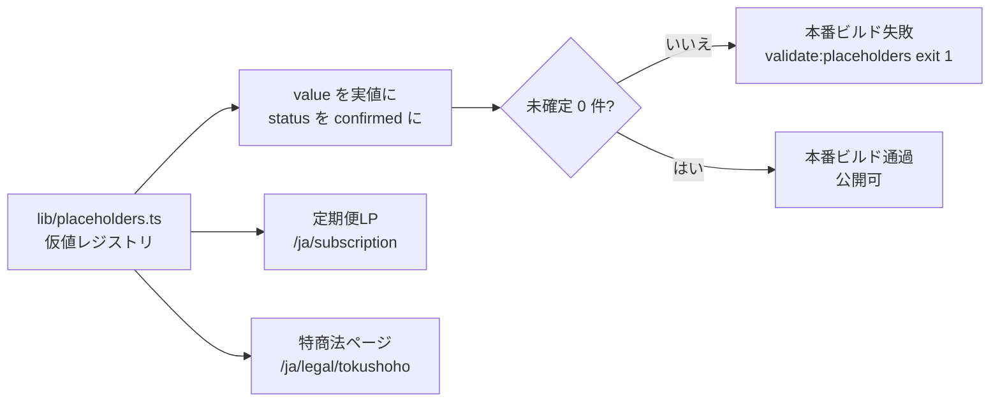

# 仮当て値 (PLACEHOLDER) 差し替え台帳

- 対象プロダクト: roji (elxea)
- 仮値のSoT: `lib/placeholders.ts` (このファイルは読み手向けの台帳。値の正本はコード側)
- 作成: 2026-08-09 JST / elxea-developer

## 一言で

事業側の確定を待っている値を「明らかに仮」と分かる形で入れて先に進めるための台帳。
仮値が本番に出るのを機械的に止める仕組み (ビルドゲート + テスト) とセットで運用する。

## 結論・状態

未確定6件。すべて `lib/placeholders.ts` に集約済みで、`VERCEL_ENV=production` の
ビルドとテストは6件が残っている間は必ず失敗する。dev / Previewは失敗しない。

## Ask

**判断 (Tier 2 / Setaka)** — 下表の6件の実値。とくに法定表記4件は公開ブロッカー。
併せて「利用規約と特商法で所在地が違う」不一致 (Open items 1) の正を決めてほしい。

---

## どこを直せば公開できるか



## 差し替え一覧

| # | 対象 (id) | 出る場所 | 現在の仮値 | 差し替え担当 | 差し替え先の根拠 | 状態 |
|---|---|---|---|---|---|---|
| 1 | `subscription.firstDeliveryDate` | 定期便LP S2 DateRibbon (Figma 8071:126) | `9月10日（木）` | Setaka (事業判断) | Shopify定期便selling planの締日・発送曜日。確定後は定数ではなく計算式に置き換える | 未確定 |
| 2 | `subscription.monthlyPrice` | 定期便LP料金SpecBand (8071:462) / 申し込みブロック (8071:514) | `1,800円` | Setaka (価格決定) | Shopify定期便商品 (tag: `subscription`) のselling plan価格がSoT。確定後は本定数を消し `detail.sellingPlanGroups` の実価格を描画 | 未確定 |
| 3 | `tokushoho.operationsManager` | 特商法ページS1販売者 (7856:932) | `（公開前に差し替え）運営統括責任者 氏名未確定` | Setaka (法定表記) | 特定商取引法 第11条。法人登記上の代表者氏名 | 未確定 (公開ブロッカー) |
| 4 | `tokushoho.address` | 特商法ページS1販売者 (7856:932) | `（公開前に差し替え）所在地未確定` | Setaka (法定表記) | 特定商取引法 第11条。法人登記上の所在地 | 未確定 (公開ブロッカー) |
| 5 | `tokushoho.phone` | 特商法ページS1販売者 + S4窓口 (7857:39763) | `（公開前に差し替え）電話番号未確定` | Setaka (法定表記) | 特定商取引法 第11条。実際に受電できる番号のみ記載可 (受付時間と整合させる) | 未確定 (公開ブロッカー) |
| 6 | `tokushoho.email` | 特商法ページS1販売者 + S4窓口 | `hello@roji.jp` | Setaka (法定表記) | Figma凍結版の値をそのまま置いている。MX / 受信テストが通れば `confirmed` にする | 未確定 (受信確認待ち) |

法定表記 (#3-#5) は実在の住所・電話番号・個人名に見えない文字列にしてある。万一ガードを
すり抜けても読み手が一目で仮値と分かる状態を保つため、単体テストで次を機械的に強制している。

- `（公開前に差し替え）` を含むこと
- 郵便番号・電話番号・番地の形をした数字列 (`\d{3}-?\d{4}` / `\d{2,4}-\d{2,4}-\d{3,4}` / `\d+-\d+-\d+`) を含まないこと

## 差し替え手順 (実値が決まったとき)

1. `lib/placeholders.ts` の該当エントリの `value` を実値にする
2. 同エントリの `status` を `"confirmed"` にする
3. 本ファイルの該当行の「状態」を `差し替え済 (YYYY-MM-DD)` にする
4. `VERCEL_ENV=production pnpm validate:placeholders` と `ROJI_PLACEHOLDER_GUARD=error pnpm test` を通す
5. #1 / #2は定数のままにせず、Shopify実データ配線に置き換える (根拠列参照)

## 仮値が本番に出ない仕組み

| 層 | 実体 | 発火条件 | 落ち方 |
|---|---|---|---|
| ビルドゲート (本番の実ブロック) | `scripts/check-placeholders.ts` (`pnpm validate:placeholders`、`pnpm build` の `next build` 前段) | `VERCEL_ENV=production` または `ROJI_PLACEHOLDER_GUARD=error` | 検出した id・ラベル・仮値・担当を列挙して exit 1 |
| テスト (公開前チェック) | `__tests__/placeholders.test.ts` | `ROJI_PLACEHOLDER_GUARD=error` の明示指定のみ | 未解決 id 一覧との差分を出して fail |

いずれも dev / Preview では発火しない (ビルドは一覧を WARN 表示して通過、テストは skip)。

判定は Vercel が自動注入する `VERCEL_ENV=production` を見る。`NODE_ENV` は見ない
(`next build` はローカルでも `NODE_ENV=production` になり、それで判定すると Preview 用
ビルドまで落ちてしまうため)。

テスト側だけ `VERCEL_ENV` で発火させていない理由: vitest は `.env.local` を process.env に
読み込むため、手元の `.env.local` が `VERCEL_ENV="production"` を持っていると通常の
`pnpm test` が落ちてしまう (このリポジトリの手元環境が実際にそうだった)。ビルドゲート側は
dotenv を読まない素の node プロセスなので、この影響を受けない。

```bash
# 仮値が残っている状態で落ちることの確認
VERCEL_ENV=production pnpm build            # exit 1 (next build に到達しない)
ROJI_PLACEHOLDER_GUARD=error pnpm test      # fail

# 差し替え後に通ることの確認 (status を confirmed にしてから)
VERCEL_ENV=production pnpm build            # exit 0
ROJI_PLACEHOLDER_GUARD=error pnpm test      # pass
```

## 仮値投入でレイアウトが崩れていないか (実測)

計測: `next dev -p 3117` / `VERCEL_ENV=preview` / Playwright chromium / deviceScaleFactor 1 /
PC 1440x900・SP 375x812 / 2026-08-09 JST。`getBoundingClientRect` の実測値 (px)。

### 定期便LP (/ja/subscription)

仮値を messages のインライン直書きからレジストリ差し込みに移しただけで、**表示文字列は
1 文字も変えていない**。よって DateRibbon の実測値は C3-2R 忠実度対比表と一致する。

| 項目 | C3-2R 記録値 | 今回の実測 | Δ | 判定 |
|---|---|---|---|---|
| DateRibbon 高さ (PC 1440) | 49.19 | 49.19 | 0 | [OK] |
| DateRibbon 幅 (PC 1440) | 1312 | 1312 | 0 | [OK] |
| DateRibbon 高さ (SP 375・2 行折返し) | 74.38 | 74.38 | 0 | [OK] |
| 横スクロール (PC / SP) | なし | なし | 0 | [OK] |

### 特商法ページ (/ja/legal/tokushoho)

こちらは仮値の文字列自体を「（公開前に差し替え）…」に変えたため、行高を変更前の文字列と
同一レイアウト文脈で比較した (同じ行を clone して旧文字列を入れ、高さだけ測る)。

| 行 | PC 変更前 → 変更後 | PC Δ | SP 変更前 → 変更後 | SP Δ |
|---|---|---|---|---|
| 運営統括責任者 | 53.19 → 53.19 | 0 | 53.19 → 78.38 | +25.19 (1 行増) |
| 所在地 | 53.19 → 53.19 | 0 | 78.38 → 78.38 | 0 (旧値も 2 行) |
| 連絡先 | 53.19 → 53.19 | 0 | 78.38 → 78.38 | 0 (旧値も 2 行) |
| 電話 (S4 窓口) | 53.19 → 53.19 | 0 | 53.19 → 78.38 | +25.19 (1 行増) |

### Vercel Preview での裏取り

同じ計測を Vercel Preview (`https://elxea-web-3vgnfc1qo-setaka1103s-projects.vercel.app`,
2026-08-09 JST) に対しても実行し、dev 計測と全項目一致を確認した
(DateRibbon PC 49.19 / SP 74.38、特商法 MetaRow PC 53.19 / SP 53.19-78.38、横スクロールなし)。
`/ja/subscription` と `/ja/legal/tokushoho` はいずれも HTTP 200。

この Preview ビルドが通ったこと自体が「Preview では仮値ガードが発火しない」実機確認になる
(Vercel は Preview に `VERCEL_ENV=preview` を注入するため)。

判定: PC は全行 Δ0。SP は 2 行が 1 行分 (25.19px) 高くなるが、`MetaRow` の値列は
`min-w-0 flex-1` で折り返す設計 (`components/editorial/rule-list.tsx`) のため、
はみ出し・切れ・重なりは発生しない。横スクロールも PC / SP どちらも発生なし
(`documentElement.scrollWidth` = `clientWidth`)。実値に差し替えれば行高は実値の長さで決まる。

## Open items (仮値ではなく、要判断の不一致)

1. **所在地の不一致** — 利用規約S4 (`app/[locale]/legal/terms/page.tsx`) は所在地に実値らしい
   文字列を載せているが、特商法ページは仮値。どちらを正とするか未決。本タスクでは
   利用規約側を変更していない (未検証の値を「確定」と扱わないため)。決まり次第、
   両ページが同じSoTを参照する形に寄せる。
2. **お届け月の表記** — 定期便LPの `nextMonthChip` / `nextMonthBody` / `month*Value` は
   月次で入れ替わる編集コンテンツで、今回の仮値集約の対象外。運用時に誰がいつ更新するか
   (Sanityへ移すか、Shopify metafieldにするか) が未決。
3. **受付時間** — 特商法ページS4の `平日 11:00–17:00（土日祝を除く）` は仮値扱いにして
   いないが、電話番号 (#5) の確定と同時に実運用と合っているか確認が必要。

## 参照元

- `lib/placeholders.ts` (仮値のSoT)
- `scripts/check-placeholders.ts` / `__tests__/placeholders.test.ts` (ガード)
- `app/[locale]/subscription/page.tsx` / `app/[locale]/legal/tokushoho/page.tsx` (参照側)
- `messages/ja.json` / `messages/en.json` の `subscriptionR2` (差し込み口 `{firstDelivery}` / `{monthlyPrice}`)
- 特定商取引法 第11条 (通信販売の広告表示義務)
