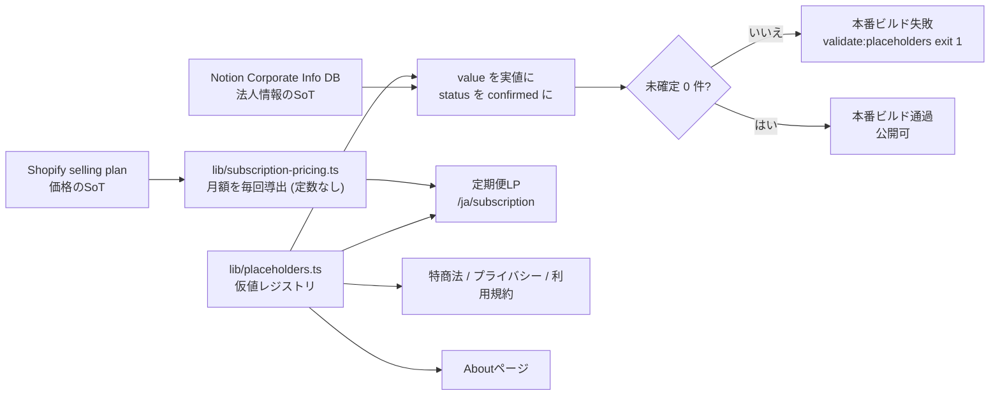

# 仮当て値 (PLACEHOLDER) 差し替え台帳

- 対象プロダクト: roji (elxea)
- 仮値のSoT: `lib/placeholders.ts` (このファイルは読み手向けの台帳。値の正本はコード側)
- 作成: 2026-08-09 JST / elxea-developer
- 最終更新: 2026-08-11 JST / elxea-developer (定期便5件を全件 `confirmed` 化。残り1件)

## 一言で

事業側の確定を待っている値を「明らかに仮」と分かる形で入れて先に進めるための台帳。
仮値が本番に出るのを機械的に止める仕組み (ビルドゲート + テスト) とセットで運用する。

## 結論・状態

**13件のうち12件が解決済み。未確定は1件** — `subscription.firstDeliveryDate` (初回お届け日) だけ。

- **法人情報6件** = NotionのCorporate Info DBの登録値で実値化し `confirmed` にした
  (2026-08-10)。所在地が3通りあった不一致も、Corporate Info DBを唯一のSoTとして
  利用規約ページを含む4か所すべて同じ値を参照する形に寄せて解消した
- **月額** = 仮値の定数を**廃止**し、Shopifyのselling planから毎リクエスト導出する
  配線に置き換えた (`lib/subscription-pricing.ts`)。レジストリからエントリを削除済み
- **初回お届け日** = 導出不能で未解決。Shopify側に締日 (cutoff) と起算日 (anchors) が
  設定されていないため計算できない (下記「初回お届け日が出せない理由」)
- **定期便の契約条件5件** = 2026-08-11に新規登録。特商法ページに定期便 (継続課金) の
  契約条件を追加したさい、法11条の表示事項のうち **決済手段 / 初回と2回目以降の課金
  タイミング / 解約の受付期限 / マイページで変更できる項目** がShopifyの設定・実測に
  依存して確定できなかった。項目を書かずに済ませられない (欠落そのものが表示義務違反に
  なる) ため、文面を先に置いて値だけをガードに載せている
- **うち3件は同日 `confirmed` 化** (2026-08-11) = **課金タイミング (初回 / 2回目以降) /
  解約の受付期限 / マイページで変更できる項目** の3件は、事業判断ではなく
  「本番Shopifyの設定とマイページ実装を読めば決まる事実」だった。事実確認調査
  (https://app.notion.com/p/3b870c9d064c8132b9daf9088fc5df7b) が実測した値で差し替えた。
  受付期限だけは、技術的な限界値 (次回課金日の当日09:00 JSTのcron実行まで) をそのまま
  案内せず、調査の推奨どおり余裕を持たせて「次回のご請求日の前日まで」を顧客向けの期限と
  している
- **残る1件 (決済手段) も同日 `confirmed` 化** (2026-08-11) = **クレジットカード
  （Visa、Mastercard、American Express、JCB）のみ**で確定した。「決済ゲートウェイの構成が
  未完了で値そのものが存在しない」という前回の見立ては**誤りだった** (下記
  「定期便の決済手段をどう確定したか」)
- **残る1件の性格** = 初回お届け日はShopify側の締日・起算日が未設定で導出できない。
  「文面を決める」問題ではなく **Shopify側の作業待ち**

未解決1件が残っている間、`VERCEL_ENV=production` のビルドは設計どおり失敗する
(dev / Previewは失敗しない)。

## Ask

**判断 (Tier 2 / Setaka)** — 次の2点。

1. **Shopifyに定期便の締日と発送スケジュールを設定するか** (初回お届け日の公開ブロッカー。
   設定されれば計算式で自動表示になり、この仮値は恒久的に消える)。**これが唯一残った
   公開ブロッカー**で、定期便の契約条件5件 (決済手段 / 課金タイミング / 解約の受付期限 /
   マイページで変更できる項目) は2026-08-11に全件実測で確定したので判断は不要になった
2. **月額の表示が `1,800円` → `2,280円` に変わる**点の確認。Shopifyの実データが
   継続2,280円 / 初回1,880円 で、仮値の1,800円 はどちらでもなかった (下記
   「月額はShopifyのどの値か」)

---

## どこを直せば公開できるか



## 差し替え一覧

| # | 対象 (id) | 出る場所 | 値 | 差し替え担当 | 値の根拠 (SoT) | 状態 |
|---|---|---|---|---|---|---|
| 1 | `subscription.firstDeliveryDate` | 定期便LP S2 DateRibbon (Figma 8071:126) | `9月10日（木）` (仮) | Setaka (事業判断) | Shopify定期便selling planの締日 (cutoff)・起算日 (anchors)。**2026-08-10時点で未設定のため導出不能** | 未確定 (公開ブロッカー) |
| 2 | ~~`subscription.monthlyPrice`~~ (レジストリから削除) | 定期便LP料金SpecBand (8071:462) / 申し込みブロック (8071:514) | Shopifyから導出 (実測: 継続 `2,280円`) | — (自動) | Shopify定期便商品 (tag: `Subscription`) の毎月お届けプランの継続価格。`lib/subscription-pricing.ts` が導出 | 差し替え済 (2026-08-10 / 定数廃止・実データ配線) |
| 3 | `tokushoho.operationsManager` | 特商法ページS1販売者 (7856:932) | 代表者氏名 | Setaka (法定表記) | Corporate Info DB「代表者氏名」(Basic)。特定商取引法 第11条 | 差し替え済 (2026-08-10) |
| 4 | `tokushoho.address` | 特商法ページS1販売者 (7856:932) / プライバシーポリシーS4 / 利用規約S4事業者情報 | 本社所在地 (郵便番号つき) | Setaka (法定表記) | Corporate Info DB「本社住所」(Address)。特定商取引法 第11条 | 差し替え済 (2026-08-10) |
| 5 | `tokushoho.phone` | 特商法ページS1販売者 + S4窓口 (7857:39763) | 代表電話 | Setaka (法定表記) | Corporate Info DB「代表電話」(Contact)。特定商取引法 第11条 | 差し替え済 (2026-08-10) |
| 6 | `tokushoho.email` | 特商法ページS1販売者 + S4窓口 / お問い合わせS1メタ / About / 利用規約S4 (8109:46669) | 法人代表メールアドレス | Setaka (法定表記) | Corporate Info DB「代表メールアドレス（一般問い合わせ用）」(Contact / 最終確認日あり) | 差し替え済 (2026-08-10) |
| 7 | `about.headOffice` | AboutページS6会社情報「本社」(8121:1312 / SP 8121:1386) | #4と同一値 | Setaka (会社情報) | Corporate Info DB「本社住所」。#4と同時に差し替えた | 差し替え済 (2026-08-10) |
| 8 | `about.branchOffice` | AboutページS6会社情報「京都事務所」(8121:1312 / SP 8121:1386) | 京都倉庫兼事務所の所在地 | Setaka (会社情報) | Corporate Info DB「京都倉庫住所」(Address)。**記載する**判断 (2026-08-10) | 差し替え済 (2026-08-10) |
| 9 | `tokushoho.subscriptionPaymentMethods` | 特商法ページIV-4お支払い方法と時期 | 定期便で使える決済手段 (クレジットカード4ブランドのみ) | Setaka (法定表記) | Shopify管理画面のペイメント設定 + Storefront API `acceptedCardBrands` + 実注文の `paymentGatewayNames` + 定期便契約の `customerPaymentMethod` の実測。特定商取引法 第11条2号 | 差し替え済 (2026-08-11 / 実測確定) |
| 10 | `tokushoho.subscriptionFirstChargeTiming` | 特商法ページIV-4 | 初回課金のタイミング (ご注文の確定時) | Setaka (法定表記) | 本番Shopifyのselling plan billing policyの実測。特定商取引法 第11条2号。事実確認調査 [3b870c9d…5df7b](https://app.notion.com/p/3b870c9d064c8132b9daf9088fc5df7b) | 差し替え済 (2026-08-11 / 実測確定) |
| 11 | `tokushoho.subscriptionRecurringChargeTiming` | 特商法ページIV-4 | 2回目以降の課金のタイミング (お申し込み日を起点とした応当日・当日午前中) | Setaka (法定表記) | 同上 + 課金cron (`app/api/cron/billing/route.ts` / `vercel.json` 毎日09:00 JST)。基準日 (anchors) 未設定のため加入日基準で回る | 差し替え済 (2026-08-11 / 実測確定) |
| 12 | `tokushoho.subscriptionCancelCutoff` | 特商法ページIV-6停止・解約の方法 | 解約・変更の受付期限 (次回のご請求日の前日) | Setaka (法定表記) | 消費者庁ガイドライン別添9 2(2)⑥。技術的限界は次回課金日の当日09:00 JST (cron実行) だが、調査の推奨どおり余裕を持たせた期限を案内する。定期便LPのFAQとリマインドメールも同一基準に統一済み (2026-08-11) | 差し替え済 (2026-08-11 / 実測確定) |
| 13 | `tokushoho.subscriptionEditableFields` | 特商法ページIV-9お申し込み内容の変更 | マイページでできる5種 (スキップ / 間隔変更 / 一時停止 / 再開 / 解約) | Setaka (法定表記) | マイページ実装 (`components/account/subscription-actions.tsx`) のボタンが5種のみ。お届け先・数量・お支払い方法・商品の変更画面は存在しない。変更できない項目を「変更できる」と書くと不実表示になるため、IV-9の地の文も同時に直した | 差し替え済 (2026-08-11 / 実測確定) |

実値そのものは本ファイルに写さない (二重SoTを作らないため)。値は
`lib/placeholders.ts` とNotionのCorporate Info DB
(https://www.notion.so/fc8c353f9650453c9707ae0a806ae484) を見ること。

#8 (京都事務所) は「載せる」で確定したが、非公開に転じる判断はいつでも可能。
その場合は `lib/placeholders.ts` の `about.branchOffice` エントリと
`app/[locale]/about/page.tsx` の会社情報の行を落とす (画面ラベルは倉庫兼事務所のため
「京都事務所」のまま)。

仮値がまだ残っているエントリ (#1) は、実在の住所・電話番号・個人名に見えない文字列に
してある。万一ガードをすり抜けても読み手が一目で仮値と分かる状態を保つため、
単体テストが `tokushoho.*` / `about.*` の**未確定エントリだけ**に次を強制している
(実値に差し替えた `confirmed` エントリは本物の住所・電話番号になるので対象外)。

- `（公開前に差し替え）` を含むこと
- 郵便番号・電話番号・番地の形をした数字列 (`\d{3}-?\d{4}` / `\d{2,4}-\d{2,4}-\d{3,4}` / `\d+-\d+-\d+`) を含まないこと

## 初回お届け日が出せない理由 (#1)

「今申し込むと初回はN月N日」は、Shopifyの定期便プランに**締日 (cutoff)** と
**起算日 (anchors)** が設定されていて初めて計算できる。2026-08-10に本番ストアの
Admin APIを実測した結果、selling plan group「elxea定期便プラン」の3プラン
(毎月 / 2ヶ月ごと / 3ヶ月ごと) はすべて次の状態だった。

| 項目 | 実測値 | 意味 |
|---|---|---|
| `deliveryPolicy.anchors` | `[]` | 毎月の起算日 (何日お届け) が未設定 |
| `deliveryPolicy.cutoff` | `null` | 締日 (何日までの申し込みが今サイクル) が未設定 |
| `deliveryPolicy.preAnchorBehavior` | `ASAP` | 起算日が無いので「注文後すぐ」扱い |

つまりShopify上は「注文したらすぐ発送、その後1ヶ月ごと」でしかなく、暦日は決まって
いない。日付を出すには (a) Shopifyに締日・起算日を設定する か (b) 発送リードタイムを
事業側で決めて表示ルールにする かのどちらかが必要で、いずれも事業判断。
**勝手に本番Shopifyの設定を作ることはしない**ため、この1件は仮値のまま残した。

なお締日・起算日は **Admin APIにしか無い** (Storefront APIの
`SellingPlanRecurringDeliveryPolicy` は `interval` / `intervalCount` のみ)。
設定後に画面へ出す際は、公開LPからAdmin APIを叩かない配線 (ビルド時取得・
metafield化・キャッシュ付きサーバ側取得のいずれか) を選ぶこと。

## 月額はShopifyのどの値か (#2)

定数を廃止し `lib/subscription-pricing.ts` が導出する。導出規則は3つ。

1. **プランの特定はプラン名ではなく配送間隔で行う** (`deliveryPolicy.interval = MONTH`
   かつ `intervalCount = 1`)。プラン名は店舗側で自由に変えられるので表示値の根拠にできない
2. **出すのは継続価格** (`sellingPlanAllocations.priceAdjustments` の末尾の
   `perDeliveryPrice`)。初回特別価格を「月額」として出すと2回目以降の請求額と食い違う
3. **導出できないときは数字を出さない** — 毎月プランが無い / allocationが無い /
   金額が数値として読めない場合は `null` を返し、画面は
   `subscriptionR2.monthlyPriceUnavailable` の文言 (`価格は準備中です`) に落ちる。
   古い定数を出すより安全側に倒す

2026-08-10の本番ストア実測値: 初回1,880円 / 継続2,280円 (税込)。
**仮値の `1,800円` はどちらでもなかった**ため、LPの表示額は `2,280円` に変わる。
LP本文は初回特別価格に触れていないので、初回1,880円を打ち出すかは別途コピーの判断
(Open items 6)。

商品タグの照合は**大小文字を区別しない**。店舗の実タグは `Subscription` で、
完全一致だと定期便商品が1件も引けず月額が出なかった (2026-08-10に修正)。

## 定期便の決済手段をどう確定したか (#9)

確定値は **クレジットカード（Visa、Mastercard、American Express、JCB）のみ** (2026-08-11)。

前回この項目を仮値にしたときの見立て —「決済ゲートウェイの構成が未完了で、値そのものが
存在しない」— は**誤りだった**。誤診の元は、定期便の課金試行に残っていた失敗
(`PAYMENT_METHOD_INCOMPATIBLE_WITH_GATEWAY_CONFIG` /
`Payment method cannot be used with the current payment gateway test mode configuration`)
を「ゲートウェイ未構成」と読んだこと。実際は**テストカードで作った契約を本番モードの
ゲートウェイに投げた**ことによるテスト/本番の食い違いで、ゲートウェイ自体は稼働している。

実測 (2026-08-11 JST) の内訳:

| 観測 | 手段 | 結果 |
|---|---|---|
| 有効なカードブランド | Shopify管理画面 (elxea-admin) / Storefront API `shop.paymentSettings.acceptedCardBrands` | Visa / Mastercard / American Express / JCB |
| 管理画面の「+2」の正体 | Storefront API `supportedDigitalWallets` | `APPLE_PAY` / `GOOGLE_PAY` (カードブランドではなくウォレット) |
| カードの処理系 | 本番注文の `paymentGatewayNames` | `shopify_payments` (Shopify Paymentsが稼働 = 定期便のカード保管に対応) |
| 定期便の請求先 | 実在契約の `customerPaymentMethod.instrument` | `CustomerCreditCard` |
| その他の有効な手段 | 管理画面 (KOMOJU) / 実注文の `paymentGatewayNames` | 楽天ペイ・スマホ決済 (コンビニ等) / `Cash on Delivery (COD)` / `manual` |
| PayPal | 管理画面 | 未有効 |

判断は2つ。

1. **カード以外は書かない** — 定期便の請求はShopifyの `subscriptionBillingAttempt` が
   保管済みの `customerPaymentMethod` に対して行う。楽天ペイ・スマホ決済 (コンビニ等)・
   代金引換・銀行振込は保管して自動請求できないため、定期便では使えない。単発販売の
   一覧 (群I) をそのまま流用すると不実表示になる
2. **Apple Pay / Google Payは「使えないから」ではなく「表記をカードに統一するため」書かない**
   — Shopify公式ドキュメント ([considerations](https://help.shopify.com/en/manual/products/purchase-options/subscriptions/considerations)
   2026-08-11取得) はShopify Payments利用時について "Customers can use accelerated
   checkouts, such as Shop Pay, Apple Pay, Google Pay, or PayPal, to purchase
   subscriptions" と明記しており、当店はshopify_payments稼働のため**使える見込みが高い**。
   それでも表記に出さないのは、ウォレットで契約しても保管されるinstrumentはクレジット
   カード (実在契約の `CustomerCreditCard` と整合) だから。ウォレット名を並べると
   "Apple Pay support for subscriptions is limited to Visa and Mastercard" (同doc) の
   但し書きが要り、かえって読み手を誤らせる

なお同docは "Customers can use only Shop Pay on some stores" とも述べており、**実チェック
アウトで定期便カートにウォレットボタンが出るかは未実測**。将来ウォレットを表記する判断を
するなら、この実測が前提になる。

「のみ」を落とさないこと。群Iにコンビニ決済・銀行振込・代金引換が並んでいるため、限定を
外すと定期便でも同じ手段が使えると読める。特商法ページIV-4には除外の一文も置いた。
回帰は `__tests__/subscription-payment-methods.test.ts` で機械固定している
(4ブランドの過不足・「のみ」の有無・カードブランド以外の手段名の混入・値の直書き)。

## 差し替え手順 (実値が決まったとき)

1. `lib/placeholders.ts` の該当エントリの `value` を実値にする
2. 同エントリの `status` を `"confirmed"` にし、`basis` にSoT (どのDBのどの項目か + 取得日) を書く
3. 本ファイルの該当行の「状態」を `差し替え済 (YYYY-MM-DD)` にする
4. `VERCEL_ENV=production pnpm validate:placeholders` と `ROJI_PLACEHOLDER_GUARD=error pnpm test` を通す
5. 外部システムに値のSoTがあるもの (価格・在庫・配送日) は定数にせず配線に置き換える (#2が実例)

法人情報を差し替えるときは **NotionのCorporate Info DBを唯一のSoTとする**。
Figmaの凍結版や他ページの記載から値を拾って「確定」扱いにしないこと
(2026-08-10まで所在地の表記が3通りに分かれていた原因がこれ)。

## 仮値が本番に出ない仕組み

| 層 | 実体 | 発火条件 | 落ち方 |
|---|---|---|---|
| ビルドゲート (本番の実ブロック) | `scripts/check-placeholders.ts` (`pnpm validate:placeholders`、`pnpm build` の `next build` 前段) | `VERCEL_ENV=production` または `ROJI_PLACEHOLDER_GUARD=error` | 検出したid・ラベル・仮値・担当を列挙してexit 1 |
| テスト (公開前チェック) | `__tests__/placeholders.test.ts` | `ROJI_PLACEHOLDER_GUARD=error` の明示指定のみ | 未解決id一覧との差分を出してfail |

いずれもdev / Previewでは発火しない (ビルドは一覧をWARN表示して通過、テストはskip)。

判定はVercelが自動注入する `VERCEL_ENV=production` を見る。`NODE_ENV` は見ない
(`next build` はローカルでも `NODE_ENV=production` になり、それで判定するとPreview用
ビルドまで落ちてしまうため)。

テスト側だけ `VERCEL_ENV` で発火させていない理由: vitestは `.env.local` をprocess.envに
読み込むため、手元の `.env.local` が `VERCEL_ENV="production"` を持っていると通常の
`pnpm test` が落ちてしまう (このリポジトリの手元環境が実際にそうだった)。ビルドゲート側は
dotenvを読まない素のnodeプロセスなので、この影響を受けない。

```bash
# 未解決1件 (初回お届け日) が残っている現状 — 設計どおり落ちる
VERCEL_ENV=production pnpm validate:placeholders   # exit 1 / 残り 1 件を列挙
ROJI_PLACEHOLDER_GUARD=error pnpm test             # 「公開ゲート」1 件だけ fail

# 通常のテストは全件 pass (作業を止めない)
pnpm test                                          # pass
```

## 仮値投入でレイアウトが崩れていないか (実測)

計測: `next dev -p 3117` / `VERCEL_ENV=preview` / Playwright chromium / deviceScaleFactor 1 /
PC 1440x900・SP 375x812 / 2026-08-09 JST。`getBoundingClientRect` の実測値 (px)。

### 定期便LP (/ja/subscription)

仮値をmessagesのインライン直書きからレジストリ差し込みに移しただけで、**表示文字列は
1文字も変えていない**。よってDateRibbonの実測値はC3-2R忠実度対比表と一致する。

| 項目 | C3-2R記録値 | 今回の実測 | Δ | 判定 |
|---|---|---|---|---|
| DateRibbon高さ (PC 1440) | 49.19 | 49.19 | 0 | [OK] |
| DateRibbon幅 (PC 1440) | 1312 | 1312 | 0 | [OK] |
| DateRibbon高さ (SP 375・2行折返し) | 74.38 | 74.38 | 0 | [OK] |
| 横スクロール (PC / SP) | なし | なし | 0 | [OK] |

初回お届け日は文字列を変えていないので、この実測は2026-08-10の差し替え後も有効。
月額は `1,800円` (6文字) → `2,280円` (6文字) で桁数が変わらないため行送りに影響しない。

### 特商法ページ (/ja/legal/tokushoho)

こちらは仮値の文字列自体を「（公開前に差し替え）…」に変えたため、行高を変更前の文字列と
同一レイアウト文脈で比較した (同じ行をcloneして旧文字列を入れ、高さだけ測る)。

| 行 | PC変更前 → 変更後 | PC Δ | SP変更前 → 変更後 | SP Δ |
|---|---|---|---|---|
| 運営統括責任者 | 53.19 → 53.19 | 0 | 53.19 → 78.38 | +25.19 (1行増) |
| 所在地 | 53.19 → 53.19 | 0 | 78.38 → 78.38 | 0 (旧値も2行) |
| 連絡先 | 53.19 → 53.19 | 0 | 78.38 → 78.38 | 0 (旧値も2行) |
| 電話 (S4窓口) | 53.19 → 53.19 | 0 | 53.19 → 78.38 | +25.19 (1行増) |

2026-08-10に実値へ差し替えたことで、SPで2行になっていた行の一部は1行に戻る
(仮値の「（公開前に差し替え）…」より実値の方が短い行がある)。`MetaRow` の値列は
`min-w-0 flex-1` で折り返す設計 (`components/editorial/rule-list.tsx`) のため、
行数がどちらに転んでも はみ出し・切れ・重なりは発生しない。

### Vercel Previewでの裏取り

同じ計測をVercel Preview (`https://elxea-web-3vgnfc1qo-setaka1103s-projects.vercel.app`,
2026-08-09 JST) に対しても実行し、dev計測と全項目一致を確認した
(DateRibbon PC 49.19 / SP 74.38、特商法MetaRow PC 53.19 / SP 53.19-78.38、横スクロールなし)。
`/ja/subscription` と `/ja/legal/tokushoho` はいずれもHTTP 200。

このPreviewビルドが通ったこと自体が「Previewでは仮値ガードが発火しない」実機確認になる
(VercelはPreviewに `VERCEL_ENV=preview` を注入するため)。

## Open items (仮値ではなく、要判断の不一致)

1. ~~**所在地の不一致 (3通り)**~~ — **解消 (2026-08-10)**。NotionのCorporate Info DBを
   唯一のSoTとし、特商法ページ / プライバシーポリシー / About / 利用規約の4か所すべてが
   `tokushoho.address` を参照する形にした (利用規約は郵便番号なしの直書きだったのを
   レジストリ参照に置換)。Figma凍結版の表記は採用していない。
2. **お届け月の表記** — 定期便LPの `nextMonthChip` / `nextMonthBody` / `month*Value` は
   月次で入れ替わる編集コンテンツで、今回の仮値集約の対象外。運用時に誰がいつ更新するか
   (Sanityへ移すか、Shopify metafieldにするか) が未決。
3. **受付時間** — 特商法ページS4の `平日 11:00–17:00（土日祝を除く）` は仮値扱いにして
   いない。電話番号 (#5) が実値になったので、**この受付時間で実際に受電できるか**の
   確認が必要 (特定商取引法 第11条は実際に連絡が取れる窓口の記載を求める)。
4. ~~**問い合わせ先メールの不一致**~~ — **解消 (2026-08-10)**。rojiは層2のサービスで
   サイト運営主体はelxea法人であるため、法人の代表メールアドレス (Corporate Info DB
   に受信実績あり) を表に出す方針で確定した。`hello@roji.jp` は採用しない。
5. **産地タイルの写真が未撮影** — About確定版の産地4タイル (8121:1409) はFigma上も
   「プレースホルダ / 撮影後差替」の指定で、実装も `ImagePlaceholder` が出る。**仮値ガードの
   対象外** (画面に文字列として出る値ではなく、未入稿が一目で分かる状態なので公開を機械的に
   止める必要がない)。撮影・入稿の担当と時期は未決。
6. **初回特別価格をLPで打ち出すか** — Shopifyの定期便商品は初回1,880円 / 継続2,280円
   だが、LP本文は初回価格に触れていない (月額として継続価格だけを出す)。初回価格を
   前面に出すならコピーとレイアウトの追加が必要。`hasFirstDeliveryDiscount()` で
   初回と継続が違う事実は取得できる状態にしてある。
7. **定期便商品が3種あり最初の1件だけを見ている** — 実ストアには緑茶 / 烏龍茶 / 紅茶の
   3商品が同じselling plan groupに属しており、LPはタグ一致の**最初の1件**の価格を出す。
   3商品とも同価格なので現状は表示に差が出ないが、価格が分かれたら「どの商品の月額か」の
   決定が必要。

8. **発送リードタイムの一意性 (2026-08-11に統一済み・再発防止つき)** — 「ご注文から
   何日で発送するか」がサイト内に4通り (3営業日以内 / 2〜4日 / 2〜4営業日 / 3〜5営業日)
   あったのを **ご注文から5営業日以内** に統一した (Setaka確定)。再発すると特商法ページの
   記載と他ページが食い違うため、`__tests__/dispatch-lead-time.test.ts` が古い言い方の
   混入で落ちるようにしてある。
9. **送料の金額表記が2系統ある (未解決・要判断)** — 定期便の送料無料は確定したが、**単発
   購入の送料**は `shippingInfo` (全国一律550円 / 5,000円以上無料) と `shipping` ページ
   (地域別770〜1,650円 / 8,000円以上無料) で食い違っている。どちらが実運用かは事業判断
   なので今回は触っていない。特商法ページは金額を書かず「配送料がかかります」に留めている
   ため、直ちに表示義務違反にはならないが、放置すると法12条 (誇大広告等の禁止) の論点になる。
10. **解約受付期限のLPと特商法の不一致 (解消済 2026-08-11)** — 特商法ページは
   2026-08-11に **次回のご請求日の前日まで** で確定した (#12。技術的限界は次回課金日当日の
   09:00 JSTのcron実行までだが、余裕を持たせた案内にしている)。定期便LPのFAQ
   (`subscriptionLp.faqA1` ja/en) と定期便リマインドメール
   (`lib/email/subscription-reminder.ts`) は「発送日/お届け日の3日前まで」と別基準だったが、
   特商法ページと同一基準に統一した。メールは値を直書きせず `lib/placeholders.ts` の
   `tokushoho.subscriptionCancelCutoff` から読む。回帰は
   `__tests__/dispatch-lead-time.test.ts` の「解約・変更の受付期限の統一」で機械固定。
11. **定期便の決済手段のLPと特商法の不一致 (解消済2026-08-11)** — 定期便LPのFAQ
   (`subscriptionR2.faqA2` ja/en) は「クレジットカード決済です。毎回のお届け日に合わせて
   引き落とします」、旧カタログ (`subscriptionLp.faqA6` ja/en) は「Apple Pay、Google Payに
   対応しています」で、特商法ページに書く内容と食い違っていた。両方を確定値
   (カード4ブランドのみ) に統一し、あわせてLPの引き落としタイミングも #11の確定値
   (お申し込み日を起点とした応当日) に直した。「お届け日に合わせて引き落とす」は実装事実
   ではない (課金cronは請求日基準で回り、発送日とは連動しない)。回帰は
   `__tests__/subscription-payment-methods.test.ts`。
12. **お届け間隔の選択肢がLPと実プランで食い違う (未解決)** — 実在のselling planは
   毎月 / 2ヶ月ごと / 3ヶ月ごとの3件 (2026-08-11時点) だが、定期便LP (`subscriptionR2`) は
   「毎月 / 隔月」の2択として書いている。特商法ページ IV-2 は実プランどおり3つで記載した。
   LP側の表記を実プランに合わせるかはコピーの判断。

## 参照元

- `lib/placeholders.ts` (仮値のSoT)
- `lib/subscription-pricing.ts` (月額の導出。Shopify selling planがSoT)
- `scripts/check-placeholders.ts` / `__tests__/placeholders.test.ts` / `__tests__/subscription-pricing.test.ts` (ガードと導出のテスト)
- `app/[locale]/subscription/page.tsx` / `app/[locale]/legal/tokushoho/page.tsx` / `app/[locale]/legal/terms/page.tsx` / `app/[locale]/legal/privacy/page.tsx` / `app/[locale]/about/page.tsx` / `app/[locale]/contact/page.tsx` (参照側)
- `messages/ja.json` / `messages/en.json` の `subscriptionR2` (差し込み口 `{firstDelivery}` / `{monthlyPrice}` と `monthlyPriceUnavailable`)
- Notion Corporate Info DB — https://www.notion.so/fc8c353f9650453c9707ae0a806ae484 (法人情報のSoT / 取得2026-08-10 JST)
- Shopify Admin API `sellingPlanGroups` (締日・起算日の実測 / 2026-08-10 JST)
- 特定商取引法 第11条 (通信販売の広告表示義務)
- 定期便の契約条件の起草 (文面の正本 / 法令チェックリスト14件) — https://app.notion.com/p/3b870c9d064c8173b866f824f95f36fa
- `__tests__/dispatch-lead-time.test.ts` (発送リードタイムと定期便条件の回帰テスト)
- `__tests__/subscription-payment-methods.test.ts` (定期便の決済手段の回帰テスト)
- Shopify Storefront API `shop.paymentSettings` / Admin API `orders.paymentGatewayNames` ・ `subscriptionContracts.customerPaymentMethod` (決済手段の実測 / 2026-08-11 JST)
- Shopify管理画面のペイメント設定 (elxea-admin実測 / 2026-08-11 JST)
- Shopify公式「Considerations and payment gateways for subscription products」 — https://help.shopify.com/en/manual/products/purchase-options/subscriptions/considerations (定期便で使える決済手段・ウォレットの制約 / 2026-08-11 JST取得)
